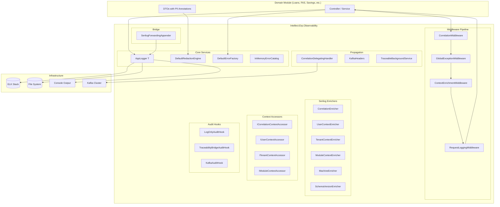
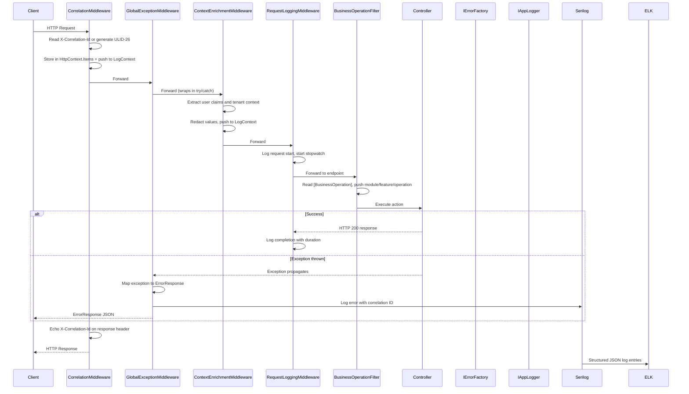
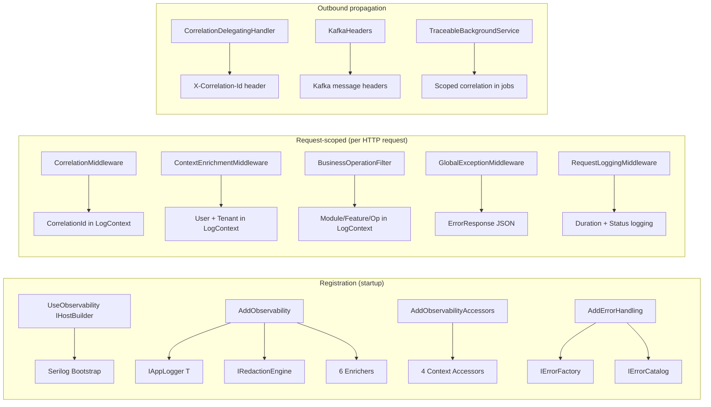
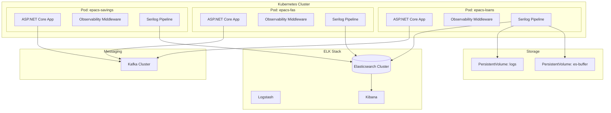

# Intellect.Erp.Observability — Developer User Guide

> **Module Version:** 1.0.0  
> **Runtime:** .NET 8 / C# 12  
> **Logging:** Serilog 3.x → ELK Stack (Elasticsearch, Logstash, Kibana)  
> **Last Updated:** 2026-04-21

---

## Table of Contents

- [1. Problem Statement](#1-problem-statement)
- [2. Executive Summary](#2-executive-summary)
- [3. Architecture](#3-architecture)
- [4. Features](#4-features)
- [5. Configuration — Developer Perspective](#5-configuration--developer-perspective)
- [6. Configuration — DevOps Perspective](#6-configuration--devops-perspective)
- [7. Deployment Diagram and Details](#7-deployment-diagram-and-details)
- [8. Troubleshooting Guide](#8-troubleshooting-guide)
- [9. Glossary](#9-glossary)
- [10. Correctness Properties](#10-correctness-properties)
- [11. API Reference](#11-api-reference)
- [12. Appendices](#12-appendices)

---

## 1. Problem Statement

### 1.1 Why This Module Exists

Enterprise ERP systems process thousands of business-critical operations daily — loan disbursements, savings deposits, voucher postings, membership registrations, and fund transfers. Every one of these operations produces log output. Operations engineers need to answer questions like: *Why did this disbursement fail? Which user triggered it? What was the correlation chain? Was sensitive data exposed in the logs?*

Before `Intellect.Erp.Observability`, each domain module (Loans, Borrowings, FAS/Accounting, Deposits, Membership, Procurement) implemented its own logging, error handling, and masking. This led to:

- **Inconsistent log schemas** across modules — different field names, different formats, different enrichment levels. Kibana dashboards required per-module customization.
- **Duplicated error handling code** — every team writing their own `try/catch` blocks, each with different HTTP status mapping, different error response shapes, and different correlation handling.
- **Fragmented correlation** — no way to trace a business flow that spans multiple modules. Each module generated its own request IDs with incompatible formats.
- **No centralized error catalog** — error codes were ad-hoc strings embedded in source code. Support engineers had no lookup table for resolution steps.
- **Inconsistent PII masking** — some modules masked Aadhaar numbers, others did not. Production logs contained raw PAN numbers, mobile numbers, and account numbers.
- **No structured audit trail** — business checkpoints were logged as unstructured text, making compliance reporting manual and error-prone.

The Observability module exists to replace all of this with a single, shared, compliance-grade logging and error handling infrastructure that domain teams adopt through configuration and annotation rather than implementation.

### 1.2 Compliance Gaps Addressed

| Gap | How the Module Addresses It |
|---|---|
| No unified log schema | Canonical field set (schema v1) with 15+ fields emitted on every log entry via Serilog enrichers |
| Missing correlation across modules | End-to-end `CorrelationId` propagation across HTTP, Kafka, and background job boundaries via ULID-26 identifiers |
| Inconsistent error responses | Single `ErrorResponse` JSON envelope with stable error codes, RFC 7807 compatibility, and deterministic exception-to-HTTP mapping |
| Sensitive data exposure in logs | Three-layer redaction engine: structural path policies, attribute-driven reflection (`[Sensitive]`, `[DoNotLog]`, `[Mask]`), and regex fallback (Aadhaar, PAN, mobile, email, JWT, connection strings) |
| No centralized error catalog | Per-module YAML error catalogs with schema validation, stable codes (`ERP-MODULE-CAT-NNNN`), and `IErrorFactory.FromCatalog()` lookup |
| Duplicated error handling | Global exception middleware with typed exception hierarchy and automatic HTTP status mapping |
| No audit extensibility | `IAuditHook` interface with LogOnly, TraceabilityBridge, and Kafka modes |
| Legacy log4net modules excluded | `SerilogForwardingAppender` bridges log4net output into the Serilog pipeline with full enrichment |

### 1.3 The Cost of Not Having Centralized Observability

Without a centralized observability module, organizations face:

- **Regulatory risk** — Audit findings for PII exposure in production logs. In financial services, this can result in fines under data protection regulations and consent orders from banking regulators.
- **Investigation delays** — When an incident occurs, investigators must search multiple log stores with different schemas, manually correlate request IDs, and hope that the relevant module captured enough context. A 15-minute investigation becomes a multi-hour effort.
- **Engineering overhead** — Every new module reinvents structured logging, error handling, and masking. Across 8+ domain modules, this represents hundreds of engineering hours duplicated.
- **Data quality degradation** — Without schema enforcement, mandatory fields go missing. Without masking enforcement, sensitive data leaks into log sinks. Without correlation, distributed traces are impossible.
- **Blind spots** — Cross-module failures are invisible when each module logs to its own sink with its own format.
- **Alert fatigue** — Without standardized severity levels and error categories, alerting rules must be customized per module. False positives proliferate.

### 1.4 Regulatory Context

The module is designed to satisfy logging and data protection requirements common across financial regulatory frameworks:

- **Data minimization** — Sensitive data (PII, account numbers, PAN, Aadhaar) must be masked or redacted before reaching any log sink. The redaction engine enforces this at write time, not query time.
- **Audit trail completeness** — Every business-critical operation must produce a structured log entry with actor identity, timestamp, operation context, and outcome.
- **Correlation and traceability** — Distributed transactions must be traceable end-to-end. The ULID-26 correlation ID propagates across HTTP, Kafka, and background job boundaries.
- **Error transparency** — API consumers must receive consistent, documented error responses with stable codes.
- **Production safety** — Exception details (stack traces, type names) must never be exposed to API consumers in production.

---

## 2. Executive Summary

### 2.1 What the Module Does

`Intellect.Erp.Observability` is a family of .NET 8 NuGet packages that provides a unified observability and error handling platform for all ePACS ERP domain modules. Domain teams adopt the platform through three extension method calls in `Program.cs` and attribute annotations on controllers and DTOs. The platform handles everything else: structured logging with canonical field enrichment, correlation ID generation and propagation, global exception handling with deterministic HTTP mapping, centralized error catalogs, three-layer PII masking, request/response body logging, audit hook extensibility, and legacy log4net bridging.

The platform composes with existing sibling utilities (`Intellect.Erp.Traceability` and `Intellect.Erp.Messaging`) through optional integration shims, and targets one-line adoption for consuming modules such as l3_Loans, l3_savingsDeposit, l3_FAS, l3_voucherProcessing, l3_membership, l3_merchandise, l3_uniteCommonAPI, and l3_auditProcessing.

### 2.2 Key Capabilities

- **Structured logging** — `IAppLogger<T>` with `Debug`, `Information`, `Warning`, `Error`, `Critical`, `BeginScope`, `BeginOperation`, and `Checkpoint` methods. Every log entry is enriched with canonical fields.
- **Correlation propagation** — ULID-26 correlation IDs generated or inherited on every HTTP request, propagated to outbound HTTP calls, Kafka messages, and background jobs.
- **Global exception handling** — `GlobalExceptionMiddleware` catches all unhandled exceptions and maps them to standardized `ErrorResponse` JSON with deterministic HTTP status codes.
- **Typed exception hierarchy** — 12 concrete exception types extending `AppException`, each carrying `ErrorCode`, `Category`, `Severity`, `Retryable`, and `CorrelationId`.
- **Centralized error catalog** — Per-module YAML files with schema validation, loaded at startup into an immutable in-memory catalog.
- **Three-layer PII masking** — Structural path policies, attribute-driven reflection (`[Sensitive]`, `[DoNotLog]`, `[Mask]`), and regex fallback (8 built-in patterns for Indian financial data).
- **Request/response body logging** — Optional, whitelist-only, redacted body capture with slow-request detection.
- **Annotation-driven adoption** — `[BusinessOperation]`, `[Sensitive]`, `[DoNotLog]`, `[Mask]`, `[ErrorCode]` attributes for zero-code enrichment and masking.
- **Audit hook extensibility** — `IAuditHook` with LogOnly, TraceabilityBridge, and Kafka modes.
- **Log4Net bridge** — `SerilogForwardingAppender` for legacy modules with lock-free queue and backpressure handling.
- **Integration shims** — Optional packages for Traceability and Messaging sibling utilities.
- **Background job observability** — `TraceableBackgroundService` base class with scoped correlation and error resilience.
- **Testing harness** — Fakes, in-memory sinks, and assertion helpers for unit and integration testing.

### 2.3 Target Audience

| Audience | What They Care About |
|---|---|
| **Domain module developers** | How to wire up `Program.cs`, annotate controllers and DTOs, throw typed exceptions, use `IAppLogger`, and write tests |
| **Platform engineers** | Architecture, package dependencies, enricher pipeline, redaction engine internals, performance characteristics |
| **Security / Compliance officers** | Masking guarantees, production safety guards, audit hook completeness, PII redaction coverage |
| **SREs / DevOps** | ELK setup, sink configuration, health checks, environment variables, alerting thresholds, scaling |
| **Frontend developers** | Error response contract, field names, error code lookup, retry semantics |

### 2.4 Technology Stack

| Component | Technology |
|---|---|
| Runtime | .NET 8 / C# 12 |
| Logging framework | Serilog 3.x with `LogContext` enrichment |
| Log sinks | Console (compact JSON or template), File (rolling daily JSON), Elasticsearch (with disk buffer) |
| Serialization | `System.Text.Json` for error responses and JSON redaction |
| Error catalog | YAML files parsed with `YamlDotNet` |
| Configuration | `Microsoft.Extensions.Options` with `DataAnnotations` validation |
| DI | `Microsoft.Extensions.DependencyInjection` |
| HTTP propagation | `DelegatingHandler` for `HttpClientFactory` |
| Kafka propagation | Static `KafkaHeaders` helper with UTF-8 byte arrays |
| Legacy bridge | log4net `AppenderSkeleton` with `ConcurrentQueue` |
| Testing | xUnit, FluentAssertions, FsCheck |
| Build | `Directory.Build.props`, `Directory.Packages.props`, central package versioning |

---

## 3. Architecture

### 3.1 High-Level Architecture Diagram



### 3.2 Request Flow



### 3.3 Package and Namespace Structure

The platform follows a layered package architecture with strict dependency direction:

```
Intellect.Erp.Observability.Abstractions  (zero deps, only MEL.Abstractions)
    ↑
Intellect.Erp.ErrorHandling               (depends on Abstractions)
    ↑
Intellect.Erp.Observability.Core          (depends on Abstractions, ErrorHandling, Serilog)
    ↑
Intellect.Erp.Observability.AspNetCore    (depends on Core, ErrorHandling, Microsoft.AspNetCore.App)
    ↑
Intellect.Erp.Observability.Propagation   (depends on Core)

Intellect.Erp.Observability.AuditHooks           (depends on Abstractions, Core)
Intellect.Erp.Observability.Log4NetBridge         (depends on Abstractions, log4net)
Intellect.Erp.Observability.Integrations.Traceability  (depends on Abstractions, Traceability)
Intellect.Erp.Observability.Integrations.Messaging     (depends on Propagation, Messaging.Contracts)
Intellect.Erp.Observability.Testing               (depends on Abstractions, Core)
```

| Package | Namespace Root | Responsibility | Key Types |
|---|---|---|---|
| `Abstractions` | `Intellect.Erp.Observability.Abstractions` | Public contracts with zero implementation deps | `IAppLogger<T>`, `IRedactionEngine`, `IErrorFactory`, `IErrorCatalog`, `IAuditHook`, `ErrorResponse`, `AppException`, all attributes and enums |
| `ErrorHandling` | `Intellect.Erp.ErrorHandling` | Exception hierarchy, error factory, YAML catalog | `ValidationException`, `BusinessRuleException`, `DefaultErrorFactory`, `YamlErrorCatalogLoader`, `InMemoryErrorCatalog` |
| `Core` | `Intellect.Erp.Observability.Core` | AppLogger, enrichers, redaction, config | `AppLogger<T>`, `DefaultRedactionEngine`, `ObservabilityOptions`, 6 enrichers |
| `AspNetCore` | `Intellect.Erp.Observability.AspNetCore` | Middlewares, filters, accessors | `CorrelationMiddleware`, `GlobalExceptionMiddleware`, `ContextEnrichmentMiddleware`, `RequestLoggingMiddleware`, 4 accessors |
| `Propagation` | `Intellect.Erp.Observability.Propagation` | Outbound correlation | `CorrelationDelegatingHandler`, `KafkaHeaders`, `TraceableBackgroundService` |
| `AuditHooks` | `Intellect.Erp.Observability.AuditHooks` | Audit event routing | `LogOnlyAuditHook`, `TraceabilityBridgeAuditHook`, `KafkaAuditHook` |
| `Log4NetBridge` | `Intellect.Erp.Observability.Log4NetBridge` | Legacy log4net forwarding | `SerilogForwardingAppender` |
| `Testing` | `Intellect.Erp.Observability.Testing` | Test infrastructure | `FakeAppLogger<T>`, `FakeCorrelationContextAccessor`, `InMemoryLogSink` |

### 3.4 Component Interaction



### 3.5 Data Flow

1. **Inbound** — An HTTP request arrives. `CorrelationMiddleware` reads or generates a ULID-26 correlation ID, stores it in `HttpContext.Items["CorrelationId"]`, and pushes it into the Serilog `LogContext`. The correlation ID is echoed on the response `X-Correlation-Id` header.

2. **Enrichment** — After authentication, `ContextEnrichmentMiddleware` extracts user claims (`userId`, `userName`, `role`) and tenant context (`tenantId`, `stateCode`, `pacsId`, `branchCode`) from `ClaimsPrincipal` and custom headers. Values are redacted through `IRedactionEngine` before being pushed into `LogContext`.

3. **Business execution** — The `BusinessOperationFilter` reads `[BusinessOperation]` attributes and pushes `module`, `feature`, and `operation` into `LogContext`. The controller action executes, using `IAppLogger<T>` for structured logging and `IErrorFactory` for typed exception creation.

4. **Error handling** — If an exception escapes the controller, `GlobalExceptionMiddleware` catches it, maps it to an `ErrorResponse` JSON body with the appropriate HTTP status code, and emits a single Error-level structured log entry.

5. **Serilog pipeline** — Every log entry passes through 6 enrichers (`CorrelationEnricher`, `UserContextEnricher`, `TenantContextEnricher`, `ModuleContextEnricher`, `MachineEnricher`, `SchemaVersionEnricher`) that add canonical fields. The enriched entry is written to configured sinks (Console, File, Elasticsearch).

6. **Outbound propagation** — When the application makes outbound HTTP calls through `HttpClientFactory` with `CorrelationDelegatingHandler`, the correlation ID, traceparent, causation ID, and tenant context are propagated as headers. For Kafka, `KafkaHeaders.WriteCorrelation()` writes context as UTF-8 byte arrays.

7. **ELK ingestion** — Elasticsearch receives structured JSON log entries with the canonical field set. Kibana dashboards query by `correlationId`, `module`, `tenantId`, `userId`, `errorCode`, and other fields.

### 3.6 Key Design Decisions

| # | Decision | Rationale |
|---|---|---|
| 1 | **Declaration over duplication** | Public API is attributes + extension methods + middleware. Domain modules never write error handling or enrichment code directly. |
| 2 | **Serilog as the logging backbone** | Serilog's `LogContext` and enricher pipeline provide the structured logging foundation. All enrichment happens through `ILogEventEnricher` implementations. |
| 3 | **Three-layer masking** | Structural paths catch JSON-level patterns, attributes catch DTO-level patterns, regex catches string-level patterns. Defense in depth. |
| 4 | **Immutable error catalog** | `InMemoryErrorCatalog` uses `ImmutableDictionary` for thread-safe, lock-free lookups. Loaded once at startup from YAML files. |
| 5 | **Correlation first** | Every request gets a ULID-26 correlation ID. Missing correlation is impossible — the middleware generates one if none is provided. |
| 6 | **Privacy at write time** | Masking is enforced before data reaches any sink. `[DoNotLog]` fields are nulled, `[Sensitive]` fields are masked, regex patterns catch residual PII. |
| 7 | **Enricher resilience** | All enrichers wrap their logic in try/catch. A failing enricher increments a telemetry counter but never breaks the logging pipeline. |
| 8 | **Production safety** | Exception details are suppressed in Production. Masking cannot be disabled in Production. These are enforced by `IValidateOptions<T>` validators. |
| 9 | **Zero static singletons** | All services are registered through DI. No static state that could leak across test boundaries. |
| 10 | **Traceability coexistence** | When the Traceability middleware is detected, `CorrelationMiddleware` becomes a passthrough to avoid duplicate correlation generation. |

---

## 4. Features

### 4.1 Structured Logging with IAppLogger

The `IAppLogger<T>` interface wraps `ILogger<T>` and provides business-context-aware logging methods:

```csharp
public interface IAppLogger<T>
{
    void Debug(string messageTemplate, params object[] args);
    void Debug(Exception? exception, string messageTemplate, params object[] args);
    void Information(string messageTemplate, params object[] args);
    void Information(Exception? exception, string messageTemplate, params object[] args);
    void Warning(string messageTemplate, params object[] args);
    void Warning(Exception? exception, string messageTemplate, params object[] args);
    void Error(string messageTemplate, params object[] args);
    void Error(Exception? exception, string messageTemplate, params object[] args);
    void Critical(string messageTemplate, params object[] args);
    void Critical(Exception? exception, string messageTemplate, params object[] args);

    IDisposable BeginScope(IReadOnlyDictionary<string, object?> state);
    IDisposable BeginOperation(string module, string feature, string operation,
        IReadOnlyDictionary<string, object?>? extraContext = null);
    void Checkpoint(string checkpoint, IReadOnlyDictionary<string, object?>? data = null);
}
```

**Key methods:**

- **`BeginScope`** — Pushes all key-value pairs from the dictionary into the Serilog `LogContext`. Returns an `IDisposable` that removes the scope when disposed.
- **`BeginOperation`** — Creates a scope with `module`, `feature`, `operation` keys plus optional extra context. Used for service-layer operations that are not controller actions.
- **`Checkpoint`** — Emits a structured log entry at Information level with a named checkpoint and optional data dictionary. Used for tracking business process progress (e.g., "ValidationComplete", "PaymentInitiated", "DisbursementAccepted").

**Implementation:** `AppLogger<T>` in `Intellect.Erp.Observability.Core` delegates to `ILogger<T>` for log emission and uses `Serilog.Context.LogContext.PushProperty()` for scope management.

**Usage example:**

```csharp
public class LoanService
{
    private readonly IAppLogger<LoanService> _logger;

    public LoanService(IAppLogger<LoanService> logger) => _logger = logger;

    public async Task ProcessDisbursement(string memberId, decimal amount)
    {
        using var scope = _logger.BeginOperation("Loans", "Disbursement", "Process",
            new Dictionary<string, object?> { ["MemberId"] = memberId });

        _logger.Information("Starting disbursement for {MemberId}, amount {Amount}", memberId, amount);

        // ... business logic ...

        _logger.Checkpoint("DisbursementValidated", new Dictionary<string, object?>
        {
            ["MemberId"] = memberId,
            ["Amount"] = amount,
            ["ValidationResult"] = "Passed"
        });

        // ... more business logic ...

        _logger.Checkpoint("DisbursementCompleted");
    }
}
```

### 4.2 Correlation ID Generation and Propagation

Every request in the system carries a unique correlation ID that traces the complete transaction across distributed boundaries.

**Generation rules:**

1. If the inbound HTTP request contains an `X-Correlation-Id` or `X-Correlation-ID` header, the provided value is used.
2. If the inbound request contains a `traceparent` header (W3C format), the trace ID portion is extracted.
3. If no correlation header is present, a new ULID-26 value is generated (26 characters, Crockford Base32 alphabet, time-sortable).

**Storage and propagation:**

- Stored in `HttpContext.Items["CorrelationId"]`
- Pushed into Serilog `LogContext` as the `CorrelationId` property
- Echoed on the response `X-Correlation-Id` header
- Propagated to outbound HTTP calls via `CorrelationDelegatingHandler`
- Written to Kafka message headers via `KafkaHeaders.WriteCorrelation()`
- Established in background jobs via `TraceableBackgroundService`

**Traceability coexistence:** When the Traceability middleware is detected in the pipeline (via a marker on `IApplicationBuilder.Properties`), the `CorrelationMiddleware` acts as a no-op passthrough to avoid duplicate correlation generation.

### 4.3 Global Exception Handling

The `GlobalExceptionMiddleware` catches all unhandled exceptions and maps them to standardized `ErrorResponse` JSON bodies. It wraps the entire downstream pipeline in a try/catch and produces a single, consistent error response for every failure.

**Behavior:**

1. Catches the exception
2. Maps the exception type to an HTTP status code (see [Appendix B](#b-exception-to-http-mapping-matrix))
3. Builds an `ErrorResponse` with all required fields
4. Serializes the response as JSON using `System.Text.Json`
5. Emits a single Error-level structured log entry with the correlation ID and error code
6. Returns the response to the client

**Production safety:**

- When `IncludeExceptionDetailsInResponse` is `true` and the environment is Production, the middleware **refuses** to include exception details and logs a warning.
- `exceptionType`, `stackTrace`, and `supportReference` fields are suppressed in Production.

**FluentValidation support:** When a `FluentValidation.ValidationException` is caught, the middleware converts it to a `ValidationException` with `FieldError[]` using reflection to extract the `Errors` collection.

**Cancellation handling:** `TaskCanceledException` and `OperationCanceledException` are mapped to HTTP 499 (Client Closed Request) with `retryable: true`.

### 4.4 Typed Exception Hierarchy

The platform provides a typed exception hierarchy rooted at `AppException`:

```
AppException (abstract)
├── ValidationException (+ FieldError[])        → HTTP 400
├── BusinessRuleException                        → HTTP 422
├── NotFoundException                            → HTTP 404
├── ConflictException                            → HTTP 409
├── UnauthorizedException                        → HTTP 401
├── ForbiddenException                           → HTTP 403
├── IntegrationException (retryable flag)        → HTTP 502
├── DependencyException                          → HTTP 503
├── DataIntegrityException                       → HTTP 500
├── ConcurrencyException                         → HTTP 409
├── ExternalSystemException                      → HTTP 502
└── SystemException                              → HTTP 500
```

Every `AppException` carries:

| Property | Type | Description |
|---|---|---|
| `ErrorCode` | `string` | Stable error code (e.g., `ERP-CORE-SYS-0001`) |
| `Category` | `ErrorCategory` | Classification for HTTP mapping |
| `Severity` | `ErrorSeverity` | Alerting and triage level |
| `Retryable` | `bool` | Whether the operation can be retried |
| `CorrelationId` | `string?` | Snapshot captured at throw time by `IErrorFactory` |

**Interface markers:**

- `BusinessRuleException` implements `IDomainPolicyRejectionException` for Traceability audit outcome mapping.
- `ConcurrencyException` optionally implements `ISagaCompensationException` for saga rollback scenarios.

### 4.5 Centralized Error Catalog

The error catalog provides a centralized registry of stable error codes loaded from per-module YAML files.

**YAML schema:**

```yaml
errors:
  - code: "ERP-LOANS-VAL-0001"
    title: "Invalid loan amount"
    userMessage: "Loan amount must be greater than zero."
    supportMessage: "Client submitted a loan disbursement request with amount <= 0."
    httpStatus: 400
    severity: "Warning"
    retryable: false
    category: "Validation"
```

**Required fields:** `code`, `title`, `userMessage`, `httpStatus`, `severity`, `retryable`, `category`.

**Code format:** `ERP-<MODULE>-<CATEGORY>-<SEQ4>` where:
- MODULE: CORE, LOANS, SAVINGS, MEMBERSHIP, FAS, VOUCHER, MERCHANDISE, AUDIT, UNITE
- CATEGORY: VAL, BIZ, NFD, CFL, SEC, INT, DEP, DAT, CON, SYS
- SEQ4: Zero-padded four-digit sequence number

**Loading:** `YamlErrorCatalogLoader` reads YAML files using YamlDotNet, validates the schema (code format regex, required fields, valid enum values), and returns `IReadOnlyList<ErrorCatalogEntry>`. Duplicate codes within a file cause a startup failure.

**Runtime lookup:** `InMemoryErrorCatalog` implements `IErrorCatalog` with an `ImmutableDictionary` for thread-safe, lock-free lookups. `GetOrDefault(code)` falls back to `ERP-CORE-SYS-0001` if the code is not found.

**Factory integration:** `IErrorFactory.FromCatalog(errorCode)` creates a typed `AppException` with properties populated from the catalog entry.

### 4.6 Sensitive Field Masking and Redaction

The `DefaultRedactionEngine` implements `IRedactionEngine` with a three-layer masking pipeline:

**Layer 1 — Structural path policies:**
- Configured via `Observability:Masking:Paths` (e.g., `$.body.password`, `$.headers.authorization`)
- Applied to `JsonElement` values using deep-walk with `System.Text.Json`
- Supports wildcard patterns (e.g., `$.body.*`)
- Masked values are replaced with `***REDACTED***`

**Layer 2 — Attribute-driven reflection:**
- `[Sensitive(mode, keepLast)]` — Masks the value, retaining the last N characters. Supports three modes:
  - `SensitivityMode.Mask` (default) — Replaces leading characters with `*`, keeps last N
  - `SensitivityMode.Hash` — Replaces with SHA-256 Base64 hash
  - `SensitivityMode.Redact` — Replaces with `***REDACTED***`
- `[DoNotLog]` — Completely excludes the property value (set to null/default)
- `[Mask(regex, replacement)]` — Applies a custom regex pattern with replacement string
- Results are cached in `ConcurrentDictionary<Type, TypeMaskingPlan>` for zero-reflection overhead on hot paths

**Layer 3 — Regex fallback:**
- 8 built-in patterns for Indian financial data (see [Appendix D](#d-built-in-regex-masking-patterns))
- Additional patterns configurable via `Observability:Masking:Regexes` (format: `"pattern|replacement"`)
- Applied to all string properties not already handled by attribute masking

**Key guarantees:**
- All operations work on shallow copies. Original objects are never mutated.
- Masking cannot be disabled in Production (enforced by `ObservabilityOptionsValidator`).
- When `UseTraceabilityPolicy` is true and `IMaskingPolicy` is resolvable, the engine delegates to the Traceability masking policy.

### 4.7 Request/Response Body Logging

The `RequestLoggingMiddleware` provides optional request and response body capture:

- **Off by default** — `CaptureRequestBody` and `CaptureResponseBody` default to `false`
- **Whitelist-only** — Bodies are only captured for routes listed in `BodyWhitelist`
- **Redacted** — All captured bodies pass through `IRedactionEngine` before logging
- **Slow request detection** — Requests exceeding `SlowRequestThresholdMs` (default 3000ms) are logged at Warning level
- **Path exclusion** — Paths in `ExcludePaths` (default: `/health`, `/metrics`, `/swagger`) are skipped entirely
- **Resilient** — Body capture failures are swallowed; they never break the request pipeline

### 4.8 Annotation-Driven Adoption

The platform provides five attributes for zero-code enrichment and masking:

| Attribute | Target | Purpose |
|---|---|---|
| `[BusinessOperation(module, feature, operation)]` | Method, Class | Declares business context; auto-pushed to LogContext by `BusinessOperationFilter` |
| `[Sensitive(mode, keepLast)]` | Property, Field, Parameter | Triggers automatic masking by `IRedactionEngine` |
| `[DoNotLog]` | Property, Field, Parameter | Completely excludes value from log output |
| `[Mask(regex, replacement)]` | Property, Field | Applies custom regex masking |
| `[ErrorCode(code)]` | Method | Declares the default error code for an action |

**Example — annotated controller action:**

```csharp
[HttpPost("disburse")]
[BusinessOperation("Loans", "Disbursement", "Create")]
[ErrorCode("ERP-LOANS-VAL-0001")]
public IActionResult Disburse([FromBody] LoanDisbursementRequest request)
{
    // BusinessOperationFilter automatically pushes module=Loans, feature=Disbursement,
    // operation=Create into the LogContext for all log entries within this action.
    // ...
}
```

**Example — annotated DTO:**

```csharp
public sealed class LoanDisbursementRequest
{
    public string MemberId { get; init; } = default!;
    public decimal Amount { get; init; }

    [Sensitive(keepLast: 4)]
    public string? AadhaarNumber { get; init; }

    [Sensitive(SensitivityMode.Mask, keepLast: 4)]
    public string? PanNumber { get; init; }

    [Mask(@"\d{6,}", "***")]
    public string? AccountNumber { get; init; }

    [DoNotLog]
    public string? AttachmentBase64 { get; init; }
}
```

### 4.9 Audit Hook Extensibility

The `IAuditHook` interface provides an extensibility point for emitting structured audit events:

```csharp
public interface IAuditHook
{
    Task EmitAsync(AuditEvent auditEvent, CancellationToken cancellationToken = default);
}
```

The `AuditEvent` record carries:

| Field | Type | Description |
|---|---|---|
| `EventId` | `string` | Unique identifier for this audit event |
| `CorrelationId` | `string` | The correlation ID of the triggering request |
| `Module` | `string` | Module name (e.g., "Loans") |
| `Feature` | `string` | Feature name (e.g., "Disbursement") |
| `Operation` | `string` | Operation name (e.g., "Create") |
| `Actor` | `string` | User or system identity |
| `TenantId` | `string` | Tenant identifier |
| `PacsId` | `string` | PACS identifier |
| `EntityType` | `string` | Type of affected entity |
| `EntityId` | `string` | Identifier of affected entity |
| `Outcome` | `AuditOutcome` | Success, Failure, or Rejected |
| `ErrorCode` | `string?` | Error code if operation failed |
| `Data` | `Dictionary<string, object?>` | Additional key-value data |
| `OccurredAt` | `DateTimeOffset` | Timestamp of the event |

**Three modes** (configured via `Observability:AuditHook:Mode`):

1. **LogOnly** (default) — Writes the audit event as a structured Serilog log entry at Information level with an `audit.v1=true` tag.
2. **TraceabilityBridge** — Routes audit events to `AuditActivityRecord` via the Traceability `ITraceSink`. Requires the Traceability integration shim.
3. **Kafka** — Publishes audit events as JSON to the topic specified in `Observability:AuditHook:Topic` via `IKafkaProducer`. Requires the Messaging integration shim.

### 4.10 Log4Net Bridge

The `SerilogForwardingAppender` bridges legacy log4net output into the Serilog pipeline:

- Extends log4net `AppenderSkeleton`
- Maps log4net levels to Serilog levels: Debug → Debug, Info → Information, Warn → Warning, Error → Error, Fatal → Fatal
- Uses a lock-free `ConcurrentQueue<LoggingEvent>` with bounded capacity (default 10,000)
- Background flush thread drains the queue into the Serilog pipeline every 100ms
- On backpressure: drops oldest entries and increments `observability.log4net.dropped` telemetry counter
- All Serilog enrichers (correlation, user, tenant, module, masking) apply to forwarded events

**Configuration in log4net.config:**

```xml
<appender name="SerilogForwarder" type="Intellect.Erp.Observability.Log4NetBridge.SerilogForwardingAppender, Intellect.Erp.Observability.Log4NetBridge">
  <MaxQueueSize value="10000" />
  <FlushIntervalMs value="100" />
</appender>

<root>
  <level value="DEBUG" />
  <appender-ref ref="SerilogForwarder" />
</root>
```

### 4.11 Traceability Integration Shim

The `Intellect.Erp.Observability.Integrations.Traceability` package provides adapter classes that bridge the Observability and Traceability utilities:

- **`TraceabilityCorrelationAdapter`** — Implements `ICorrelationContextAccessor` by delegating to `ITraceContextAccessor`
- **`TraceabilityUserAdapter`** — Implements `IUserContextAccessor` by delegating to `ITraceContextAccessor`
- **`TraceabilityTenantAdapter`** — Implements `ITenantContextAccessor` by delegating to `ITraceContextAccessor`
- **`TraceabilityMaskingAdapter`** — Wraps `IMaskingPolicy` as the structural masking layer in `IRedactionEngine`
- **`TraceabilityAuditAdapter`** — Maps `AuditEvent` to `AuditActivityRecord`

When the Traceability middleware is detected in the pipeline, `CorrelationMiddleware` becomes a passthrough to avoid duplicate correlation generation.

### 4.12 Messaging Integration Shim

The `Intellect.Erp.Observability.Integrations.Messaging` package enriches Kafka event envelopes:

- **`ObservabilityProducerContextEnricher`** — Implements `IProducerContextEnricher`, enriches `EventEnvelope` with correlation ID, causation ID, user ID, and tenant ID
- Formats the `traceparent` header in W3C format (`00-{traceId}-{spanId}-{flags}`) rather than using `Activity.Current.Id` directly

### 4.13 Background Job Observability

The `TraceableBackgroundService` abstract base class extends `BackgroundService` to provide correlation context and structured logging in background jobs:

```csharp
public abstract class TraceableBackgroundService : BackgroundService
{
    protected virtual string ModuleName => GetType().Name;
    protected virtual string OperationName => "BackgroundExecution";
    protected abstract Task ExecuteTracedAsync(CancellationToken stoppingToken);
}
```

**Behavior:**
- Creates a DI scope for each execution cycle
- Generates a new ULID correlation ID
- Opens an enrichment scope with `CorrelationId`, `module`, and `operation`
- Catches exceptions, logs at Error level with the scoped correlation ID, and continues operation
- Gracefully handles `OperationCanceledException` on shutdown

### 4.14 Testing Harness

The `Intellect.Erp.Observability.Testing` package provides test infrastructure:

- **`FakeAppLogger<T>`** — Captures all log calls in an in-memory list for assertion
- **`FakeCorrelationContextAccessor`** — Settable correlation ID for test scenarios
- **`FakeErrorFactory`** — Creates exceptions without DI dependencies
- **`InMemoryLogSink`** — Serilog sink that captures `LogEvent` instances for assertion
- **`LogAssertions`** — FluentAssertions extensions for verifying log output (field presence, level, message patterns)

---

## 5. Configuration — Developer Perspective

### 5.1 Adding NuGet Packages

**Minimum adoption (most modules):**

```xml
<ItemGroup>
  <PackageReference Include="Intellect.Erp.Observability.AspNetCore" />
  <PackageReference Include="Intellect.Erp.ErrorHandling" />
</ItemGroup>
```

**With outbound HTTP correlation:**

```xml
<ItemGroup>
  <PackageReference Include="Intellect.Erp.Observability.AspNetCore" />
  <PackageReference Include="Intellect.Erp.Observability.Propagation" />
  <PackageReference Include="Intellect.Erp.ErrorHandling" />
</ItemGroup>
```

**With audit hooks:**

```xml
<ItemGroup>
  <PackageReference Include="Intellect.Erp.Observability.AspNetCore" />
  <PackageReference Include="Intellect.Erp.Observability.AuditHooks" />
  <PackageReference Include="Intellect.Erp.ErrorHandling" />
</ItemGroup>
```

**With Traceability integration:**

```xml
<ItemGroup>
  <PackageReference Include="Intellect.Erp.Observability.AspNetCore" />
  <PackageReference Include="Intellect.Erp.Observability.Integrations.Traceability" />
  <PackageReference Include="Intellect.Erp.ErrorHandling" />
</ItemGroup>
```

**With legacy log4net bridge:**

```xml
<ItemGroup>
  <PackageReference Include="Intellect.Erp.Observability.Log4NetBridge" />
</ItemGroup>
```

**For testing:**

```xml
<ItemGroup>
  <PackageReference Include="Intellect.Erp.Observability.Testing" />
</ItemGroup>
```

### 5.2 Program.cs Wiring

The complete setup requires four extension method calls:

```csharp
using Intellect.Erp.Observability.AspNetCore;
using Intellect.Erp.Observability.Core;

var builder = WebApplication.CreateBuilder(args);

// 1. Serilog bootstrap from Observability config
builder.Host.UseObservability();

// 2. Register observability services (IAppLogger<T>, IRedactionEngine, enrichers)
builder.Services.AddObservability(builder.Configuration);

// 3. Register HttpContext-backed context accessors
builder.Services.AddObservabilityAccessors();

// 4. Register error handling (IErrorFactory, IErrorCatalog from YAML)
builder.Services.AddErrorHandling(builder.Configuration);

// 5. (Optional) Register audit hooks
// builder.Services.AddAuditHooks(builder.Configuration);

builder.Services.AddControllers();

var app = builder.Build();

// 6. Register observability middleware pipeline
//    (Correlation → GlobalException → ContextEnrichment → RequestLogging)
app.UseObservability();

app.UseRouting();
app.UseAuthentication();    // Framework auth — runs between middleware layers
app.UseAuthorization();
app.MapControllers();

app.Run();
```

**What each call does:**

| Call | Registers |
|---|---|
| `UseObservability()` on `IHostBuilder` | Configures Serilog from `ObservabilityOptions`, registers Console/File/ES sinks |
| `AddObservability(config)` | `IAppLogger<T>` (open generic), `IRedactionEngine`, 6 enrichers, `ObservabilityOptions` with validation |
| `AddObservabilityAccessors()` | `ICorrelationContextAccessor`, `IUserContextAccessor`, `ITenantContextAccessor`, `IModuleContextAccessor` (all HttpContext-backed) |
| `AddErrorHandling(config)` | `IErrorFactory`, `IErrorCatalog` (from YAML files), `ErrorHandlingOptions` |
| `UseObservability()` on `IApplicationBuilder` | 4 middlewares in documented order, Traceability detection, marker property |
| `AddAuditHooks(config)` | `IAuditHook` implementation based on configured mode |

### 5.3 Annotating Controllers

```csharp
[ApiController]
[Route("api/[controller]")]
public class LoanController : ControllerBase
{
    private readonly IAppLogger<LoanController> _logger;
    private readonly IErrorFactory _errorFactory;

    public LoanController(IAppLogger<LoanController> logger, IErrorFactory errorFactory)
    {
        _logger = logger;
        _errorFactory = errorFactory;
    }

    [HttpPost("disburse")]
    [BusinessOperation("Loans", "Disbursement", "Create")]
    public IActionResult Disburse([FromBody] LoanDisbursementRequest request)
    {
        if (request.Amount <= 0)
        {
            throw _errorFactory.Validation(
                "Loan amount must be greater than zero.",
                [new FieldError("Amount", "amount-positive", "Must be greater than 0")]);
        }

        if (request.MemberId == "UNKNOWN")
        {
            throw _errorFactory.NotFound("Member not found.");
        }

        if (request.Amount > 1_000_000)
        {
            throw _errorFactory.BusinessRule("Loan amount exceeds maximum disbursement limit.");
        }

        _logger.Checkpoint("LoanDisbursementAccepted", new Dictionary<string, object?>
        {
            ["MemberId"] = request.MemberId,
            ["Amount"] = request.Amount,
        });

        return Ok(new { success = true, loanId = Guid.NewGuid().ToString("N")[..12] });
    }

    [HttpGet("{loanId}")]
    [BusinessOperation("Loans", "Inquiry", "GetById")]
    public IActionResult GetById(string loanId)
    {
        if (loanId == "000000000000")
        {
            throw _errorFactory.NotFound($"Loan '{loanId}' not found.");
        }

        _logger.Information("Loan {LoanId} retrieved successfully", loanId);
        return Ok(new { loanId, status = "Active", amount = 50000m });
    }

    [HttpPost("{loanId}/approve")]
    [BusinessOperation("Loans", "Approval", "Approve")]
    public IActionResult Approve(string loanId)
    {
        if (loanId == "ALREADY_APPROVED")
        {
            throw _errorFactory.Conflict("Loan has already been approved.");
        }

        _logger.Checkpoint("LoanApproved", new Dictionary<string, object?>
        {
            ["LoanId"] = loanId,
        });

        return Ok(new { success = true, loanId, status = "Approved" });
    }
}
```

### 5.4 Annotating DTOs for PII Masking

```csharp
public sealed class LoanDisbursementRequest
{
    /// <summary>The member identifier — not sensitive, logged as-is.</summary>
    public string MemberId { get; init; } = default!;

    /// <summary>The loan amount — not sensitive, logged as-is.</summary>
    public decimal Amount { get; init; }

    /// <summary>Aadhaar number — masked with last 4 digits visible.</summary>
    [Sensitive(keepLast: 4)]
    public string? AadhaarNumber { get; init; }
    // Input:  "123456789012" → Output: "********9012"

    /// <summary>PAN card number — masked with last 4 characters visible.</summary>
    [Sensitive(SensitivityMode.Mask, keepLast: 4)]
    public string? PanNumber { get; init; }
    // Input:  "ABCDE1234F" → Output: "******234F"

    /// <summary>Account number — custom regex masking for digit sequences.</summary>
    [Mask(@"\d{6,}", "***")]
    public string? AccountNumber { get; init; }
    // Input:  "ACC-12345678901234" → Output: "ACC-***"

    /// <summary>Base64-encoded attachment — completely excluded from logs.</summary>
    [DoNotLog]
    public string? AttachmentBase64 { get; init; }
    // Output: null (excluded from log output entirely)
}
```

### 5.5 Throwing Typed Exceptions

Use `IErrorFactory` to create typed exceptions. The factory automatically stamps the current correlation ID on each exception.

```csharp
// Validation failure (HTTP 400) with field errors
throw _errorFactory.Validation("Invalid input",
    [new FieldError("Email", "email-format", "Must be a valid email address"),
     new FieldError("Amount", "amount-positive", "Must be greater than 0")]);

// Business rule violation (HTTP 422)
throw _errorFactory.BusinessRule("Member is not eligible for this loan product.");

// Not found (HTTP 404)
throw _errorFactory.NotFound("Loan with ID 'ABC123' not found.");

// Conflict (HTTP 409)
throw _errorFactory.Conflict("Loan has already been approved.");

// Unauthorized (HTTP 401)
throw _errorFactory.Unauthorized("Authentication token has expired.");

// Forbidden (HTTP 403)
throw _errorFactory.Forbidden("User does not have permission to approve loans.");

// Integration failure (HTTP 502) — retryable
throw _errorFactory.Integration("CBS service returned an error.", retryable: true);

// Dependency unavailable (HTTP 503)
throw _errorFactory.Dependency("Database connection pool exhausted.");

// From error catalog
throw _errorFactory.FromCatalog("ERP-LOANS-BIZ-0001");
throw _errorFactory.FromCatalog("ERP-LOANS-VAL-0001", "Custom override message");
```

### 5.6 Using IAppLogger for Structured Logging

```csharp
public class PaymentService
{
    private readonly IAppLogger<PaymentService> _logger;

    public PaymentService(IAppLogger<PaymentService> logger) => _logger = logger;

    public async Task ProcessPayment(string paymentId, decimal amount)
    {
        // Standard log levels
        _logger.Debug("Processing payment {PaymentId}", paymentId);
        _logger.Information("Payment {PaymentId} initiated for {Amount}", paymentId, amount);
        _logger.Warning("Payment {PaymentId} amount {Amount} exceeds threshold", paymentId, amount);
        _logger.Error("Payment {PaymentId} failed", paymentId);
        _logger.Critical("Payment system is unavailable");

        // With exceptions
        try { /* ... */ }
        catch (Exception ex)
        {
            _logger.Error(ex, "Payment {PaymentId} failed with exception", paymentId);
        }

        // Business operation scope
        using var scope = _logger.BeginOperation("Payments", "Transfer", "Execute",
            new Dictionary<string, object?> { ["PaymentId"] = paymentId });

        // All log entries within this scope will have module=Payments, feature=Transfer,
        // operation=Execute, PaymentId={paymentId} in the LogContext.

        _logger.Checkpoint("PaymentValidated");
        // ... business logic ...
        _logger.Checkpoint("PaymentExecuted", new Dictionary<string, object?>
        {
            ["Amount"] = amount,
            ["Status"] = "Completed"
        });
    }
}
```

### 5.7 Creating Error Catalog YAML Files

Create a YAML file per module in the `config/error-catalog/` directory:

```yaml
# config/error-catalog/loans.yaml
errors:
  - code: "ERP-LOANS-VAL-0001"
    title: "Invalid loan amount"
    userMessage: "Loan amount must be greater than zero."
    supportMessage: "Client submitted a loan disbursement request with amount <= 0."
    httpStatus: 400
    severity: "Warning"
    retryable: false
    category: "Validation"

  - code: "ERP-LOANS-BIZ-0001"
    title: "Loan limit exceeded"
    userMessage: "The loan amount exceeds the maximum disbursement limit."
    supportMessage: "Loan amount exceeded the configured maximum for the member's tier."
    httpStatus: 422
    severity: "Warning"
    retryable: false
    category: "Business"

  - code: "ERP-LOANS-NFD-0001"
    title: "Loan not found"
    userMessage: "The requested loan could not be found."
    supportMessage: "Loan lookup by ID returned no results — verify the loan ID."
    httpStatus: 404
    severity: "Warning"
    retryable: false
    category: "NotFound"

  - code: "ERP-LOANS-CFL-0001"
    title: "Loan already approved"
    userMessage: "This loan has already been approved and cannot be approved again."
    supportMessage: "Duplicate approval attempt detected — loan is already in Approved state."
    httpStatus: 409
    severity: "Warning"
    retryable: false
    category: "Conflict"
```

Register the file in `appsettings.json`:

```json
{
  "ErrorHandling": {
    "CatalogFiles": [
      "config/error-catalog/core.yaml",
      "config/error-catalog/loans.yaml"
    ]
  }
}
```

### 5.8 Configuring Audit Hooks

```json
{
  "Observability": {
    "AuditHook": {
      "Mode": "LogOnly"
    }
  }
}
```

**LogOnly mode** (default — writes to Serilog):

```json
{ "Observability": { "AuditHook": { "Mode": "LogOnly" } } }
```

**TraceabilityBridge mode** (routes to Traceability ITraceSink):

```json
{ "Observability": { "AuditHook": { "Mode": "TraceabilityBridge" } } }
```

**Kafka mode** (publishes to Kafka topic):

```json
{ "Observability": { "AuditHook": { "Mode": "Kafka", "Topic": "epacs.audit.events" } } }
```

**Emitting audit events in code:**

```csharp
public class LoanApprovalService
{
    private readonly IAuditHook _auditHook;
    private readonly ICorrelationContextAccessor _correlation;

    public async Task ApproveAsync(string loanId, string userId)
    {
        // ... business logic ...

        await _auditHook.EmitAsync(new AuditEvent(
            EventId: Guid.NewGuid().ToString("N"),
            CorrelationId: _correlation.CorrelationId ?? "",
            Module: "Loans",
            Feature: "Approval",
            Operation: "Approve",
            Actor: userId,
            TenantId: "TENANT-001",
            PacsId: "PACS-001",
            EntityType: "Loan",
            EntityId: loanId,
            Outcome: AuditOutcome.Success,
            ErrorCode: null,
            Data: new Dictionary<string, object?> { ["ApprovedAmount"] = 50000m },
            OccurredAt: DateTimeOffset.UtcNow));
    }
}
```

### 5.9 Writing Unit Tests with the Testing Package

```csharp
using Intellect.Erp.Observability.Testing;
using FluentAssertions;

public class LoanControllerTests
{
    [Fact]
    public void Disburse_WithInvalidAmount_ThrowsValidationException()
    {
        // Arrange
        var logger = new FakeAppLogger<LoanController>();
        var correlation = new FakeCorrelationContextAccessor { CorrelationId = "test-correlation-001" };
        var errorFactory = new FakeErrorFactory(correlation);
        var controller = new LoanController(logger, errorFactory);

        // Act
        var act = () => controller.Disburse(new LoanDisbursementRequest { Amount = -1 });

        // Assert
        act.Should().Throw<ValidationException>()
            .Which.ErrorCode.Should().Be("ERP-CORE-VAL-0001");
    }

    [Fact]
    public void Disburse_WithValidAmount_LogsCheckpoint()
    {
        // Arrange
        var logger = new FakeAppLogger<LoanController>();
        var correlation = new FakeCorrelationContextAccessor { CorrelationId = "test-correlation-002" };
        var errorFactory = new FakeErrorFactory(correlation);
        var controller = new LoanController(logger, errorFactory);

        // Act
        controller.Disburse(new LoanDisbursementRequest
        {
            MemberId = "MEM-001",
            Amount = 50000m
        });

        // Assert
        logger.Checkpoints.Should().ContainSingle()
            .Which.Name.Should().Be("LoanDisbursementAccepted");
    }
}
```

### 5.10 Complete appsettings.json Reference

```json
{
  "Logging": {
    "LogLevel": {
      "Default": "Information",
      "Microsoft.AspNetCore": "Warning"
    }
  },
  "Observability": {
    "ApplicationName": "epacs-sample",
    "ModuleName": "SampleHost",
    "Environment": "Development",
    "Sinks": {
      "Console": {
        "Enabled": true,
        "CompactFormat": false,
        "OutputTemplate": "[{Timestamp:HH:mm:ss} {Level:u3}] [{CorrelationId}] {Message:lj}{NewLine}{Exception}"
      },
      "File": {
        "Enabled": true,
        "Path": "logs/sample-.log",
        "RollingInterval": "Day",
        "JsonFormat": true
      },
      "Elasticsearch": {
        "Enabled": false,
        "Url": "http://localhost:9200",
        "IndexFormat": "{0:yyyy.MM}",
        "BufferPath": "logs/es-buffer"
      }
    },
    "Masking": {
      "Enabled": true,
      "Paths": [
        "$.body.password",
        "$.headers.authorization"
      ],
      "Regexes": [],
      "UseTraceabilityPolicy": false
    },
    "RequestLogging": {
      "CaptureRequestBody": false,
      "CaptureResponseBody": false,
      "SlowRequestThresholdMs": 3000,
      "ExcludePaths": [ "/health", "/metrics", "/swagger" ],
      "BodyWhitelist": []
    },
    "ModuleOverrides": {
      "Microsoft": "Warning",
      "System": "Warning"
    },
    "Telemetry": {
      "HealthCheckPath": "/health/observability"
    }
  },
  "ErrorHandling": {
    "IncludeExceptionDetailsInResponse": true,
    "ReturnProblemDetails": true,
    "DefaultErrorCode": "ERP-CORE-SYS-0001",
    "CatalogFiles": [
      "config/error-catalog/core.yaml",
      "config/error-catalog/sample.yaml"
    ],
    "ClientErrorUriBase": "https://errors.epacs.in/"
  }
}
```

**Configuration key reference:**

| Key | Type | Default | Description |
|---|---|---|---|
| `Observability:ApplicationName` | string | (required) | Application name for log enrichment and ES index |
| `Observability:ModuleName` | string | (required) | Module name for log enrichment |
| `Observability:Environment` | string | `"Development"` | Deployment environment |
| `Observability:Sinks:Console:Enabled` | bool | `true` | Enable console sink |
| `Observability:Sinks:Console:CompactFormat` | bool | `true` | Use compact JSON format |
| `Observability:Sinks:Console:OutputTemplate` | string | `"[{Timestamp:HH:mm:ss}...]"` | Serilog output template |
| `Observability:Sinks:File:Enabled` | bool | `false` | Enable file sink |
| `Observability:Sinks:File:Path` | string | `"logs/app-.log"` | Log file path |
| `Observability:Sinks:File:RollingInterval` | string | `"Day"` | Rolling interval |
| `Observability:Sinks:File:JsonFormat` | bool | `true` | Use JSON format |
| `Observability:Sinks:Elasticsearch:Enabled` | bool | `false` | Enable ES sink |
| `Observability:Sinks:Elasticsearch:Url` | string | `""` | ES node URL |
| `Observability:Sinks:Elasticsearch:IndexFormat` | string | `"{0:yyyy.MM}"` | Index format pattern |
| `Observability:Sinks:Elasticsearch:BufferPath` | string | `"logs/es-buffer"` | Disk buffer path |
| `Observability:Masking:Enabled` | bool | `true` | Enable masking |
| `Observability:Masking:Paths` | string[] | `[]` | Structural JSON paths to mask |
| `Observability:Masking:Regexes` | string[] | `[]` | Additional regex patterns |
| `Observability:Masking:UseTraceabilityPolicy` | bool | `false` | Delegate to Traceability masking |
| `Observability:RequestLogging:CaptureRequestBody` | bool | `false` | Capture request bodies |
| `Observability:RequestLogging:CaptureResponseBody` | bool | `false` | Capture response bodies |
| `Observability:RequestLogging:SlowRequestThresholdMs` | int | `3000` | Slow request threshold |
| `Observability:RequestLogging:ExcludePaths` | string[] | `["/health","/metrics","/swagger"]` | Paths to exclude |
| `Observability:RequestLogging:BodyWhitelist` | string[] | `[]` | Routes for body capture |
| `Observability:ModuleOverrides` | dict | `{}` | Per-namespace log level overrides |
| `Observability:Telemetry:HealthCheckPath` | string | `"/health/observability"` | Health check endpoint |
| `ErrorHandling:IncludeExceptionDetailsInResponse` | bool | `false` | Include exception details |
| `ErrorHandling:ReturnProblemDetails` | bool | `false` | RFC 7807 format |
| `ErrorHandling:DefaultErrorCode` | string | `"ERP-CORE-SYS-0001"` | Default error code |
| `ErrorHandling:CatalogFiles` | string[] | `[]` | YAML catalog file paths |
| `ErrorHandling:ClientErrorUriBase` | string | `"https://errors.epacs.in/"` | RFC 7807 type URI base |

---

## 6. Configuration — DevOps Perspective

### 6.1 ELK Stack Setup

The Observability platform writes structured JSON log entries to Elasticsearch via the Serilog Elasticsearch sink. The recommended ELK stack setup:

**Elasticsearch index pattern:**

The index format is `{applicationName}-{environment}-{yyyy.MM}`. For example, an application named `epacs-loans` in the `Production` environment produces indices like `epacs-loans-production-2026.04`.

**Kibana index pattern:** Create a Kibana index pattern matching `epacs-*` to aggregate logs across all modules.

**Recommended Elasticsearch mappings:**

```json
{
  "mappings": {
    "properties": {
      "@timestamp": { "type": "date" },
      "level": { "type": "keyword" },
      "correlationId": { "type": "keyword" },
      "userId": { "type": "keyword" },
      "userName": { "type": "keyword" },
      "role": { "type": "keyword" },
      "tenantId": { "type": "keyword" },
      "stateCode": { "type": "keyword" },
      "pacsId": { "type": "keyword" },
      "branchCode": { "type": "keyword" },
      "module": { "type": "keyword" },
      "serviceName": { "type": "keyword" },
      "env": { "type": "keyword" },
      "feature": { "type": "keyword" },
      "operation": { "type": "keyword" },
      "machine": { "type": "keyword" },
      "log.schema": { "type": "keyword" },
      "checkpoint": { "type": "keyword" },
      "httpMethod": { "type": "keyword" },
      "path": { "type": "keyword" },
      "status": { "type": "integer" },
      "durationMs": { "type": "float" },
      "errorCode": { "type": "keyword" },
      "message": { "type": "text" }
    }
  }
}
```

### 6.2 Serilog Sink Configuration

**Console sink** — Two modes:

| Mode | Config | Output |
|---|---|---|
| Compact JSON | `CompactFormat: true` | Single-line JSON per log entry (recommended for container environments) |
| Template | `CompactFormat: false` | Human-readable format with configurable `OutputTemplate` |

**File sink** — Rolling daily JSON lines:

| Setting | Description |
|---|---|
| `Path` | File path with rolling suffix (e.g., `logs/app-.log` → `logs/app-20260421.log`) |
| `RollingInterval` | `Day`, `Hour`, `Month`, or `Infinite` |
| `JsonFormat` | `true` for compact JSON, `false` for plain text |

**Elasticsearch sink** — With disk buffer for offline resilience:

| Setting | Description |
|---|---|
| `Url` | Elasticsearch node URL (must be valid absolute URI when enabled) |
| `IndexFormat` | Date format pattern appended to `{app}-{env}-` prefix |
| `BufferPath` | Disk path for offline buffering when ES is unavailable |

### 6.3 Health Check Endpoint

The platform exposes a health check endpoint at the path configured in `Observability:Telemetry:HealthCheckPath` (default: `/health/observability`).

The health check reports:
- Serilog pipeline status
- Elasticsearch sink connectivity (when enabled)
- Error catalog load status

### 6.4 Environment Variables

| Variable | Purpose | Example |
|---|---|---|
| `ASPNETCORE_ENVIRONMENT` | Controls environment-specific behavior (Production safety guards) | `Production` |
| `Observability__ApplicationName` | Override application name via env var | `epacs-loans` |
| `Observability__Environment` | Override environment via env var | `Production` |
| `Observability__Sinks__Elasticsearch__Url` | Override ES URL via env var | `http://elk-prod:9200` |
| `ErrorHandling__IncludeExceptionDetailsInResponse` | Override exception detail inclusion | `false` |
| `NUGET_AUTH_TOKEN` | GitHub Packages PAT for NuGet restore (never committed) | `ghp_...` |

### 6.5 Production Safety Guards

The platform enforces several safety guards in Production environments:

| Guard | Behavior |
|---|---|
| **Masking enforcement** | `Masking:Enabled` must be `true` when `Environment` is `Production`. Validated at startup by `ObservabilityOptionsValidator`. |
| **Exception detail suppression** | When `IncludeExceptionDetailsInResponse` is `true` and environment is Production, the middleware refuses to include details and logs a warning. |
| **ES URL validation** | When the Elasticsearch sink is enabled, the URL must be a valid absolute URI. Validated at startup. |
| **Required fields** | `ApplicationName` and `ModuleName` must be non-empty. Validated at startup. |

### 6.6 Scaling Considerations

- **Enricher performance** — All enrichers are singletons with no per-request allocation. Attribute reflection results are cached in `ConcurrentDictionary<Type, TypeMaskingPlan>`.
- **Elasticsearch buffering** — When ES is unavailable, logs are buffered to disk at `BufferPath`. Monitor disk usage and set alerts for buffer growth.
- **Log4Net bridge** — The `SerilogForwardingAppender` queue has a bounded capacity (default 10,000). Monitor `observability.log4net.dropped` for backpressure.
- **Correlation ID generation** — ULID generation is lock-free and monotonic. No contention under high concurrency.
- **Redaction engine** — Type masking plans are cached per type. First access incurs reflection cost; subsequent accesses are O(1) dictionary lookup.

---

## 7. Deployment Diagram and Details

### 7.1 Deployment Architecture



### 7.2 Pod-Level Detail

Each application pod contains:

| Component | Description |
|---|---|
| **ASP.NET Core App** | The domain module (Loans, FAS, Savings, etc.) |
| **Observability Middleware** | 4 middlewares registered by `UseObservability()` |
| **Serilog Pipeline** | 6 enrichers + configured sinks (Console, File, ES) |
| **Log Volume** | PersistentVolume for file sink output |
| **ES Buffer Volume** | PersistentVolume for Elasticsearch offline buffer |

**Resource recommendations:**

| Resource | Minimum | Recommended |
|---|---|---|
| CPU overhead | < 1% per request | Negligible for most workloads |
| Memory overhead | ~5 MB for enrichers + catalog | ~10 MB with large catalogs |
| Disk (log files) | 100 MB/day (depends on volume) | 1 GB with 7-day retention |
| Disk (ES buffer) | 50 MB | 500 MB for extended outages |

### 7.3 Rolling Deployment

The Observability platform is stateless and supports zero-downtime rolling deployments:

1. **No database migrations** — The platform has no database. All state is in-memory (error catalog, enricher registrations) or on disk (log files, ES buffer).
2. **Configuration reload** — `ObservabilityOptions` and `ErrorHandlingOptions` are bound at startup. Configuration changes require a pod restart.
3. **Log continuity** — During rolling deployment, old and new pods write to the same Elasticsearch index. Correlation IDs ensure log entries from both versions can be traced.
4. **Backward compatibility** — The canonical field set (schema v1) is stable. New fields are additive; existing fields are never renamed or removed.

---

## 8. Troubleshooting Guide

### 8.1 Logs Not Appearing in ELK

| Symptom | Possible Cause | Resolution |
|---|---|---|
| No logs in Elasticsearch | ES sink disabled | Set `Observability:Sinks:Elasticsearch:Enabled` to `true` |
| No logs in Elasticsearch | ES URL invalid | Verify `Observability:Sinks:Elasticsearch:Url` is a valid absolute URI |
| No logs in Elasticsearch | ES cluster unreachable | Check network connectivity; logs should be buffering to `BufferPath` |
| Logs appear in console but not ES | ES sink not configured | Verify `UseObservability()` is called on `IHostBuilder` |
| Logs missing enrichment fields | `AddObservability()` not called | Ensure `AddObservability(builder.Configuration)` is in `Program.cs` |
| Logs missing user/tenant fields | `AddObservabilityAccessors()` not called | Ensure `AddObservabilityAccessors()` is in `Program.cs` |

### 8.2 Correlation IDs Missing

| Symptom | Possible Cause | Resolution |
|---|---|---|
| No `CorrelationId` in logs | `UseObservability()` not called on `IApplicationBuilder` | Add `app.UseObservability()` before `app.UseRouting()` |
| Correlation ID not echoed on response | Middleware order wrong | Ensure `UseObservability()` is called before `UseRouting()` |
| Outbound HTTP calls missing correlation | `CorrelationDelegatingHandler` not registered | Register with `AddObservabilityCorrelation()` on `IHttpClientBuilder` |
| Background jobs missing correlation | Not using `TraceableBackgroundService` | Extend `TraceableBackgroundService` instead of `BackgroundService` |

### 8.3 Masking Not Applied

| Symptom | Possible Cause | Resolution |
|---|---|---|
| PII visible in logs | `Masking:Enabled` is `false` | Set to `true` (enforced in Production) |
| `[Sensitive]` not working | Property not readable/writable | Ensure property has both `get` and `set` accessors |
| `[DoNotLog]` not working | Object not passed through `IRedactionEngine` | Ensure DTOs are redacted via `RedactObject()` before logging |
| Regex patterns not matching | Pattern syntax error | Verify regex in `Masking:Regexes` (format: `"pattern\|replacement"`) |
| Structural paths not matching | Path format wrong | Use JSONPath format: `$.body.fieldName` |

### 8.4 Error Responses Missing Fields

| Symptom | Possible Cause | Resolution |
|---|---|---|
| No `correlationId` in error response | `CorrelationMiddleware` not registered | Ensure `UseObservability()` is called |
| No `fieldErrors` in validation response | Not using `ValidationException` | Throw via `_errorFactory.Validation()` with `FieldError[]` |
| `exceptionType` missing | Production environment | Expected — exception details are suppressed in Production |
| `type` URI missing | `ClientErrorUriBase` not configured | Set `ErrorHandling:ClientErrorUriBase` |

### 8.5 Health Check Failing

| Symptom | Possible Cause | Resolution |
|---|---|---|
| Health endpoint returns 404 | Health check not registered | Verify `Telemetry:HealthCheckPath` configuration |
| Health check reports unhealthy | ES sink unreachable | Check Elasticsearch connectivity |
| Health check reports degraded | Error catalog load warnings | Check `CatalogFiles` paths exist on disk |

### 8.6 Key Log Messages to Search For

| Log Message Pattern | Level | Meaning |
|---|---|---|
| `"Unhandled exception {ErrorCode} for correlation {CorrelationId}"` | Error | Exception caught by GlobalExceptionMiddleware |
| `"HTTP {HttpMethod} {Path} responded {StatusCode} in {DurationMs}ms (SLOW)"` | Warning | Request exceeded slow threshold |
| `"HTTP {HttpMethod} {Path} started"` | Information | Request started |
| `"Checkpoint {Checkpoint} reached"` | Information | Business checkpoint logged |
| `"IncludeExceptionDetailsInResponse is enabled but environment is Production"` | Warning | Production safety guard triggered |
| `"Failed to load error catalog file: {CatalogFile}"` | Warning | YAML catalog file not found or invalid |
| `"TraceableBackgroundService {ServiceName} failed with CorrelationId {CorrelationId}"` | Error | Background job failure |

### 8.7 Key Metrics and Alert Thresholds

| Metric | Description | Alert Threshold |
|---|---|---|
| `observability.enricher.errors` | Enricher exceptions swallowed | > 10/min |
| `observability.log4net.dropped` | Log4Net events dropped due to backpressure | > 0/min |
| `observability.error.catalog.miss` | Error codes not found in catalog | > 5/min |
| `observability.exception.count` | Exceptions caught by GlobalExceptionMiddleware | > 50/min |
| `observability.slow.request.count` | Requests exceeding slow threshold | > 10/min |
| ES buffer disk usage | Offline buffer growth | > 80% of allocated volume |

---

## 9. Glossary

### 9.1 Domain Terms

| Term | Definition |
|---|---|
| **Observability Platform** | The complete set of NuGet packages (`Intellect.Erp.Observability.*` and `Intellect.Erp.ErrorHandling`) that provide structured logging, error handling, masking, correlation, and audit capabilities. |
| **AppLogger** | The application-level structured logger (`IAppLogger<T>`) that wraps `ILogger<T>` and provides business checkpoint logging, scoped operations, and canonical context enrichment. |
| **Correlation ID** | A ULID-26 identifier that uniquely traces a request across HTTP, Kafka, and background job boundaries. Propagated via the `X-Correlation-Id` header. |
| **Error Catalog** | A centralized registry of stable error codes loaded from per-module YAML files, keyed by the format `ERP-<MODULE>-<CATEGORY>-<SEQ4>`. |
| **Error Response** | The standardized JSON error envelope returned to API consumers, compatible with RFC 7807 ProblemDetails plus ePACS extensions. |
| **Redaction Engine** | The component (`IRedactionEngine`) responsible for masking and redacting sensitive data through three layers: structural path policies, attribute-driven reflection, and regex fallback patterns. |
| **Error Factory** | The DI-resolvable service (`IErrorFactory`) that creates typed `AppException` instances from error codes and catalog entries. |
| **Context Accessor** | A family of DI-resolvable interfaces (`ICorrelationContextAccessor`, `IUserContextAccessor`, `ITenantContextAccessor`, `IModuleContextAccessor`) that provide canonical request context for enrichment. |
| **Middleware Pipeline** | The ordered set of ASP.NET Core middlewares registered by `UseObservability()`: Correlation, GlobalException, ContextEnrichment, and RequestLogging. |
| **Audit Hook** | The extensibility interface (`IAuditHook`) for emitting structured audit events in LogOnly, TraceabilityBridge, or Kafka modes. |
| **Log4Net Bridge** | The `SerilogForwardingAppender` that routes legacy log4net output into the Serilog pipeline with full enrichment. |
| **Traceability Shim** | The optional integration package that bridges `ITraceContextAccessor` and `IMaskingPolicy` from the sibling Traceability utility. |
| **Messaging Shim** | The optional integration package that enriches Kafka event envelopes with correlation and context fields. |
| **Consumer Module** | Any ePACS ERP module (e.g., l3_Loans, l3_FAS) that adopts the Observability Platform. |
| **ELK Stack** | The Elasticsearch-Logstash-Kibana infrastructure that ingests and indexes structured log output. |
| **Canonical Field Set** | The stable set of JSON field names (schema v1) emitted in every structured log entry for ELK indexing. |
| **Business Operation** | A controller action or service method annotated with `[BusinessOperation]` to declare module, feature, and operation context. |
| **AppException** | The abstract base exception class carrying ErrorCode, Category, Severity, Retryable flag, and CorrelationId snapshot. |
| **ULID-26** | Universally Unique Lexicographically Sortable Identifier, 26 characters in Crockford Base32 encoding. Time-sortable and collision-resistant. |

### 9.2 Enum Values

**ErrorCategory:**

| Value | HTTP Status | Description |
|---|---|---|
| `Validation` | 400 | Input validation failure |
| `Business` | 422 | Business rule violation |
| `NotFound` | 404 | Requested resource not found |
| `Conflict` | 409 | State conflict with current resource version |
| `Security` | 401/403 | Authentication or authorization failure |
| `Integration` | 502 | External integration or upstream service failure |
| `Dependency` | 503 | Required dependency unavailable |
| `Data` | 500 | Data integrity or persistence failure |
| `Concurrency` | 409 | Optimistic concurrency conflict |
| `System` | 500 | Unclassified system-level failure |

**ErrorSeverity:**

| Value | Description |
|---|---|
| `Info` | Informational — no action required |
| `Warning` | Potential issue that may need attention |
| `Error` | A failure that needs investigation |
| `Critical` | A severe failure requiring immediate attention |

**AuditOutcome:**

| Value | Description |
|---|---|
| `Success` | The operation completed successfully |
| `Failure` | The operation failed due to an error |
| `Rejected` | The operation was rejected by a business rule or policy |

**SensitivityMode:**

| Value | Description |
|---|---|
| `Mask` | Mask the value, optionally retaining trailing characters |
| `Hash` | Replace the value with a one-way SHA-256 hash |
| `Redact` | Completely remove the value from output |

---

## 10. Correctness Properties

The following 15 correctness properties are formally defined in the design document and verified through property-based tests (FsCheck) and example-based tests (xUnit).

### Property 1: Correlation ID Round-Trip

**Requirement:** Req 1, AC 1.1, 1.4

**Formal statement:** For any valid correlation ID string `c` provided as an inbound `X-Correlation-Id` header, the middleware pipeline must echo the exact same value in the response `X-Correlation-Id` header.

```
∀ c ∈ ValidCorrelationIds : echo(inject(c)) == c
```

**Test approach:** Property-based test generating random ULID strings, sending HTTP requests with the header, asserting the response header matches exactly.

### Property 2: ULID Format Invariant

**Requirement:** Req 1, AC 1.2

**Formal statement:** For any HTTP request without a correlation header, the generated correlation ID must be a valid ULID-26 string (26 characters, Crockford Base32 alphabet).

```
∀ request ∈ RequestsWithoutCorrelationHeader :
    correlationId(request) matches ^[0-9A-HJKMNP-TV-Z]{26}$
```

**Test approach:** Property-based test sending requests without correlation headers, asserting the response header value matches the ULID regex.

### Property 3: Outbound HTTP Correlation Propagation

**Requirement:** Req 1, AC 1.5

**Formal statement:** For any correlation ID in the current scope, an outbound HTTP request through a client registered with `AddObservabilityCorrelation()` must carry the `X-Correlation-Id` header with the exact same value.

```
∀ correlationId ∈ Scope : outbound.header["X-Correlation-Id"] == correlationId
```

**Test approach:** Property-based test with in-memory `HttpMessageHandler`, generating random correlation IDs, asserting outbound header matches.

### Property 4: W3C Traceparent Format

**Requirement:** Req 1, AC 1.6; Req 13, AC 13.2

**Formal statement:** For any `Activity.Current` with a trace ID and span ID, the `traceparent` header must match the W3C format.

```
∀ (traceId, spanId, flags) ∈ ActivityContext :
    traceparent matches ^00-[0-9a-f]{32}-[0-9a-f]{16}-[0-9a-f]{2}$
```

**Test approach:** Property-based test generating random 32-hex trace IDs and 16-hex span IDs, asserting the formatted traceparent matches the W3C regex.

### Property 5: Kafka Header Completeness

**Requirement:** Req 1, AC 1.7

**Formal statement:** For any set of context values, `KafkaHeaders.WriteCorrelation()` must produce a header dictionary containing all non-null values, and `ReadCorrelation()` must recover them.

```
∀ context ∈ CorrelationContext :
    ReadCorrelation(WriteCorrelation(context)) ⊇ { v ∈ context | v ≠ null }
```

**Test approach:** Property-based test generating random context values, writing headers, reading them back, asserting all non-null values are preserved.

### Property 6: Error Response Required Fields

**Requirement:** Req 3, AC 3.14; Req 14, AC 14.1

**Formal statement:** For any `AppException` caught by the `GlobalExceptionMiddleware`, the serialized `ErrorResponse` must contain all required fields.

```
∀ exception ∈ AppException :
    response = middleware.handle(exception)
    response.HasField("success") ∧ response.HasField("errorCode") ∧
    response.HasField("title") ∧ response.HasField("message") ∧
    response.HasField("correlationId") ∧ response.HasField("status") ∧
    response.HasField("severity") ∧ response.HasField("retryable") ∧
    response.HasField("timestamp")
```

**Test approach:** Property-based test generating random `AppException` instances, serializing through the middleware, asserting all required JSON fields are present and non-null.

### Property 7: Exception-to-HTTP Mapping Determinism

**Requirement:** Req 3, AC 3.2–3.13

**Formal statement:** For any `AppException` subclass, the `GlobalExceptionMiddleware` must map it to a deterministic HTTP status code based solely on the exception type.

```
∀ exceptionType ∈ AppExceptionSubclasses :
    httpStatus(exceptionType) == constant(exceptionType)
```

**Test approach:** Example-based tests covering all 12 exception types plus `TaskCanceledException`, `FluentValidation.ValidationException`, and unknown exceptions.

### Property 8: Error Catalog Round-Trip

**Requirement:** Req 5, AC 5.1, 5.3

**Formal statement:** For any valid `ErrorCatalogEntry` serialized to YAML and loaded by the catalog loader, `FromCatalog(entry.Code)` must produce an `AppException` whose properties match the original entry.

```
∀ entry ∈ ValidErrorCatalogEntries :
    exception = FromCatalog(load(serialize(entry)))
    exception.ErrorCode == entry.Code ∧
    exception.Category == entry.Category ∧
    exception.Severity == entry.Severity ∧
    exception.Retryable == entry.Retryable
```

**Test approach:** Property-based test generating random valid `ErrorCatalogEntry` instances, serializing to YAML, loading, calling `FromCatalog`, asserting property equality.

### Property 9: Error Code Format Validation

**Requirement:** Req 5, AC 5.6

**Formal statement:** For any string, the error code validator must accept it if and only if it matches the pattern `^ERP-[A-Z]+-[A-Z]{3}-\d{4}$` with valid MODULE and CATEGORY segments.

```
∀ code ∈ String :
    isValid(code) ⟺ regex.IsMatch(code) ∧ validModule(code) ∧ validCategory(code)
```

**Test approach:** Property-based test generating random strings (both valid and invalid codes), asserting the validator agrees with the regex + segment validation.

### Property 10: Sensitive Attribute Masking

**Requirement:** Req 6, AC 6.3

**Formal statement:** For any string value on a property annotated with `[Sensitive(keepLast=N)]`, the redacted output must retain the last N characters and mask all preceding characters.

```
∀ (value, N) where len(value) > N :
    redacted = mask(value, N)
    redacted.EndsWith(value[^N:]) ∧
    redacted[0:^N].All(c => c == '*')
```

**Test approach:** Property-based test generating random strings and keepLast values, applying redaction, asserting the tail matches and the prefix is masked.

### Property 11: DoNotLog Complete Exclusion

**Requirement:** Req 6, AC 6.4

**Formal statement:** For any value on a property annotated with `[DoNotLog]`, the redacted output must be null or excluded from the property dictionary.

```
∀ obj with [DoNotLog] property P :
    redacted = RedactObject(obj)
    redacted.P == null ∨ redacted.P == default
```

**Test approach:** Property-based test generating random objects with `[DoNotLog]` properties, redacting, asserting the field is absent from output.

### Property 12: Redaction Non-Mutation

**Requirement:** Req 6, AC 6.8

**Formal statement:** For any input object passed to `IRedactionEngine.RedactObject()`, the original object's property values must remain unchanged after redaction.

```
∀ obj ∈ Objects :
    snapshot = deepCopy(obj)
    RedactObject(obj)
    obj == snapshot
```

**Test approach:** Property-based test generating random DTOs, taking a deep snapshot before redaction, asserting equality after redaction.

### Property 13: Error Response Type URI

**Requirement:** Req 14, AC 14.3

**Formal statement:** For any error code and configured `ClientErrorUriBase`, the `type` field in the `ErrorResponse` must equal the concatenation.

```
∀ (errorCode, base) :
    response.type == base + errorCode
```

**Test approach:** Property-based test generating random error codes and URI bases, asserting the `type` field is the concatenation.

### Property 14: Canonical Field Set Stability

**Requirement:** Req 2, AC 2.5

**Formal statement:** For any log entry emitted through the Observability Platform, the JSON output must contain the canonical fields.

```
∀ logEntry ∈ EmittedLogs :
    logEntry.HasProperty("@timestamp") ∧
    logEntry.HasProperty("level") ∧
    logEntry.HasProperty("app") ∧
    logEntry.HasProperty("env") ∧
    logEntry.HasProperty("machine") ∧
    logEntry.HasProperty("module") ∧
    logEntry.HasProperty("correlationId") ∧
    logEntry.HasProperty("log.schema")
```

**Test approach:** Golden-file snapshot test plus property-based test emitting logs with random content, asserting all canonical fields are present.

### Property 15: Log Scope Dictionary Completeness

**Requirement:** Req 2, AC 2.2

**Formal statement:** For any dictionary passed to `BeginScope`, all keys from the dictionary must appear as properties in the Serilog `LogContext` within the scope.

```
∀ dict ∈ IReadOnlyDictionary<string, object?> :
    using (BeginScope(dict))
        ∀ key ∈ dict.Keys : logContext.Contains(key)
```

**Test approach:** Property-based test generating random dictionaries, opening a scope, emitting a log, asserting all dictionary keys appear in the captured log event properties.

---

## 11. API Reference

### 11.1 Extension Methods

**`Intellect.Erp.Observability.Core.HostBuilderExtensions`:**

```csharp
public static IHostBuilder UseObservability(this IHostBuilder hostBuilder)
```

Configures Serilog from `ObservabilityOptions`. Registers Console, File, and Elasticsearch sinks based on configuration. Applies module-level log level overrides.

**`Intellect.Erp.Observability.Core.ServiceCollectionExtensions`:**

```csharp
public static IServiceCollection AddObservability(
    this IServiceCollection services, IConfiguration configuration)
```

Registers: `IAppLogger<T>` (open generic singleton), `IRedactionEngine` (singleton), 6 Serilog enrichers (singletons), `ObservabilityOptions` with `ValidateOnStart`.

**`Intellect.Erp.Observability.AspNetCore.ServiceCollectionExtensions`:**

```csharp
public static IServiceCollection AddObservabilityAccessors(this IServiceCollection services)
```

Registers: `ICorrelationContextAccessor` → `HttpContextCorrelationContextAccessor`, `IUserContextAccessor` → `HttpContextUserContextAccessor`, `ITenantContextAccessor` → `HttpContextTenantContextAccessor`, `IModuleContextAccessor` → `ConfigurationModuleContextAccessor`.

```csharp
public static IServiceCollection AddErrorHandling(
    this IServiceCollection services, IConfiguration configuration)
```

Registers: `IErrorFactory` → `DefaultErrorFactory`, `IErrorCatalog` → `InMemoryErrorCatalog` (loaded from YAML files), `ErrorHandlingOptions` with `ValidateOnStart`.

**`Intellect.Erp.Observability.AspNetCore.ApplicationBuilderExtensions`:**

```csharp
public static IApplicationBuilder UseObservability(this IApplicationBuilder app)
```

Registers middlewares in order: `CorrelationMiddleware`, `GlobalExceptionMiddleware`, `ContextEnrichmentMiddleware`, `RequestLoggingMiddleware`. Detects Traceability middleware. Sets marker property.

**`Intellect.Erp.Observability.AuditHooks.AuditHookServiceCollectionExtensions`:**

```csharp
public static IServiceCollection AddAuditHooks(
    this IServiceCollection services, IConfiguration configuration)
```

Registers `IAuditHook` implementation based on `Observability:AuditHook:Mode` configuration.

### 11.2 Key Interfaces

**`IAppLogger<T>`** — `Intellect.Erp.Observability.Abstractions`

| Method | Description |
|---|---|
| `Debug(messageTemplate, args)` | Debug-level log entry |
| `Information(messageTemplate, args)` | Information-level log entry |
| `Warning(messageTemplate, args)` | Warning-level log entry |
| `Error(messageTemplate, args)` | Error-level log entry |
| `Critical(messageTemplate, args)` | Critical-level log entry |
| `BeginScope(state)` | Push dictionary into LogContext, returns IDisposable |
| `BeginOperation(module, feature, operation, extraContext?)` | Push business operation context, returns IDisposable |
| `Checkpoint(checkpoint, data?)` | Emit named checkpoint at Information level |

**`ICorrelationContextAccessor`** — `Intellect.Erp.Observability.Abstractions`

| Property | Type | Description |
|---|---|---|
| `CorrelationId` | `string?` | Current request correlation ID |
| `CausationId` | `string?` | Parent operation causation ID |
| `TraceParent` | `string?` | W3C traceparent header value |

**`IUserContextAccessor`** — `Intellect.Erp.Observability.Abstractions`

| Property | Type | Description |
|---|---|---|
| `UserId` | `string?` | Authenticated user identifier |
| `UserName` | `string?` | Authenticated user display name |
| `Role` | `string?` | Authenticated user role |
| `ImpersonatingUserId` | `string?` | Impersonating user identifier |

**`ITenantContextAccessor`** — `Intellect.Erp.Observability.Abstractions`

| Property | Type | Description |
|---|---|---|
| `TenantId` | `string?` | Tenant identifier |
| `StateCode` | `string?` | State code for the tenant |
| `PacsId` | `string?` | PACS identifier |
| `BranchCode` | `string?` | Branch code |

**`IModuleContextAccessor`** — `Intellect.Erp.Observability.Abstractions`

| Property | Type | Description |
|---|---|---|
| `ModuleName` | `string?` | Module name (e.g., "Loans") |
| `ServiceName` | `string?` | Application/service name |
| `Environment` | `string?` | Deployment environment |
| `Feature` | `string?` | Current feature name |
| `Operation` | `string?` | Current operation name |

**`IRedactionEngine`** — `Intellect.Erp.Observability.Abstractions`

| Method | Description |
|---|---|
| `Redact(string value)` | Apply regex patterns to a string value |
| `RedactJson(JsonElement element)` | Apply structural path masking to JSON |
| `RedactProperties(IReadOnlyDictionary<string, object?> properties)` | Redact values in a property dictionary |
| `RedactObject(object obj, Type? type)` | Redact an object using attribute-driven + regex masking. Returns a new object. |

**`IErrorFactory`** — `Intellect.Erp.Observability.Abstractions`

| Method | Returns | HTTP Status |
|---|---|---|
| `Validation(message, fieldErrors?, innerException?)` | `AppException` | 400 |
| `BusinessRule(message, innerException?)` | `AppException` | 422 |
| `NotFound(message, innerException?)` | `AppException` | 404 |
| `Conflict(message, innerException?)` | `AppException` | 409 |
| `Unauthorized(message, innerException?)` | `AppException` | 401 |
| `Forbidden(message, innerException?)` | `AppException` | 403 |
| `Integration(message, retryable?, innerException?)` | `AppException` | 502 |
| `Dependency(message, innerException?)` | `AppException` | 503 |
| `DataIntegrity(message, innerException?)` | `AppException` | 500 |
| `Concurrency(message, innerException?)` | `AppException` | 409 |
| `ExternalSystem(message, innerException?)` | `AppException` | 502 |
| `System(message, innerException?)` | `AppException` | 500 |
| `FromCatalog(errorCode, message?, innerException?)` | `AppException` | From catalog |

**`IErrorCatalog`** — `Intellect.Erp.Observability.Abstractions`

| Member | Description |
|---|---|
| `TryGet(string code, out ErrorCatalogEntry? entry)` | Look up by code, returns true if found |
| `GetOrDefault(string code)` | Look up by code, falls back to ERP-CORE-SYS-0001 |
| `All` | All loaded entries |

**`IAuditHook`** — `Intellect.Erp.Observability.Abstractions`

| Method | Description |
|---|---|
| `EmitAsync(AuditEvent auditEvent, CancellationToken cancellationToken)` | Emit a structured audit event |

### 11.3 Key DTOs and Records

**`ErrorResponse`** — `Intellect.Erp.Observability.Abstractions`

```csharp
public sealed record ErrorResponse
{
    public bool Success { get; init; }                    // Always false
    public required string ErrorCode { get; init; }       // e.g., "ERP-CORE-SYS-0001"
    public required string Title { get; init; }           // Short title
    public required string Message { get; init; }         // Consumer-safe message
    public required string CorrelationId { get; init; }   // Request correlation ID
    public string? TraceId { get; init; }                 // OpenTelemetry trace ID
    public int Status { get; init; }                      // HTTP status code
    public required string Severity { get; init; }        // "Error", "Warning", etc.
    public bool Retryable { get; init; }                  // Can the operation be retried?
    public required string Timestamp { get; init; }       // ISO-8601 UTC
    public string? Type { get; init; }                    // RFC 7807 type URI
    public FieldError[]? FieldErrors { get; init; }       // Validation field errors
    public string? ExceptionType { get; init; }           // Suppressed in Production
    public string? StackTrace { get; init; }              // Suppressed in Production
    public string? SupportReference { get; init; }        // Suppressed in Production
}
```

**`ErrorCatalogEntry`** — `Intellect.Erp.Observability.Abstractions`

```csharp
public sealed record ErrorCatalogEntry(
    string Code,            // "ERP-LOANS-VAL-0001"
    string Title,           // "Invalid loan amount"
    string UserMessage,     // Consumer-safe message
    string SupportMessage,  // Internal resolution guidance
    int HttpStatus,         // 400
    ErrorSeverity Severity, // Warning
    bool Retryable,         // false
    ErrorCategory Category  // Validation
);
```

**`FieldError`** — `Intellect.Erp.Observability.Abstractions`

```csharp
public sealed record FieldError(
    string Field,    // "Amount"
    string Code,     // "amount-positive"
    string Message   // "Must be greater than 0"
);
```

**`AuditEvent`** — `Intellect.Erp.Observability.Abstractions`

```csharp
public sealed record AuditEvent(
    string EventId,
    string CorrelationId,
    string Module,
    string Feature,
    string Operation,
    string Actor,
    string TenantId,
    string PacsId,
    string EntityType,
    string EntityId,
    AuditOutcome Outcome,
    string? ErrorCode,
    Dictionary<string, object?> Data,
    DateTimeOffset OccurredAt
);
```

**`AppException`** — `Intellect.Erp.Observability.Abstractions`

```csharp
public abstract class AppException : Exception
{
    public string ErrorCode { get; }          // Stable error code
    public ErrorCategory Category { get; }    // Classification
    public ErrorSeverity Severity { get; }    // Alerting level
    public bool Retryable { get; }            // Retry semantics
    public string? CorrelationId { get; set; } // Snapshot at throw time
}
```

### 11.4 Middleware Pipeline

The `UseObservability()` extension registers middlewares in this exact order:

| Order | Middleware | Namespace | Responsibility |
|---|---|---|---|
| 1 | `CorrelationMiddleware` | `Intellect.Erp.Observability.AspNetCore.Middleware` | Generate/read correlation ID, push to LogContext, echo on response |
| 2 | `GlobalExceptionMiddleware` | `Intellect.Erp.Observability.AspNetCore.Middleware` | Catch exceptions, map to ErrorResponse JSON |
| 3 | `ContextEnrichmentMiddleware` | `Intellect.Erp.Observability.AspNetCore.Middleware` | Extract user/tenant context from claims, push to LogContext |
| 4 | `RequestLoggingMiddleware` | `Intellect.Erp.Observability.AspNetCore.Middleware` | Log request start/end with duration and status |

**Important:** `UseObservability()` must be called **before** `UseRouting()` and `UseAuthentication()`. The `ContextEnrichmentMiddleware` runs after authentication so that `HttpContext.User` claims are populated.

### 11.5 Error Response Contract

**Success response** (not managed by the Observability platform):

```json
{
  "success": true,
  "data": { ... }
}
```

**Error response** (managed by `GlobalExceptionMiddleware`):

```json
{
  "success": false,
  "errorCode": "ERP-LOANS-VAL-0001",
  "title": "Invalid loan amount",
  "message": "Loan amount must be greater than zero.",
  "correlationId": "01HZX5PQ8WZ4A5C2M8YT4F3M6V",
  "traceId": "4bf92f3577b34da6a3ce929d0e0e4736",
  "status": 400,
  "severity": "Warning",
  "retryable": false,
  "timestamp": "2026-04-21T10:23:45.123Z",
  "type": "https://errors.epacs.in/ERP-LOANS-VAL-0001",
  "fieldErrors": [
    {
      "field": "Amount",
      "code": "amount-positive",
      "message": "Must be greater than 0"
    }
  ]
}
```

**Error response with exception details** (non-Production only):

```json
{
  "success": false,
  "errorCode": "ERP-CORE-SYS-0001",
  "title": "Internal Server Error",
  "message": "An unexpected error occurred. Please try again later.",
  "correlationId": "01HZX5PQ8WZ4A5C2M8YT4F3M6V",
  "status": 500,
  "severity": "Error",
  "retryable": false,
  "timestamp": "2026-04-21T10:23:45.123Z",
  "type": "https://errors.epacs.in/ERP-CORE-SYS-0001",
  "exceptionType": "System.NullReferenceException",
  "stackTrace": "   at SampleHost.Controllers.LoanController.Disburse(...) ...",
  "supportReference": "01HZX5PQ8WZ4A5C2M8YT4F3M6V"
}
```

**Field presence rules:**

| Field | Always Present | Condition |
|---|---|---|
| `success` | Yes | Always `false` |
| `errorCode` | Yes | From exception or default `ERP-CORE-SYS-0001` |
| `title` | Yes | From exception type mapping |
| `message` | Yes | From exception message |
| `correlationId` | Yes | From middleware pipeline |
| `traceId` | No | Only when `Activity.Current` exists |
| `status` | Yes | HTTP status code |
| `severity` | Yes | From exception severity |
| `retryable` | Yes | From exception retryable flag |
| `timestamp` | Yes | ISO-8601 UTC |
| `type` | Yes | `{ClientErrorUriBase}{errorCode}` |
| `fieldErrors` | No | Only for `ValidationException` |
| `exceptionType` | No | Non-Production + `IncludeExceptionDetailsInResponse` |
| `stackTrace` | No | Non-Production + `IncludeExceptionDetailsInResponse` |
| `supportReference` | No | Non-Production + `IncludeExceptionDetailsInResponse` |

---

## 12. Appendices

### A. Error Code Format Rules

Error codes follow the pattern `ERP-<MODULE>-<CATEGORY>-<SEQ4>`:

**Regex:** `^ERP-[A-Z]+-[A-Z]{3}-\d{4}$`

**MODULE segment** — Identifies the domain module:

| Code | Module |
|---|---|
| `CORE` | Core platform / shared |
| `LOANS` | Loans module |
| `SAVINGS` | Savings and deposits |
| `MEMBERSHIP` | Membership management |
| `FAS` | Financial accounting system |
| `VOUCHER` | Voucher processing |
| `MERCHANDISE` | Merchandise / procurement |
| `AUDIT` | Audit processing |
| `UNITE` | Common API gateway |

**CATEGORY segment** — Identifies the error category:

| Code | Category | HTTP Status |
|---|---|---|
| `VAL` | Validation | 400 |
| `BIZ` | Business rule | 422 |
| `NFD` | Not found | 404 |
| `CFL` | Conflict | 409 |
| `SEC` | Security | 401/403 |
| `INT` | Integration | 502 |
| `DEP` | Dependency | 503 |
| `DAT` | Data integrity | 500 |
| `CON` | Concurrency | 409 |
| `SYS` | System | 500 |

**SEQ4 segment** — Zero-padded four-digit sequence number (0001–9999).

**Examples:**
- `ERP-CORE-SYS-0001` — Unhandled system error
- `ERP-LOANS-VAL-0001` — Invalid loan amount
- `ERP-LOANS-BIZ-0001` — Loan limit exceeded
- `ERP-SAVINGS-NFD-0001` — Account not found
- `ERP-FAS-CFL-0001` — Voucher already posted

### B. Exception-to-HTTP Mapping Matrix

| Exception Type | HTTP Status | ErrorCategory | Default Retryable | Default Severity |
|---|---|---|---|---|
| `ValidationException` | 400 | Validation | `false` | Warning |
| `BusinessRuleException` | 422 | Business | `false` | Warning |
| `NotFoundException` | 404 | NotFound | `false` | Warning |
| `ConflictException` | 409 | Conflict | `false` | Warning |
| `UnauthorizedException` | 401 | Security | `false` | Warning |
| `ForbiddenException` | 403 | Security | `false` | Warning |
| `ConcurrencyException` | 409 | Concurrency | `true` | Warning |
| `DataIntegrityException` | 500 | Data | `false` | Error |
| `IntegrationException` | 502 | Integration | (from exception) | Error |
| `DependencyException` | 503 | Dependency | `true` | Error |
| `ExternalSystemException` | 502 | Integration | `false` | Error |
| `SystemException` | 500 | System | `false` | Error |
| `TaskCanceledException` | 499 | System | `true` | Warning |
| `OperationCanceledException` | 499 | System | `true` | Warning |
| `FluentValidation.ValidationException` | 400 | Validation | `false` | Warning |
| (Unknown exception) | 500 | System | `false` | Error |

### C. Canonical ELK Field Set

Every structured log entry emitted through the Observability Platform contains the following canonical fields (schema v1):

| Field | Source | Type | Description |
|---|---|---|---|
| `@timestamp` | Serilog | datetime | Log entry timestamp |
| `level` | Serilog | keyword | Log level (Debug, Information, Warning, Error, Critical) |
| `message` | Serilog | text | Rendered log message |
| `correlationId` | `CorrelationEnricher` | keyword | Request correlation ID (ULID-26) |
| `userId` | `UserContextEnricher` | keyword | Authenticated user ID (redacted) |
| `userName` | `UserContextEnricher` | keyword | Authenticated user name (redacted) |
| `role` | `UserContextEnricher` | keyword | Authenticated user role (redacted) |
| `tenantId` | `TenantContextEnricher` | keyword | Tenant identifier |
| `stateCode` | `TenantContextEnricher` | keyword | State code |
| `pacsId` | `TenantContextEnricher` | keyword | PACS identifier |
| `branchCode` | `TenantContextEnricher` | keyword | Branch code |
| `module` | `ModuleContextEnricher` | keyword | Module name |
| `serviceName` | `ModuleContextEnricher` | keyword | Application/service name |
| `env` | `ModuleContextEnricher` | keyword | Deployment environment |
| `feature` | `ModuleContextEnricher` / LogContext | keyword | Feature name (from `[BusinessOperation]`) |
| `operation` | `ModuleContextEnricher` / LogContext | keyword | Operation name (from `[BusinessOperation]`) |
| `machine` | `MachineEnricher` | keyword | Machine/hostname |
| `log.schema` | `SchemaVersionEnricher` | keyword | Always `"v1"` |
| `checkpoint` | `AppLogger.Checkpoint` | keyword | Business checkpoint name |
| `httpMethod` | `RequestLoggingMiddleware` | keyword | HTTP method |
| `path` | `RequestLoggingMiddleware` | keyword | Request path |
| `status` | `RequestLoggingMiddleware` | integer | HTTP response status code |
| `durationMs` | `RequestLoggingMiddleware` | float | Request duration in milliseconds |

### D. Built-in Regex Masking Patterns

The `DefaultRedactionEngine` includes 8 built-in regex patterns applied as the fallback masking layer:

| # | Pattern Name | Regex | Replacement | Example Input | Example Output |
|---|---|---|---|---|---|
| 1 | Aadhaar (12-digit) | `\b\d{4}[\s-]?\d{4}[\s-]?\d{4}\b` | `****-****-****` | `1234 5678 9012` | `****-****-****` |
| 2 | PAN | `\b[A-Z]{5}\d{4}[A-Z]\b` | `***PAN***` | `ABCDE1234F` | `***PAN***` |
| 3 | Indian Mobile | `\b[6-9]\d{9}\b` | `***MOBILE***` | `9876543210` | `***MOBILE***` |
| 4 | Account Number | `\b\d{10,20}\b` | `***ACCOUNT***` | `12345678901234` | `***ACCOUNT***` |
| 5 | IFSC Code | `\b[A-Z]{4}0[A-Z0-9]{6}\b` | `***IFSC***` | `SBIN0001234` | `***IFSC***` |
| 6 | Email | `\b[A-Za-z0-9._%+-]+@[A-Za-z0-9.-]+\.[A-Za-z]{2,}\b` | `***EMAIL***` | `user@example.com` | `***EMAIL***` |
| 7 | JWT/Bearer Token | `(?i)(bearer\s+)[A-Za-z0-9-_]+\.[A-Za-z0-9-_]+\.[A-Za-z0-9-_]+` | `$1***TOKEN***` | `Bearer eyJ...` | `Bearer ***TOKEN***` |
| 8 | Connection String Password | `(?i)(password\|pwd)\s*=\s*[^;]+` | `$1=***` | `password=secret123` | `password=***` |

Additional patterns can be added via `Observability:Masking:Regexes` configuration (format: `"pattern|replacement"`).

### E. Audit Hook Modes

| Mode | Implementation | Destination | Requirements |
|---|---|---|---|
| `LogOnly` | `LogOnlyAuditHook` | Serilog pipeline (Information level, `audit.v1=true` tag) | None (default) |
| `TraceabilityBridge` | `TraceabilityBridgeAuditHook` | Traceability `ITraceSink` via `AuditActivityRecord` adapter | `Intellect.Erp.Observability.Integrations.Traceability` package + Traceability utility |
| `Kafka` | `KafkaAuditHook` | Kafka topic (JSON serialized `AuditEvent`) | `Intellect.Erp.Observability.Integrations.Messaging` package + `IKafkaProducer` + `Observability:AuditHook:Topic` configured |

**Configuration:**

```json
{
  "Observability": {
    "AuditHook": {
      "Mode": "LogOnly",
      "Topic": null
    }
  }
}
```

**Mode selection rules:**
- `LogOnly` — Default. No additional dependencies. Audit events appear in ELK with `audit.v1=true` filter.
- `TraceabilityBridge` — Use when the Traceability utility is deployed alongside the module. Audit events are persisted in the Traceability MySQL database.
- `Kafka` — Use when audit events need to be consumed by external systems. Requires `Topic` to be configured; startup fails if `Topic` is missing.

---

*This document is the authoritative reference for the Intellect.Erp.Observability platform. For quick-start adoption, see [docs/adoption-guide.md](adoption-guide.md). For error catalog authoring, see [docs/error-catalog-authoring.md](error-catalog-authoring.md). For ELK field reference, see [docs/elk-field-reference.md](elk-field-reference.md). For log4net migration, see [docs/migration-from-log4net.md](migration-from-log4net.md).*

*Proprietary — Intellect Design Arena Ltd.*
