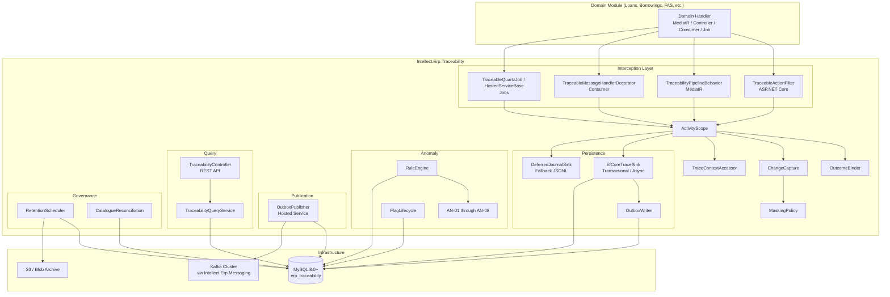
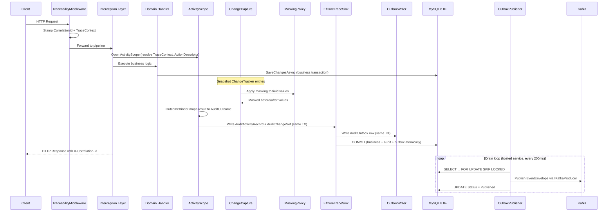
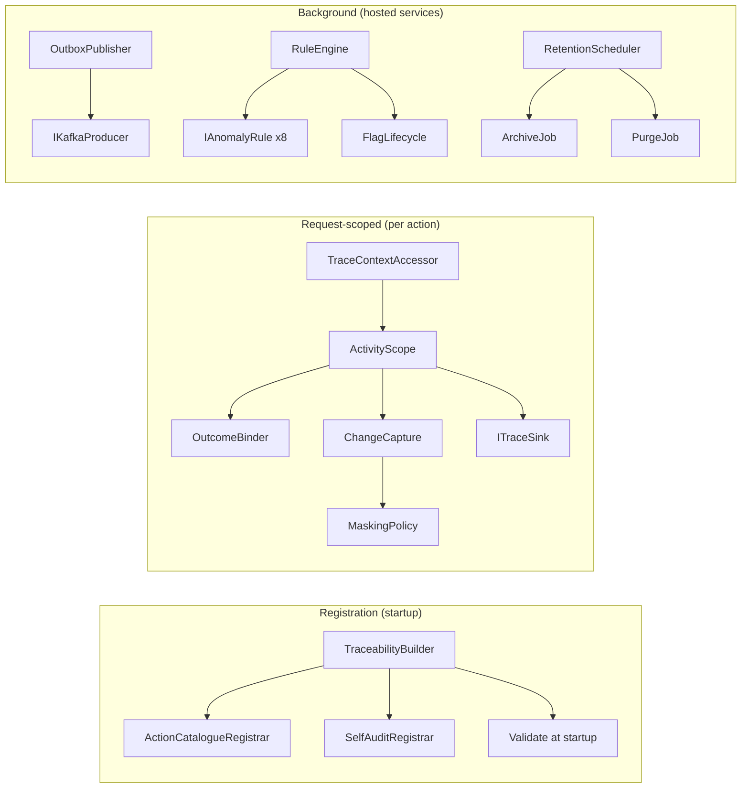
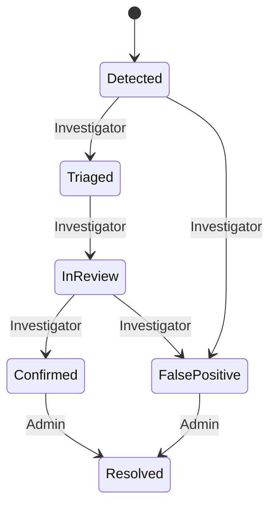
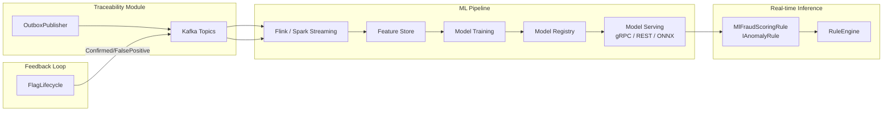
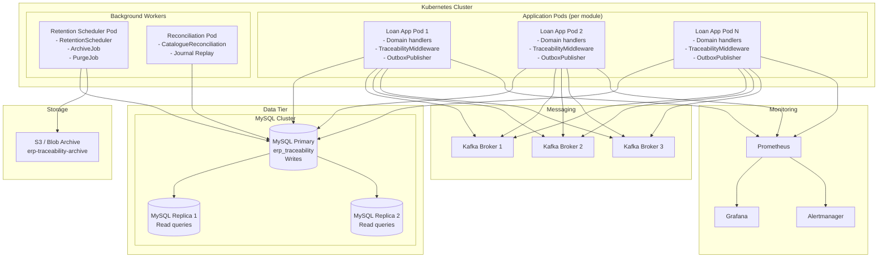

# Intellect.Erp.Traceability — Developer User Guide

> **Module Version:** 1.0.0  
> **Runtime:** .NET 8 / C# 12  
> **Database:** MySQL 8.0+ (InnoDB, `utf8mb4_0900_ai_ci`)  
> **Messaging:** Kafka via `Intellect.Erp.Messaging` v2.2  
> **Last Updated:** 2026-04-21

---

## Table of Contents

- [1. Problem Statement](#1-problem-statement)
  - [1.1 Why This Module Exists](#11-why-this-module-exists)
  - [1.2 Compliance Gaps Addressed](#12-compliance-gaps-addressed)
  - [1.3 The Cost of Not Having Centralized Traceability](#13-the-cost-of-not-having-centralized-traceability)
  - [1.4 Regulatory Context](#14-regulatory-context)
- [2. Executive Summary](#2-executive-summary)
  - [2.1 What the Module Does](#21-what-the-module-does)
  - [2.2 Key Capabilities](#22-key-capabilities)
  - [2.3 Target Audience](#23-target-audience)
  - [2.4 Technology Stack](#24-technology-stack)
- [3. Architecture](#3-architecture)
  - [3.1 High-Level Architecture Diagram](#31-high-level-architecture-diagram)
  - [3.2 Request Flow — Transactional Mode](#32-request-flow--transactional-mode)
  - [3.3 Package and Namespace Structure](#33-package-and-namespace-structure)
  - [3.4 Component Interaction](#34-component-interaction)
  - [3.5 Data Flow: Capture → Persist → Publish → Query](#35-data-flow-capture--persist--publish--query)
  - [3.6 Key Design Decisions](#36-key-design-decisions)
- [4. Features](#4-features)
  - [4.1 Declarative Activity Registration](#41-declarative-activity-registration)
  - [4.2 Context Enrichment](#42-context-enrichment)
  - [4.3 Interception Across 4 Execution Models](#43-interception-across-4-execution-models)
  - [4.4 Outcome Binding](#44-outcome-binding)
  - [4.5 Before/After Change Capture](#45-beforeafter-change-capture)
  - [4.6 Sensitivity Masking](#46-sensitivity-masking)
  - [4.7 MySQL Persistence](#47-mysql-persistence)
  - [4.8 Outbox-Driven Kafka Publication](#48-outbox-driven-kafka-publication)
  - [4.9 Query and Investigation API](#49-query-and-investigation-api)
  - [4.10 Anomaly Rule Engine](#410-anomaly-rule-engine)
  - [4.11 Flag Lifecycle State Machine](#411-flag-lifecycle-state-machine)
  - [4.12 Retention, Archival, and Legal Hold](#412-retention-archival-and-legal-hold)
  - [4.13 Self-Audit](#413-self-audit)
  - [4.14 Observability](#414-observability)
  - [4.15 Testing Package](#415-testing-package)
  - [4.16 Schema Versioning](#416-schema-versioning)
  - [4.17 Machine Learning Integration Points](#417-machine-learning-integration-points)
- [5. Configuration — Developer Perspective](#5-configuration--developer-perspective)
  - [5.1 Adding the NuGet Package](#51-adding-the-nuget-package)
  - [5.2 Program.cs / Startup.cs Wiring](#52-programcs--startupcs-wiring)
  - [5.3 Annotating a MediatR Handler](#53-annotating-a-mediatr-handler)
  - [5.4 Annotating a Controller Action](#54-annotating-a-controller-action)
  - [5.5 Annotating a Kafka Consumer](#55-annotating-a-kafka-consumer)
  - [5.6 Annotating a Hosted Service / Quartz Job](#56-annotating-a-hosted-service--quartz-job)
  - [5.7 Using the Fluent Registration DSL](#57-using-the-fluent-registration-dsl)
  - [5.8 Configuring Masking Policies](#58-configuring-masking-policies)
  - [5.9 Writing Unit Tests with the Testing Package](#59-writing-unit-tests-with-the-testing-package)
  - [5.10 Complete appsettings.json Reference](#510-complete-appsettingsjson-reference)
- [6. Configuration — DevOps Perspective](#6-configuration--devops-perspective)
  - [6.1 MySQL Database Setup](#61-mysql-database-setup)
  - [6.2 Connection String Configuration](#62-connection-string-configuration)
  - [6.3 Kafka Topic Provisioning](#63-kafka-topic-provisioning)
  - [6.4 Health Check Endpoint Configuration](#64-health-check-endpoint-configuration)
  - [6.5 OpenTelemetry Metrics Scraping](#65-opentelemetry-metrics-scraping)
  - [6.6 Retention Scheduler Cron Configuration](#66-retention-scheduler-cron-configuration)
  - [6.7 Deferred Journal Path and Disk Provisioning](#67-deferred-journal-path-and-disk-provisioning)
  - [6.8 Environment Variables and Secret Management](#68-environment-variables-and-secret-management)
  - [6.9 Scaling Considerations](#69-scaling-considerations)
- [7. Deployment Diagram and Details](#7-deployment-diagram-and-details)
  - [7.1 Deployment Architecture](#71-deployment-architecture)
  - [7.2 Pod-Level Detail](#72-pod-level-detail)
  - [7.3 Database Migration Strategy](#73-database-migration-strategy)
  - [7.4 Blue-Green / Rolling Deployment](#74-blue-green--rolling-deployment)
  - [7.5 Partition Rotation Automation](#75-partition-rotation-automation)
- [8. Troubleshooting Guide](#8-troubleshooting-guide)
  - [8.1 My Audit Records Aren't Being Written](#81-my-audit-records-arent-being-written)
  - [8.2 Outbox Is Growing but Not Draining](#82-outbox-is-growing-but-not-draining)
  - [8.3 Anomaly Rules Aren't Firing](#83-anomaly-rules-arent-firing)
  - [8.4 Queries Return Empty Results](#84-queries-return-empty-results)
  - [8.5 Masking Isn't Applied](#85-masking-isnt-applied)
  - [8.6 Health Check Failing](#86-health-check-failing)
  - [8.7 Key Log Messages to Search For](#87-key-log-messages-to-search-for)
  - [8.8 Key Metrics and Alert Thresholds](#88-key-metrics-and-alert-thresholds)
- [9. Glossary](#9-glossary)
  - [9.1 Domain Terms](#91-domain-terms)
  - [9.2 Enum Values](#92-enum-values)
  - [9.3 Role Names and Permissions](#93-role-names-and-permissions)
- [10. Correctness Properties](#10-correctness-properties)
- [11. API Reference](#11-api-reference)
  - [11.1 REST Endpoints](#111-rest-endpoints)
  - [11.2 Library Facade — ITraceabilityQuery](#112-library-facade--itraceabilityquery)
  - [11.3 Key DTOs](#113-key-dtos)
- [12. Data Model Reference](#12-data-model-reference)
  - [12.1 AuditActivity Table](#121-auditactivity-table)
  - [12.2 AuditChangeSet Table](#122-auditchangeset-table)
  - [12.3 AuditOutbox Table](#123-auditoutbox-table)
  - [12.4 AnomalyFlag Table](#124-anomalyflag-table)
  - [12.5 Supporting Tables](#125-supporting-tables)
  - [12.6 Index Listing](#126-index-listing)
  - [12.7 Partition Strategy](#127-partition-strategy)
- [13. Appendices](#13-appendices)
  - [A. Action Name Taxonomy Rules](#a-action-name-taxonomy-rules)
  - [B. Anomaly Rule Catalogue](#b-anomaly-rule-catalogue)
  - [C. Self-Audit Event Catalogue](#c-self-audit-event-catalogue)
  - [D. Kafka Topic Naming Convention](#d-kafka-topic-naming-convention)
  - [E. Retention Class Durations](#e-retention-class-durations)

---

## 1. Problem Statement

### 1.1 Why This Module Exists

Enterprise ERP systems process thousands of business-critical operations daily — loan approvals, fund disbursements, voucher postings, account modifications, and regulatory filings. Every one of these operations must be traceable. Regulators, auditors, and internal compliance teams need to answer questions like: *Who approved this loan? When? What changed? Was the approval legitimate?*

Before `Intellect.Erp.Traceability`, each domain module (Loans, Borrowings, FAS/Accounting, Deposits, Membership, Procurement) implemented its own bespoke audit trail. This led to:

- **Inconsistent audit schemas** across modules — different column names, different granularity, different retention policies.
- **Duplicated persistence code** — every team writing their own `INSERT INTO audit_log` statements, each with different error handling and retry logic.
- **Fragmented correlation** — no way to trace a business flow that spans multiple modules (e.g., a loan approval that triggers a voucher posting that triggers a fund transfer).
- **No centralized anomaly detection** — suspicious patterns (impossible travel, out-of-hours access, high reversal concentration) went undetected because each module's audit data lived in isolation.
- **Inconsistent masking** — some modules masked sensitive data, others did not. Some masked at query time, others at write time. Some not at all.

The Traceability module exists to replace all of this with a single, shared, compliance-grade audit infrastructure that domain teams adopt through declaration rather than implementation.

### 1.2 Compliance Gaps Addressed

| Gap | How the Module Addresses It |
|---|---|
| No unified audit schema | Single `AuditActivityRecord` schema with 40+ fields covering actor, action, entity, timing, source, outcome, correlation, and classification |
| Missing correlation across modules | End-to-end `CorrelationId`/`CausationId`/`SagaId` propagation across HTTP, Kafka, and saga boundaries |
| Inconsistent data retention | Four retention classes (`SHORT_90D`, `STANDARD_3Y`, `EXTENDED_7Y`, `REGULATORY_10Y`) with automated archival and purge |
| Sensitive data exposure in audit logs | Write-time masking with four strategies (`None`, `EmailMask`, `LastFour`, `Token`); `RESTRICTED` values are never stored raw |
| No anomaly detection | Eight deterministic rules (AN-01 through AN-08) with configurable thresholds, shadow mode, and kill switches |
| Audit-of-audit gap | Ten self-audit events ensure the module's own operations are traceable |
| No governed onboarding | Action catalogue with taxonomy validation, startup reconciliation, and governance review |

### 1.3 The Cost of Not Having Centralized Traceability

Without a centralized traceability module, organizations face:

- **Regulatory risk** — Audit findings for incomplete or inconsistent trails. In financial services, this can result in fines, consent orders, or license restrictions.
- **Investigation delays** — When an incident occurs, investigators must query multiple databases with different schemas, manually correlate records, and hope that the relevant module captured enough detail. A 15-minute investigation becomes a multi-day effort.
- **Engineering overhead** — Every new module reinvents audit capture. Across 6+ domain modules, this represents hundreds of engineering hours duplicated.
- **Data quality degradation** — Without validation, mandatory fields go missing. Without masking enforcement, sensitive data leaks into audit tables. Without retention policies, storage grows unbounded.
- **Blind spots** — Cross-module anomalies (e.g., a user approving their own loan in one module and posting the voucher in another) are invisible when audit data is siloed.

### 1.4 Regulatory Context

The module is designed to satisfy audit trail requirements common across financial regulatory frameworks:

- **Audit trail completeness** — Every business-critical operation must produce a tamper-evident record with actor identity, timestamp, action, and outcome.
- **Data retention** — Records must be retained for periods ranging from 90 days (operational) to 10 years (regulatory), with the ability to apply legal holds that prevent purge.
- **Privacy and data minimization** — Sensitive data (PII, account numbers, PAN) must be masked or tokenized at rest. Detokenization requires elevated privileges and is itself audited.
- **Access control** — Audit data access must be role-based and tenant-scoped. Cross-tenant queries are prohibited by default.
- **Anomaly detection** — Suspicious patterns must be flagged for investigation with a governed triage workflow.
- **Audit of audit** — Changes to the audit system itself (rule changes, catalogue updates, retention operations) must be recorded.

---

## 2. Executive Summary

### 2.1 What the Module Does

`Intellect.Erp.Traceability` is a shared .NET 8 / C# library delivered as a single NuGet package that provides compliance-grade traceability and audit capabilities across all ERP domain modules. Domain teams declare traceable business actions through attributes and a fluent registration DSL. The module handles everything else: context capture, structured persistence to MySQL 8.0+, outbox-driven Kafka publication, queryable read models, deterministic anomaly detection, and governance (retention, masking, catalogue reconciliation).

The design follows the `utils-messaging` consolidation pattern: multiple logical sub-namespaces inside a single deployable project. The module is explicitly broader than a transport library — the compliance-grade source of truth is structured persistence in MySQL; Kafka is used for asynchronous distribution and anomaly pipelines via the existing messaging outbox.

### 2.2 Key Capabilities

- **Declarative capture** — Annotate handlers with `[TraceableAction]`, `[TraceableConsumer]`, or `[TraceableJob]`; no audit persistence code in domain modules.
- **Four interception models** — ASP.NET Core action filters, MediatR pipeline behaviors, Kafka consumer decorators, and hosted service/Quartz job wrappers.
- **Rich context enrichment** — Actor identity, tenant scope, correlation chain, saga context, geo-location, and source metadata captured automatically.
- **Seven terminal outcomes** — `Started`, `Succeeded`, `Failed`, `Rejected`, `Compensated`, `TimedOut`, `Cancelled`.
- **Field-level change capture** — Before/after deltas from EF Core `ChangeTracker` with allow-lists and `[Redact]` exclusions.
- **Write-time masking** — Four strategies (`None`, `EmailMask`, `LastFour`, `Token`) enforced at persistence time, not query time.
- **MySQL 8.0+ persistence** — Transactional, async, and deferred journal modes with partitioned tables and batched writes.
- **Outbox-driven Kafka publication** — Five canonical topics with active-active drain via `SELECT … FOR UPDATE SKIP LOCKED`.
- **Query and investigation API** — REST endpoints and `ITraceabilityQuery` facade with tenant isolation, role-based access, and sensitivity redaction.
- **Anomaly rule engine** — Eight deterministic rules with three modes (active, shadow, disabled), per-rule timeouts, and kill switches.
- **Flag lifecycle** — Governed state machine (`Detected → Triaged → InReview → Confirmed → Resolved`) with role-based transitions.
- **Retention and archival** — Four retention classes, automated archival to S3/Blob, legal hold support, partition rotation.
- **Self-audit** — Ten self-audit events for the module's own administrative operations.
- **Observability** — Nine OpenTelemetry metrics, composite health checks, structured logging.
- **Testing package** — Fakes, harnesses, builders, and in-memory DB for unit and integration tests.

### 2.3 Target Audience

| Audience | What They Care About |
|---|---|
| **Domain module developers** | How to annotate handlers, configure change capture, write tests, and onboard new actions |
| **Platform engineers** | Architecture, persistence modes, outbox mechanics, performance budgets, scaling |
| **Compliance officers** | Retention policies, masking guarantees, self-audit completeness, flag lifecycle |
| **SREs / DevOps** | Deployment, health checks, metrics, alerting, troubleshooting, partition maintenance |

### 2.4 Technology Stack

| Component | Technology |
|---|---|
| Runtime | .NET 8 / C# 12 |
| Database | MySQL 8.0+ (InnoDB, `utf8mb4_0900_ai_ci`) |
| ORM | Entity Framework Core 8 via Pomelo.EntityFrameworkCore.MySql |
| Messaging | Apache Kafka via `Intellect.Erp.Messaging` v2.2 |
| Metrics | OpenTelemetry (`System.Diagnostics.Metrics`) |
| Health checks | `Microsoft.Extensions.Diagnostics.HealthChecks` |
| ID generation | ULID (`Ulid` library) — `CHAR(26)`, time-sortable |
| Resilience | Polly (retry, circuit breaker) |
| Scheduling | Quartz.NET (retention scheduler, windowed rule evaluation) |
| Testing | xUnit, FluentAssertions, Moq, FsCheck, Testcontainers |

---

## 3. Architecture

### 3.1 High-Level Architecture Diagram



### 3.2 Request Flow — Transactional Mode

The following sequence diagram shows the complete flow for an HTTP request with `PersistenceMode=Transactional`:



### 3.3 Package and Namespace Structure

The module follows the `utils-messaging` consolidation pattern — a single NuGet package with internal namespace hierarchy:

| Namespace | Responsibility | Key Types |
|---|---|---|
| `Contracts` | Records, enums, envelope extensions | `AuditActivityRecord`, `AuditOutcome`, `Sensitivity`, `RetentionClass`, `TraceContext`, `ActionDescriptor` |
| `Core.Attributes` | Declarative annotations | `[TraceableAction]`, `[TraceableConsumer]`, `[TraceableJob]`, `[Redact]` |
| `Core.Abstractions` | Extension points | `ITraceContextAccessor`, `ITraceSink`, `IMaskingPolicy`, `IRetentionPolicy`, `IEntityIdResolver`, `IAuditEnricher` |
| `Core.Interception` | Capture mechanics | `ActivityScope`, `OutcomeBinder`, `ChangeCapture` |
| `Core.Registration` | DI wiring and validation | `TraceabilityBuilder`, `ActionCatalogueRegistrar`, `SelfAuditRegistrar` |
| `Core.Options` | Strongly-typed configuration | `TraceabilityOptions` and 20+ sub-option classes |
| `AspNetCore` | HTTP pipeline integration | `TraceabilityMiddleware`, `TraceableActionFilter`, `RequestContextEnricher` |
| `Mediatr` | MediatR pipeline integration | `TraceabilityPipelineBehavior<TRequest,TResponse>` |
| `Consumer` | Kafka consumer integration | `TraceableMessageHandlerDecorator<T>` |
| `Jobs` | Background job integration | `TraceableHostedServiceBase`, `TraceableQuartzJob` |
| `Storage.EfCore` | EF Core DbContext and entities | `TraceabilityDbContext`, entity configurations, migrations |
| `Storage.Sinks` | Write implementations | `EfCoreTraceSink`, `DeferredJournalSink` |
| `Outbox` | Reliable publication | `AuditOutboxWriter`, `AuditOutboxPublisher` |
| `Query` | Read models and REST API | `ITraceabilityQuery`, `TraceabilityQueryService`, `TraceabilityController` |
| `Anomaly` | Rule engine and flags | `IAnomalyRule`, `RuleEngine`, `FlagLifecycle`, AN-01 through AN-08 |
| `Retention` | Archival and purge | `RetentionScheduler`, `ArchiveJob`, `PurgeJob` |
| `Telemetry` | Metrics and health | `TraceabilityMeter`, `TraceabilityActivitySource`, `TraceabilityHealthCheck` |
| `Testing` | Test infrastructure | `FakeTraceSink`, `FakeTraceContextAccessor`, `InMemoryTraceabilityDb`, `AnomalyRuleHarness`, `TestBuilders` |

### 3.4 Component Interaction



### 3.5 Data Flow: Capture → Persist → Publish → Query

1. **Capture** — The interception layer (filter, behavior, decorator, or job wrapper) opens an `ActivityScope`. The `TraceContextAccessor` resolves actor, tenant, correlation, saga, and geo context from the ambient environment (HTTP context, message envelope, `Activity.Current`, `ClaimsPrincipal`).

2. **Persist** — On scope dispose, the `OutcomeBinder` determines the terminal outcome. If `CaptureBeforeAfter=true`, `ChangeCapture` snapshots EF Core `ChangeTracker` entries, applies the field allow-list, honors `[Redact]`, and delegates to `IMaskingPolicy` for value transformation. The `EfCoreTraceSink` writes the `AuditActivityRecord` and `AuditChangeSet` rows. In `Transactional` mode, this happens inside the same database transaction as the business operation. The `OutboxWriter` writes an `AuditOutbox` row in the same transaction if `PublishToKafka=true`.

3. **Publish** — The `AuditOutboxPublisher` hosted service polls the `AuditOutbox` table using `SELECT … FOR UPDATE SKIP LOCKED` (MySQL 8.0 native), serializes payloads into `EventEnvelope<T>`, and publishes to Kafka via `IKafkaProducer`. Multiple publisher instances can run concurrently (active-active) without contention.

4. **Query** — The `TraceabilityQueryService` (and its REST controller) provides tenant-scoped, role-gated, sensitivity-redacted queries. Investigators can query by entity timeline, actor history, correlation trail, or flag queue.

### 3.6 Key Design Decisions

| # | Decision | Rationale |
|---|---|---|
| 1 | **Declaration over duplication** | Public API is attributes + fluent DSL + middleware/interceptors. Domain modules never write audit rows directly. This eliminates duplicated persistence code and ensures consistent schema. |
| 2 | **DB as evidence source** | Activity rows are written inside the business transaction when `PersistenceMode=Transactional`. Kafka is always secondary via the outbox. The database is the compliance-grade source of truth; Kafka is for distribution. |
| 3 | **MySQL-only persistence** | The sole supported RDBMS is MySQL 8.0+ (InnoDB, `utf8mb4_0900_ai_ci`), using Pomelo EF Core provider. No other provider is permitted. This aligns with the ERP data tier and avoids multi-provider complexity. |
| 4 | **Outcome completeness** | Interceptors always emit a terminal outcome (`Succeeded`, `Failed`, `Rejected`, `Compensated`, `TimedOut`, `Cancelled`) even on exception, timeout, or cancellation. No business operation goes unrecorded. |
| 5 | **Correlation first** | `CorrelationId`/`CausationId`/`TraceId`/`SagaId` are always stamped. Missing correlation is a data-quality violation, not a silent omission. This enables cross-module investigation. |
| 6 | **Privacy at write time** | Sensitivity labels and masking rules are enforced at persistence time, not query time. `RESTRICTED` field values are never stored raw. This is a defense-in-depth measure — even a database breach does not expose raw sensitive data. |
| 7 | **Active-active outbox drain** | MySQL 8.0 `SELECT … FOR UPDATE SKIP LOCKED` enables multiple publisher instances without contention. This aligns with `Intellect.Erp.Messaging.Kafka.Outbox` and supports horizontal scaling of the publication path. |

---

## 4. Features

### 4.1 Declarative Activity Registration

The module supports two registration approaches:

**Attribute-based (recommended for most cases):**

- `[TraceableAction]` — For MediatR handlers and ASP.NET Core controller actions
- `[TraceableConsumer]` — For Kafka consumer handlers
- `[TraceableJob]` — For hosted services and Quartz jobs

Each attribute accepts properties for action name, entity type, entity ID resolution, severity, sensitivity, retention class, change capture settings, Kafka publication flag, and rule profile.

**Fluent DSL (for dynamic or cross-cutting registration):**

```csharp
builder.RegisterAction("Loan.Approve")
    .ForEntity("Loan", sel => sel.FromArg<ApproveLoanCommand>(c => c.LoanId))
    .WithSeverity(TraceSeverity.Critical)
    .CaptureBeforeAfter(fields: new[] { "Status", "ApprovedAmount" })
    .PublishToKafka()
    .UseRuleProfile("high-risk-approval")
    .WithSensitivity(Sensitivity.CONFIDENTIAL)
    .WithRetention(RetentionClass.REGULATORY_10Y);
```

All action names must follow the taxonomy regex `^[A-Z][A-Za-z0-9]+\.[A-Z][A-Za-z0-9]+\.[A-Z][A-Za-z0-9.]+$` (at least three dot-separated segments, each starting with an uppercase letter). Validation runs at DI composition time; invalid names fail application startup.

### 4.2 Context Enrichment

The `ITraceContextAccessor` resolves the following context automatically:

| Context Group | Fields | Source |
|---|---|---|
| **Actor** | `UserId`, `UserName`, `Role`, `ImpersonatingUserId` | `ClaimsPrincipal` (HTTP), `EventEnvelope` headers (Kafka), job context |
| **Tenant** | `TenantId`, `StateCode`, `Scope` | Claims, message context, configuration default |
| **Correlation** | `CorrelationId`, `CausationId`, `TraceId`, `SpanId`, `SagaId`, `SagaStep` | HTTP headers (`X-Correlation-Id`, `traceparent`), `Activity.Current`, `EventEnvelope` headers |
| **Origin** | `Channel`, `SourceSystem`, `BranchCode`, `DeviceId`, `IpAddress`, `UserAgent` | HTTP context, message context |
| **Geo** | `Latitude`, `Longitude`, `GeoHash`, `GeoAccuracyMeters`, `LocationSource` | HTTP headers, branch terminal lookup, IP geolocation |

When a mandatory field (`UserId`, `TenantId`, `CorrelationId`) is missing, the module records a data-quality violation metric (`erp_traceability_dq_missing_field_total`) and persists the activity with available fields. It does not fail the business operation.

### 4.3 Interception Across 4 Execution Models

| Model | Interceptor | Trigger | Registration |
|---|---|---|---|
| **ASP.NET Core** | `TraceableActionFilter` | `[TraceableAction]` on controller action | `.WithAspNetCoreCapture()` |
| **MediatR** | `TraceabilityPipelineBehavior<TRequest,TResponse>` | `[TraceableAction]` on handler class | `.WithMediatrCapture()` |
| **Kafka Consumer** | `TraceableMessageHandlerDecorator<T>` | `[TraceableConsumer]` on `IMessageHandler<T>` | `.WithConsumerCapture()` |
| **Jobs** | `TraceableHostedServiceBase` / `TraceableQuartzJob` | `[TraceableJob]` on job class | `.WithJobsCapture()` |

Each interceptor:
1. Opens an `ActivityScope` with resolved `TraceContext` and `ActionDescriptor`
2. Executes the business logic
3. On completion (success or failure), invokes `OutcomeBinder` to determine the terminal outcome
4. Invokes `ChangeCapture` if `CaptureBeforeAfter=true`
5. Writes via `ITraceSink`
6. Never propagates audit errors to business code

### 4.4 Outcome Binding

The `OutcomeBinder` maps execution results to one of seven `AuditOutcome` values:

| Execution Result | Outcome | Notes |
|---|---|---|
| No exception, no cancellation | `Succeeded` | Default happy path |
| `ValidationException` or domain policy rejection | `Rejected` | Distinguishes business rejections from technical failures |
| Unhandled exception | `Failed` | `ErrorCategory` is populated from the exception type |
| `OperationCanceledException` + `CaptureCancellationAsTimedOut=true` | `TimedOut` | Configurable behavior |
| `OperationCanceledException` + `CaptureCancellationAsTimedOut=false` | `Cancelled` | Default cancellation mapping |
| Saga compensation applied | `Compensated` | For saga rollback scenarios |
| `WriteStartRecord=true` at scope open | `Started` | Intermediate; replaced by terminal outcome at scope close |

The mapping is a total function: every possible execution result maps to exactly one outcome. The `ActivityScope` guarantees exactly one terminal outcome per action execution, even when multiple exceptions or re-entrant dispose calls occur.

### 4.5 Before/After Change Capture

Change capture is opt-in per action via `CaptureBeforeAfter=true`. The `ChangeCapture` component:

1. Snapshots EF Core `ChangeTracker` entries after `SaveChangesAsync`
2. Applies the `CaptureFields` allow-list (if specified; otherwise captures all non-navigation scalar fields)
3. Excludes any field marked with `[Redact]` — regardless of allow-list contents
4. Enforces `MaxFieldsPerActivity` (default 64); excess fields are truncated with a metric increment
5. Delegates to `IMaskingPolicy` for value transformation before persistence
6. Produces `AuditChangeSet` rows with `BeforeValueMasked` and `AfterValueMasked` columns

Example entity with `[Redact]`:

```csharp
public class Loan
{
    public Guid Id { get; set; }
    public string Status { get; set; } = "Draft";
    public decimal ApprovedAmount { get; set; }

    [Redact]  // Never captured in change sets
    public string InternalNotes { get; set; } = "";
}
```

### 4.6 Sensitivity Masking

The `IMaskingPolicy` applies four masking strategies based on sensitivity classification:

| Sensitivity | Strategy | Behavior |
|---|---|---|
| `PUBLIC` | `None` | Value stored and returned as-is |
| `INTERNAL` | `None` | Value stored and returned as-is |
| `CONFIDENTIAL` | `EmailMask` or `LastFour` | Value partially masked (e.g., `j***@example.com`, `****4821`) |
| `RESTRICTED` | `Token` | Value replaced with a token; raw value never stored. Token contains no substring of 4+ characters from the original. |

Masking is enforced at write time. The `BeforeValueMasked` and `AfterValueMasked` columns in `AuditChangeSet` contain only masked/tokenized output. When `TreatMissingMaskingPolicyAsError=true` (default), a field with no matching policy fails the capture rather than persisting an unmasked value.

Detokenization requires the `Traceability.ComplianceOfficer` role plus a non-empty justification string, and emits a `Traceability.Detokenization.Performed` self-audit activity.

### 4.7 MySQL Persistence

The module supports three persistence modes:

| Mode | Behavior | Trade-off |
|---|---|---|
| `Transactional` | Audit record written in the same DB transaction as the business operation | Atomicity guaranteed; if business TX rolls back, audit rolls back too |
| `BestEffortAsync` | Audit record buffered via in-process async channel with bounded capacity | Lower latency; potential loss on process crash |
| `DeferredQueue` | Audit record written to local JSONL file; reconciliation job replays to DB | Fallback for DB outages; zero evidence loss on recovery |

Key persistence features:
- **ULID primary keys** — `CHAR(26)`, monotonically sortable by generation time
- **Monthly partitioning** — `PARTITION BY RANGE (TO_DAYS(OccurredAtUtc))` with nightly rotation
- **Batched writes** — Multi-row `INSERT` statements targeting 50–200 rows per flush
- **Deadlock retry** — Exponential backoff with jitter for `ER_LOCK_DEADLOCK (1213)` and `ER_LOCK_WAIT_TIMEOUT (1205)`
- **Deferred journal fallback** — Local append-only JSONL when MySQL is unavailable

### 4.8 Outbox-Driven Kafka Publication

The outbox pattern ensures reliable publication with zero message loss after database commit:

1. `AuditOutboxWriter` writes an `AuditOutbox` row in the same transaction as the `AuditActivityRecord`
2. `AuditOutboxPublisher` (hosted service) polls with `SELECT … FOR UPDATE SKIP LOCKED`
3. Serializes payload into `EventEnvelope<T>` via `Intellect.Erp.Messaging`
4. Publishes to Kafka via `IKafkaProducer`
5. Marks row as `Published` on success

**Five canonical topics:**

| Topic | Event Type | When Published |
|---|---|---|
| `activityRecorded.v1` | Successful activity | Action completes with `Succeeded` outcome |
| `activityFailed.v1` | Failed activity | Action completes with `Failed`, `Rejected`, `TimedOut`, or `Cancelled` outcome |
| `anomalyDetected.v1` | Anomaly flag | Rule engine detects a match |
| `caseEscalated.v1` | Case escalation | Flag linked to external case system |
| `retentionLifecycleChanged.v1` | Retention event | Archive, purge, or legal hold operation |

The outbox supports active-active deployment: multiple publisher instances can drain concurrently without contention or duplicate publication, thanks to `SKIP LOCKED` and the unique key `(AuditId, Topic, EventType)`.

### 4.9 Query and Investigation API

The module exposes both REST endpoints and a library facade for querying audit data:

**REST endpoints** (all require `Traceability.Reader` role minimum):
- `GET /api/traceability/activities?entityType=Loan&entityId=LN-2026-004821` — Entity timeline
- `GET /api/traceability/activities?userId=u12345&from=2026-04-01&to=2026-04-30` — Actor history
- `GET /api/traceability/activities?correlationId=c-01J...` — Correlation trail
- `GET /api/traceability/flags?state=Detected&severity=High` — Flag queue

**Library facade** (`ITraceabilityQuery`):
- `GetEntityTimelineAsync(entityType, entityId, options, ct)`
- `GetActorHistoryAsync(userId, range, options, ct)`
- `GetCorrelationTrailAsync(correlationId, ct)`
- `GetFlagQueueAsync(filter, ct)`

All queries enforce tenant scope, apply sensitivity redaction based on caller role, and paginate results (default 50, max 500).

### 4.10 Anomaly Rule Engine

The `RuleEngine` evaluates registered `IAnomalyRule` implementations against persisted activities:

| Rule Code | Name | Evaluation Mode | Default Mode |
|---|---|---|---|
| AN-01 | Impossible Travel | In-process (per activity) | Active |
| AN-02 | High Reversal Concentration | Windowed (scheduled) | Active |
| AN-03 | Repeated Fail-Then-Success | In-process | Shadow |
| AN-04 | Maker-Checker Concern | In-process | Active |
| AN-05 | Out-of-Hours Risk | In-process | Active |
| AN-06 | Saga Inconsistency | Windowed | Shadow |
| AN-07 | Volume Spike | Windowed | Active |
| AN-08 | Repeated DLT on Entity | In-process | Shadow |

Rules operate in three modes:
- **Active** — Flags are persisted and external notifications are emitted
- **Shadow** — Flags are persisted but no external notifications (observation period)
- **Disabled** — Evaluation is skipped entirely

The engine enforces a per-rule evaluation time budget (default 20 ms). Rules exceeding the budget are dropped to shadow mode with an alert. De-duplication prevents duplicate flags from re-evaluation.

### 4.11 Flag Lifecycle State Machine



Every transition:
- Validates the caller's role (`Traceability.Investigator` for triage/review, `Traceability.Admin` for resolution)
- Persists the `AnomalyFlag` update
- Emits a `Traceability.Flag.Transition` self-audit activity

### 4.12 Retention, Archival, and Legal Hold

The `RetentionScheduler` runs on a configurable cron schedule (default `0 30 2 * * ?` — 2:30 AM daily):

1. Identifies `RetentionTag` rows past `ExpiresAtUtc`
2. Checks for active legal holds — if present, skips purge regardless of expiry
3. Archives to `IAuditArchiveSink` (S3 / Azure Blob)
4. Purges only after archive acknowledgment
5. Emits self-audit activities for each operation
6. Coordinates with MySQL partition rotation

Four retention classes with configurable durations:

| Class | Default Duration | Archive Before Purge |
|---|---|---|
| `SHORT_90D` | 90 days | No |
| `STANDARD_3Y` | 1,095 days (3 years) | Yes |
| `EXTENDED_7Y` | 2,555 days (7 years) | Yes |
| `REGULATORY_10Y` | 3,650 days (10 years) | Yes |

### 4.13 Self-Audit

The module audits its own administrative operations through 10 self-audit events:

| # | Action Name | Trigger |
|---|---|---|
| 1 | `Traceability.Catalogue.ActionRegistered` | New action registered in catalogue |
| 2 | `Traceability.Catalogue.ActionDeprecated` | Action deprecated in catalogue |
| 3 | `Traceability.Rule.Activated` | Rule mode changed to Active |
| 4 | `Traceability.Rule.Deactivated` | Rule mode changed to Disabled |
| 5 | `Traceability.Rule.ThresholdChanged` | Rule thresholds modified |
| 6 | `Traceability.Flag.Transition` | Flag state transition |
| 7 | `Traceability.Retention.Archived` | Records archived |
| 8 | `Traceability.Retention.Purged` | Records purged |
| 9 | `Traceability.Retention.LegalHoldApplied` | Legal hold applied or released |
| 10 | `Traceability.Detokenization.Performed` | Detokenization requested |

All self-audit actions are registered with `CaptureBeforeAfter=true` and `PublishToKafka=true`.

### 4.14 Observability

**Nine OpenTelemetry metrics** (meter name: `Intellect.Erp.Traceability`):

| Metric | Type | Description |
|---|---|---|
| `erp_traceability_activities_total` | Counter | Total audit activities captured (labels: `module`, `action`, `outcome`) |
| `erp_traceability_capture_overhead_ms` | Histogram | Capture overhead per action in ms (label: `mode`) |
| `erp_traceability_sink_write_ms` | Histogram | Sink write duration in ms |
| `erp_traceability_outbox_queue_depth` | Gauge | Current outbox pending row count |
| `erp_traceability_outbox_publish_lag_ms` | Histogram | DB commit to Kafka publish lag in ms |
| `erp_traceability_flags_total` | Counter | Anomaly flags raised (labels: `rule`, `severity`, `state`) |
| `erp_traceability_rule_eval_ms` | Histogram | Rule evaluation duration in ms (label: `rule`) |
| `erp_traceability_masking_failures_total` | Counter | Masking failures |
| `erp_traceability_dq_missing_field_total` | Counter | Data-quality missing field violations (label: `field`) |

**Health checks** (composite, registered as `traceability`):
1. Database reachability — Can the `TraceabilityDbContext` connect?
2. Outbox backlog depth — Is the pending count below `MaxInFlight * 2`?
3. Rule engine heartbeat — Are rules registered in the catalogue?
4. Deferred journal drain — Are there pending `.jsonl` files?

**Structured logging levels:**
- `Information` — Activity persistence
- `Warning` — Data-quality violations, masking failures, rule evaluation timeouts, capture overhead budget exceeded
- `Error` — Persistence failures, outbox publication failures, rule exceptions

### 4.15 Testing Package

The module provides a testing package for unit and integration tests without requiring a real database or Kafka broker:

| Component | Purpose |
|---|---|
| `FakeTraceSink` | Records all written activities and change sets in memory; exposes `AssertActivityWritten`, `AssertChangeSetContains`, `AssertNoRestrictedFieldsInChanges` |
| `FakeTraceContextAccessor` | Accepts configurable user, tenant, and correlation values |
| `FakeMaskingPolicy` | Configurable masking behavior for tests |
| `InMemoryTraceabilityDb` | EF Core InMemory provider for integration tests |
| `AnomalyRuleHarness` | Accepts rule implementations and fixture streams; exposes resulting flags |
| `TestBuilders` | Fluent builders for `AuditActivityRecord` and `TraceContext` with sensible defaults |

### 4.16 Schema Versioning

Every `AuditActivityRecord` and Kafka event payload includes a `schemaVersion` integer field (initial value `1`).

- **Additive changes** (new optional fields) — No schema version bump required
- **Breaking changes** (field removal, rename, type change) — Schema version bump required; parallel publication to new major-version topic for at least 30 days
- **CI validation** — Published events are validated against committed JSON Schema fixtures; non-additive changes without a version bump fail the build

### 4.17 Machine Learning Integration Points

The module provides two natural integration surfaces for ML-based anomaly detection, fraud scoring, and behavioral analytics.

#### 4.17.1 Custom Anomaly Rules via `IAnomalyRule`

The `IAnomalyRule` interface is the primary hook for ML model inference at evaluation time. Implement a custom rule that calls your ML scoring service:

```csharp
using Intellect.Erp.Traceability.Anomaly;
using Intellect.Erp.Traceability.Contracts;

public sealed class MlFraudScoringRule : IAnomalyRule
{
    private readonly IFraudScoringClient _mlClient;

    public string Code => "ML-01";
    public int Version => 1;
    public TraceSeverity Severity => TraceSeverity.Critical;
    public RuleMode Mode { get; set; } = RuleMode.Shadow; // Start in shadow mode

    public MlFraudScoringRule(IFraudScoringClient mlClient)
    {
        _mlClient = mlClient;
    }

    public async ValueTask<IReadOnlyList<AnomalyFlag>> EvaluateOnActivityAsync(
        AuditActivityRecord activity,
        IRuleEvaluationContext ctx,
        CancellationToken ct)
    {
        // Build feature vector from the activity record
        var features = new FraudFeatures
        {
            UserId = activity.UserId,
            Action = activity.Action,
            EntityType = activity.EntityType,
            Amount = ExtractAmount(activity),
            Hour = activity.OccurredAtUtc.Hour,
            BranchCode = activity.BranchCode,
            Latitude = activity.Latitude,
            Longitude = activity.Longitude
        };

        // Call ML model (HTTP, gRPC, or in-process ONNX)
        var score = await _mlClient.ScoreAsync(features, ct);

        if (score.FraudProbability < 0.7m)
            return Array.Empty<AnomalyFlag>();

        return new[]
        {
            new AnomalyFlag
            {
                AuditId = activity.AuditId,
                TenantId = activity.TenantId,
                RuleCode = Code,
                RuleVersion = Version,
                Severity = score.FraudProbability > 0.9m
                    ? TraceSeverity.Critical
                    : TraceSeverity.High,
                Score = score.FraudProbability,
                ScopeKey = activity.UserId,
                Bucket = activity.OccurredAtUtc.ToString("yyyy-MM"),
                Evidence = JsonDocument.Parse(JsonSerializer.Serialize(score))
            }
        };
    }

    public ValueTask<IReadOnlyList<AnomalyFlag>> EvaluateWindowedAsync(
        IWindowedStore store, IRuleEvaluationContext ctx, CancellationToken ct)
        => new(Array.Empty<AnomalyFlag>());
}
```

Register the custom rule in DI:

```csharp
builder.Services.AddSingleton<IAnomalyRule, MlFraudScoringRule>();
```

The `RuleEngine` automatically picks up all registered `IAnomalyRule` implementations. The per-rule timeout (default 20 ms) applies — for ML inference that takes longer, increase `PerRuleTimeoutMs` or use the windowed evaluation path for batch scoring.

**Windowed evaluation for batch ML scoring:**

The `IWindowedStore` interface provides access to historical activities for feature engineering:

```csharp
public async ValueTask<IReadOnlyList<AnomalyFlag>> EvaluateWindowedAsync(
    IWindowedStore store, IRuleEvaluationContext ctx, CancellationToken ct)
{
    var now = DateTime.UtcNow;
    var windowStart = now.AddHours(-24);

    // Get all activities in the last 24 hours for batch scoring
    var activities = await store.GetActivitiesAsync(
        tenantId: "all", from: windowStart, to: now, ct);

    // Build feature matrix and call batch ML endpoint
    var scores = await _mlClient.BatchScoreAsync(activities, ct);

    // Return flags for high-scoring activities
    return scores
        .Where(s => s.FraudProbability > 0.7m)
        .Select(s => new AnomalyFlag { /* ... */ })
        .ToList();
}
```

#### 4.17.2 Kafka Event Stream for ML Pipelines

The 5 canonical Kafka topics provide a real-time event stream for offline ML training and online inference:

| Topic | ML Use Case |
|---|---|
| `activityRecorded` | Training data for behavioral models, feature store population |
| `activityFailed` | Error pattern detection, failure prediction models |
| `anomalyDetected` | Feedback loop for model retraining (confirmed vs. false positive) |
| `caseEscalated` | Labeled data for supervised learning (escalated = high risk) |
| `retentionLifecycleChanged` | Data lineage tracking for ML feature stores |

**Architecture for ML integration:**



**Key integration patterns:**

1. **Online scoring** — Implement `IAnomalyRule` that calls a model serving endpoint (TensorFlow Serving, Triton, SageMaker, or in-process ONNX Runtime). Use `EvaluateOnActivityAsync` for real-time, `EvaluateWindowedAsync` for batch.

2. **Offline training** — Consume `activityRecorded` events from Kafka into a feature store (Feast, Tecton, or custom). Train models on historical activity patterns. Deploy to model registry.

3. **Feedback loop** — When investigators confirm or dismiss flags via the `FlagLifecycle`, the `anomalyDetected` and `caseEscalated` events provide labeled data for supervised learning. Consume these events to retrain models.

4. **Feature engineering** — The `AuditActivityRecord` provides 40+ fields suitable for feature extraction: temporal patterns (hour, day of week), geographic patterns (lat/lon, branch code), behavioral patterns (action frequency, outcome distribution), and relational patterns (correlation chains, saga steps).

#### 4.17.3 In-Process ONNX Runtime Example

For low-latency inference without network calls, load an ONNX model directly:

```csharp
public sealed class OnnxFraudRule : IAnomalyRule
{
    private readonly InferenceSession _session;

    public OnnxFraudRule()
    {
        _session = new InferenceSession("models/fraud_detector_v3.onnx");
    }

    public async ValueTask<IReadOnlyList<AnomalyFlag>> EvaluateOnActivityAsync(
        AuditActivityRecord activity, IRuleEvaluationContext ctx, CancellationToken ct)
    {
        var input = BuildInputTensor(activity);
        var results = _session.Run(new[] { NamedOnnxValue.CreateFromTensor("input", input) });
        var score = results.First().AsEnumerable<float>().First();

        if (score < 0.7f) return Array.Empty<AnomalyFlag>();

        return new[] { CreateFlag(activity, (decimal)score) };
    }
}
```

This runs within the 20 ms per-rule budget since ONNX inference is typically sub-millisecond for tabular models.

---

## 5. Configuration — Developer Perspective

### 5.1 Adding the NuGet Package

Add the consolidated package to your project:

```xml
<ItemGroup>
  <!-- Single consolidated package (mirrors utils-messaging consolidation) -->
  <PackageReference Include="Intellect.Erp.Traceability" Version="1.0.0" />

  <!-- You already have these if you use Kafka messaging -->
  <PackageReference Include="Intellect.Erp.Messaging" Version="2.2.0" />
</ItemGroup>
```

The module is delivered as a single NuGet package. Domain modules depend on `Intellect.Erp.Traceability` only — no additional sub-packages are needed.

### 5.2 Program.cs / Startup.cs Wiring

Register the module in your DI container using `AddTraceability()` and the fluent builder:

```csharp
using Intellect.Erp.Traceability.Core;

var builder = WebApplication.CreateBuilder(args);

// Register the Traceability module with all subsystems
builder.Services.AddTraceability(builder.Configuration)
    .WithMySqlStore()                   // Pomelo EF Core → MySQL 8.0+
    .WithMessagingOutbox()              // Outbox-driven Kafka publication
    .WithDefaultRules()                 // AN-01 through AN-08
    .WithAspNetCoreCapture()            // Action filter for [TraceableAction]
    .WithMediatrCapture()               // Pipeline behavior for MediatR
    .WithConsumerCapture()              // Decorator for Kafka consumers
    .WithJobsCapture()                  // Wrapper for hosted services / Quartz
    .WithRetentionScheduler()           // Nightly archival and purge
    .BuildTraceability();               // Finalize: register sinks, validate, start hosted services

// Register Kafka messaging (companion module)
builder.Services.AddKafkaMessaging(builder.Configuration);
builder.Services.AddKafkaConsumers();

var app = builder.Build();

// Add middleware early in the pipeline for correlation context stamping
app.UseTraceability();

app.MapControllers();
app.Run();
```

The `AddTraceability()` call binds `TraceabilityOptions` from the `"Traceability"` configuration section, registers core abstractions, and returns a `TraceabilityBuilder`. Each `.With*()` call enables a subsystem. `BuildTraceability()` finalizes registration and runs startup validation.

`UseTraceability()` adds the `TraceabilityMiddleware` to the ASP.NET Core pipeline. This middleware stamps `CorrelationId` and `TraceContext` onto `HttpContext.Items` at ingress. Call it early in the pipeline — before authentication and routing — to ensure correlation context is available to all downstream middleware.

### 5.3 Annotating a MediatR Handler

```csharp
using Intellect.Erp.Traceability.Core.Attributes;
using Intellect.Erp.Traceability.Contracts;

[TraceableAction(
    action: "Loans.Loan.Approve",
    entityType: "Loan",
    EntityIdArgument = nameof(ApproveLoanCommand.LoanId),
    Severity = TraceSeverity.Critical,
    Sensitivity = Sensitivity.CONFIDENTIAL,
    Retention = RetentionClass.REGULATORY_10Y,
    CaptureBeforeAfter = true,
    CaptureFields = new[] { "Status", "ApprovedAmount", "MaturityDate" },
    PublishToKafka = true,
    RuleProfile = "high-risk-approval")]
public sealed class ApproveLoanCommandHandler : IRequestHandler<ApproveLoanCommand, Result>
{
    private readonly LoanDbContext _db;

    public ApproveLoanCommandHandler(LoanDbContext db) => _db = db;

    public async Task<Result> Handle(ApproveLoanCommand request, CancellationToken ct)
    {
        // Pure domain logic. No audit plumbing here.
        var loan = await _db.Loans.SingleAsync(x => x.Id == request.LoanId, ct);
        loan.Approve(request.ApprovedBy, request.ApprovedAmount);
        await _db.SaveChangesAsync(ct);
        return Result.Ok();
    }
}
```

The `TraceabilityPipelineBehavior` discovers the `[TraceableAction]` attribute on the handler class, opens an `ActivityScope`, executes the handler, and writes the audit record. The handler contains zero audit code.

### 5.4 Annotating a Controller Action

```csharp
using Intellect.Erp.Traceability.Core.Attributes;
using Intellect.Erp.Traceability.Contracts;

[ApiController]
[Route("api/vouchers")]
public sealed class VoucherController : ControllerBase
{
    [HttpPost("{voucherId}/reverse")]
    [TraceableAction(
        action: "FAS.Voucher.Reverse",
        entityType: "Voucher",
        EntityIdRouteParameter = "voucherId",
        Severity = TraceSeverity.High,
        CaptureBeforeAfter = true,
        PublishToKafka = true,
        RuleProfile = "reversals")]
    public async Task<IActionResult> Reverse(
        string voucherId,
        [FromBody] ReverseVoucherDto dto,
        CancellationToken ct)
    {
        // Business logic only
        await _voucherService.ReverseAsync(voucherId, dto, ct);
        return Ok();
    }
}
```

Note the use of `EntityIdRouteParameter` instead of `EntityIdArgument` — the filter extracts the entity ID from the route parameter.

### 5.5 Annotating a Kafka Consumer

```csharp
using Intellect.Erp.Traceability.Core.Attributes;
using Intellect.Erp.Traceability.Consumer;

[MessageHandler("accounting.fas.voucherCreated", "v1")]
[TraceableConsumer(
    Action = "Accounting.VoucherCreated.Consumed",
    EntityType = "Loan",
    EntityIdPath = "Payload.LoanId",
    OutcomeMode = TraceOutcomeMode.ConsumerExecution)]
public sealed class VoucherCreatedHandler : IMessageHandler<VoucherCreatedPayload>
{
    public string EventType => "accounting.fas.voucherCreated";
    public string SchemaVersion => "v1";

    public async Task<ConsumeResult> HandleAsync(
        EventEnvelope<VoucherCreatedPayload> envelope,
        MessageContext context,
        CancellationToken ct)
    {
        // Business logic — correlation/causation/saga are auto-propagated
        // from the EventEnvelope headers into the audit record.
        await _service.ProcessVoucherAsync(envelope.Payload, ct);
        return ConsumeResult.Succeeded();
    }
}
```

The `TraceableMessageHandlerDecorator<T>` wraps the handler, extracts correlation/causation/saga from `EventEnvelope<T>`, and integrates with the existing `MessageDeduplicator` to avoid duplicate audit rows on redelivery.

### 5.6 Annotating a Hosted Service / Quartz Job

```csharp
using Intellect.Erp.Traceability.Core.Attributes;
using Intellect.Erp.Traceability.Jobs;

[TraceableJob(
    Action = "Loans.EndOfDay.AccrueInterest",
    EntityType = "Job",
    EntityIdSelector = nameof(JobRunContext.RunId),
    Severity = TraceSeverity.Medium)]
public sealed class InterestAccrualJob : TraceableQuartzJob
{
    private readonly IInterestService _service;

    public InterestAccrualJob(IInterestService service) => _service = service;

    protected override async Task ExecuteCoreAsync(
        IJobExecutionContext ctx,
        CancellationToken ct)
    {
        await _service.AccrueAsync(ctx, ct);
    }
}
```

For hosted services, extend `TraceableHostedServiceBase`:

```csharp
[TraceableJob(
    Action = "Platform.Reconciliation.Execute",
    EntityType = "Job",
    Severity = TraceSeverity.Low)]
public sealed class ReconciliationService : TraceableHostedServiceBase
{
    protected override async Task ExecuteCoreAsync(CancellationToken ct)
    {
        // Job logic
    }
}
```

### 5.7 Using the Fluent Registration DSL

For cases where you prefer not to use attributes (e.g., registering actions for third-party handlers or applying cross-cutting configuration):

```csharp
builder.Services.AddTraceability(builder.Configuration)
    .RegisterAction("Loans.Loan.Release")
        .ForEntity("Loan", sel => sel.FromArg<ReleaseLoanCommand>(c => c.LoanId))
        .WithSeverity(TraceSeverity.Critical)
        .CaptureBeforeAfter(fields: new[] { "Status", "DisbursedAmount" })
        .PublishToKafka()
        .UseRuleProfile("funds-movement")
        .WithSensitivity(Sensitivity.CONFIDENTIAL)
        .WithRetention(RetentionClass.REGULATORY_10Y)
        .Done()  // Returns to TraceabilityBuilder
    .RegisterAction("Loans.Loan.Disburse")
        .ForEntity("Loan", sel => sel.FromArg<DisburseLoanCommand>(c => c.LoanId))
        .WithSeverity(TraceSeverity.High)
        .CaptureBeforeAfter()
        .PublishToKafka()
        .Done()
    .WithMySqlStore()
    .WithMessagingOutbox()
    .WithDefaultRules()
    .WithAspNetCoreCapture()
    .BuildTraceability();
```

### 5.8 Configuring Masking Policies

Masking policies are configured in `appsettings.json` under `Traceability:Masking:Policies`:

```json
{
  "Traceability": {
    "Masking": {
      "Enabled": true,
      "FailOnMissingPolicy": true,
      "Policies": [
        { "FieldPattern": "*AccountNumber*", "Sensitivity": "RESTRICTED", "Strategy": "Token" },
        { "FieldPattern": "*Amount*",        "Sensitivity": "INTERNAL",   "Strategy": "None" },
        { "FieldPattern": "*Email*",         "Sensitivity": "CONFIDENTIAL","Strategy": "EmailMask" },
        { "FieldPattern": "*Phone*",         "Sensitivity": "CONFIDENTIAL","Strategy": "LastFour" },
        { "FieldPattern": "*PAN*",           "Sensitivity": "RESTRICTED", "Strategy": "Token" },
        { "FieldPattern": "*Aadhaar*",       "Sensitivity": "RESTRICTED", "Strategy": "Token" }
      ]
    }
  }
}
```

Policies are matched in order by `FieldPattern` (glob syntax). The first matching policy wins. Available strategies:

| Strategy | Behavior | Example |
|---|---|---|
| `None` | No masking | `john@example.com` → `john@example.com` |
| `EmailMask` | Mask local part | `john@example.com` → `j***@example.com` |
| `LastFour` | Show only last 4 characters | `1234567890` → `******7890` |
| `Token` | Replace with opaque token | `1234567890` → `tok_a1b2c3d4e5f6` |

### 5.9 Writing Unit Tests with the Testing Package

**Basic activity assertion:**

```csharp
using Intellect.Erp.Traceability.Testing;
using Intellect.Erp.Traceability.Contracts;

public class LoanApprovalTests
{
    [Fact]
    public async Task Approving_Loan_Writes_Activity_And_ChangeSet()
    {
        // Arrange
        var sink = new FakeTraceSink();
        var ctx = new FakeTraceContextAccessor(
            user: "u1", tenant: "RJ", correlationId: "c-1");
        var host = TestHost.Create(sink, ctx);

        // Act
        var mediator = host.Services.GetRequiredService<IMediator>();
        await mediator.Send(new ApproveLoanCommand("LN-1", approvedAmount: 50_000));

        // Assert
        sink.AssertActivityWritten(
            action: "Loans.Loan.Approve",
            outcome: AuditOutcome.Succeeded);
        sink.AssertChangeSetContains(
            field: "Status", before: "Draft", after: "Approved");
        sink.AssertNoRestrictedFieldsInChanges();
    }
}
```

**Anomaly rule testing:**

```csharp
[Fact]
public async Task ImpossibleTravel_Flags_Two_Actions_From_Distant_Origins()
{
    // Arrange
    var harness = new AnomalyRuleHarness()
        .WithRule(new ImpossibleTravelRule(
            thresholds: new(maxKmPerHour: 900, minDistanceMeters: 500_000)));

    var t0 = DateTime.UtcNow;

    // Act — two actions from distant locations within 10 minutes
    harness.Feed(TestBuilders.Activity()
        .WithUserId("u1")
        .WithGeo(latitude: 28.6, longitude: 77.2)  // Delhi
        .WithOccurredAt(t0)
        .Build());

    harness.Feed(TestBuilders.Activity()
        .WithUserId("u1")
        .WithGeo(latitude: 51.5, longitude: -0.1)  // London
        .WithOccurredAt(t0.AddMinutes(10))
        .Build());

    // Assert
    harness.Flags.Should().ContainSingle(f =>
        f.RuleCode == "AN-01" && f.Severity == Severity.High);
}
```

**Using InMemoryTraceabilityDb for integration tests:**

```csharp
[Fact]
public async Task End_To_End_Capture_Persists_To_InMemory_Db()
{
    var db = new InMemoryTraceabilityDb();
    var host = TestHost.CreateWithDb(db);

    var mediator = host.Services.GetRequiredService<IMediator>();
    await mediator.Send(new ApproveLoanCommand("LN-1", approvedAmount: 50_000));

    var activities = await db.Context.AuditActivities
        .Where(a => a.EntityId == "LN-1")
        .ToListAsync();

    activities.Should().ContainSingle()
        .Which.Outcome.Should().Be(AuditOutcome.Succeeded);
}
```

### 5.10 Complete appsettings.json Reference

Below is the complete configuration reference with inline comments explaining each option:

```jsonc
{
  // JSON Schema for IDE autocompletion (optional)
  "$schema": "https://intellect.erp/schemas/traceability-options-1.0.json",

  "Traceability": {
    // Global kill-switch for the entire traceability module
    "Enabled": true,

    // Logical module name — used in action taxonomy and telemetry
    "ModuleName": "loans",

    // Service name for telemetry and catalogue registration
    "ServiceName": "loan-application",

    // Deployment environment name (e.g. "prod", "staging", "dev")
    "EnvironmentName": "prod",

    // Default tenant scope when no tenant claim is present
    "DefaultTenantScope": "RJ",

    // How audit records are persisted: Transactional | BestEffortAsync | DeferredQueue
    "PersistenceMode": "Transactional",

    // Default retention class for actions that don't specify one
    "DefaultRetention": "STANDARD_3Y",

    // Default sensitivity for actions that don't specify one
    "DefaultSensitivity": "INTERNAL",

    // ── Capture pipeline configuration ──
    "Capture": {
      "AspNetCore": {
        "Enabled": true,
        "IncludeRoutePattern": true,
        "IncludeUserAgent": true,
        "MaxUserAgentLength": 120
      },
      "Mediatr":  { "Enabled": true },
      "Consumer": { "Enabled": true },
      "Jobs":     { "Enabled": true },

      // Map OperationCanceledException to TimedOut instead of Cancelled
      "CaptureCancellationAsTimedOut": true,

      // Persist an intermediate Started record at scope open
      "WriteStartRecordDefault": false,

      // Soft budget in ms per wrapper; exceeding emits metric + warning
      "OverheadBudgetMs": 8
    },

    // ── Change-set (before/after delta) configuration ──
    "ChangeSet": {
      "DefaultCaptureBeforeAfter": false,
      "MaxFieldsPerActivity": 64,
      "MaxValueLength": 2048,
      "TreatMissingMaskingPolicyAsError": true
    },

    // ── MySQL storage configuration ──
    "Storage": {
      "Provider": "MySql",
      "ConnectionStringName": "TraceabilityDb",
      "Database": "erp_traceability",
      "ServerVersion": "8.0.35",
      "CharacterSet": "utf8mb4",
      "Collation": "utf8mb4_0900_ai_ci",
      "TransactionIsolationLevel": "ReadCommitted",
      "WriteBatchSize": 100,
      "WriteFlushIntervalMs": 250,
      "AsyncChannelCapacity": 10000,
      "DeadlockRetry": {
        "MaxAttempts": 5,
        "BaseDelayMs": 25,
        "Jitter": true
      },
      "CommandTimeoutSeconds": 30,
      "PoolSize": { "Min": 4, "Max": 64 },
      "EnableConnectionRetry": true,
      "DeferredJournal": {
        "Enabled": true,
        "Path": "/var/lib/erp-traceability/journal",
        "MaxFileSizeMb": 128,
        "RetentionDays": 14
      }
    },

    // ── Kafka outbox publication ──
    "Kafka": {
      "Enabled": true,
      "TopicPrefix": "prod.RJ.platform.traceability.event",
      "PublishFailuresByDefault": false,
      "Topics": {
        "ActivityRecorded":          "prod.RJ.platform.traceability.event.activityRecorded.v1",
        "ActivityFailed":            "prod.RJ.platform.traceability.event.activityFailed.v1",
        "AnomalyDetected":           "prod.RJ.platform.traceability.event.anomalyDetected.v1",
        "CaseEscalated":             "prod.RJ.platform.traceability.event.caseEscalated.v1",
        "RetentionLifecycleChanged": "prod.RJ.platform.traceability.event.retentionLifecycleChanged.v1"
      },
      "OutboxPublisher": {
        "PollIntervalMs": 200,
        "BatchSize": 200,
        "MaxInFlight": 500,
        "UseSkipLocked": true,
        "LeaseSeconds": 30,
        "MaxAttempts": 10,
        "BackoffPolicy": "ExponentialWithJitter"
      }
    },

    // ── Sensitivity masking ──
    "Masking": {
      "Enabled": true,
      "FailOnMissingPolicy": true,
      "Policies": [
        { "FieldPattern": "*AccountNumber*", "Sensitivity": "RESTRICTED",   "Strategy": "Token" },
        { "FieldPattern": "*Amount*",        "Sensitivity": "INTERNAL",     "Strategy": "None" },
        { "FieldPattern": "*Email*",         "Sensitivity": "CONFIDENTIAL", "Strategy": "EmailMask" },
        { "FieldPattern": "*Phone*",         "Sensitivity": "CONFIDENTIAL", "Strategy": "LastFour" },
        { "FieldPattern": "*PAN*",           "Sensitivity": "RESTRICTED",   "Strategy": "Token" },
        { "FieldPattern": "*Aadhaar*",       "Sensitivity": "RESTRICTED",   "Strategy": "Token" }
      ]
    },

    // ── Anomaly rule engine ──
    "Anomaly": {
      "Engine": {
        "Enabled": true,
        "PerRuleTimeoutMs": 20,
        "MaxConcurrency": 8
      },
      "ActiveRules":   ["AN-01", "AN-02", "AN-04", "AN-05", "AN-07"],
      "ShadowRules":   ["AN-03", "AN-06", "AN-08"],
      "DisabledRules": [],
      "RuleOverrides": {
        "AN-01": {
          "Thresholds": {
            "maxKmPerHour": 900,
            "minDistanceMeters": 500000,
            "windowMinutes": 30
          },
          "WhitelistBranchCodes": ["RJ001", "RJ002"]
        },
        "AN-05": {
          "OperatingWindows": [
            {
              "TenantId": "RJ",
              "DaysOfWeek": ["Mon", "Tue", "Wed", "Thu", "Fri"],
              "Start": "08:00",
              "End": "20:00"
            }
          ]
        }
      }
    },

    // ── Retention and archival ──
    "Retention": {
      "ScheduleCron": "0 30 2 * * ?",
      "ClassDefaults": {
        "SHORT_90D":      { "Days": 90,   "Archive": false },
        "STANDARD_3Y":    { "Days": 1095, "Archive": true },
        "EXTENDED_7Y":    { "Days": 2555, "Archive": true },
        "REGULATORY_10Y": { "Days": 3650, "Archive": true }
      },
      "ArchiveSink": "S3",
      "ArchiveBucket": "erp-traceability-archive",
      "ArchiveKeyPrefix": "prod/RJ/loans/",
      "LegalHoldOverride": true,
      "PartitionRotation": {
        "Enabled": true,
        "MonthsAhead": 2,
        "DropAfterArchive": true
      }
    },

    // ── Authorization ──
    "Authz": {
      "RequireTenantClaim": true,
      "TenantClaimType": "tenant",
      "ReaderRole":       "Traceability.Reader",
      "InvestigatorRole": "Traceability.Investigator",
      "AdminRole":        "Traceability.Admin",
      "ComplianceRole":   "Traceability.ComplianceOfficer",
      "RedactInExport":   true,
      "ExportMaxRows":    100000
    },

    // ── Query and pagination ──
    "Query": {
      "DefaultPageSize": 50,
      "MaxPageSize": 500,
      "DefaultWindowDays": 30,
      "MaxWindowDays": 90,
      "AllowCrossTenant": false
    },

    // ── Telemetry ──
    "Telemetry": {
      "EnableMetrics": true,
      "EnableTracing": true,
      "MeterName": "Intellect.Erp.Traceability",
      "HealthCheckPath": "/health/traceability"
    },

    // ── Governance ──
    "Governance": {
      "CatalogueReconciliation": {
        "Enabled": true,
        "CataloguePath": "./traceability-catalogue",
        "OnMissingInYaml": "MarkDeprecated",
        "OnMissingInDb": "Insert"
      },
      "FailStartupOnValidationError": true
    }
  },

  // ── Connection strings ──
  "ConnectionStrings": {
    // IMPORTANT: Do not commit real passwords. Use secret injection (Vault, AWS SM, Azure KV).
    "TraceabilityDb": "Server=mysql-primary.erp.local;Port=3306;Database=erp_traceability;User Id=erp_trace_app;Password=__INJECT_FROM_SECRET__;SslMode=Required;TreatTinyAsBoolean=true;ConnectionReset=true;Pooling=true;MinimumPoolSize=4;MaximumPoolSize=64;DefaultCommandTimeout=30;"
  }
}
```

---

## 6. Configuration — DevOps Perspective

### 6.1 MySQL Database Setup

The traceability module requires a dedicated MySQL 8.0+ database. No other RDBMS is supported.

**Prerequisites:**

| Requirement | Value |
|---|---|
| Engine | MySQL 8.0.28+ (InnoDB) |
| Charset / Collation | `utf8mb4` / `utf8mb4_0900_ai_ci` |
| `sql_mode` | Must include `STRICT_ALL_TABLES,NO_ENGINE_SUBSTITUTION,NO_ZERO_DATE,NO_ZERO_IN_DATE` |
| Transaction isolation | `READ-COMMITTED` (session) |
| Timezone | `time_zone='+00:00'` — all writes are UTC |
| `binlog_format` | `ROW` |
| `innodb_file_per_table` | `ON` |
| Partition support | Enabled (default in MySQL 8.0) |
| Scheduled events | `event_scheduler=ON` for partition rotation |

**Database provisioning:**

```sql
-- Create the dedicated database
CREATE DATABASE erp_traceability
  CHARACTER SET utf8mb4
  COLLATE utf8mb4_0900_ai_ci;

-- Application user (SELECT, INSERT, UPDATE, DELETE, EXECUTE)
CREATE USER 'erp_trace_app'@'%' IDENTIFIED BY '<secret>';
GRANT SELECT, INSERT, UPDATE, DELETE, EXECUTE, CREATE TEMPORARY TABLES
  ON erp_traceability.* TO 'erp_trace_app'@'%';

-- Separate DDL user for migrations (elevated privileges)
CREATE USER 'erp_trace_ddl'@'%' IDENTIFIED BY '<secret>';
GRANT ALL PRIVILEGES ON erp_traceability.* TO 'erp_trace_ddl'@'%';
```

**Partitioning setup:**

The `AuditActivity` and `AuditChangeSet` tables use `PARTITION BY RANGE (TO_DAYS(OccurredAtUtc))` with monthly partitions. The initial bootstrap creates 12 rolling monthly partitions plus a `p_future` MAXVALUE catch-all:

```sql
-- Example partition bootstrap (generated by EF Core migration)
ALTER TABLE AuditActivity PARTITION BY RANGE (TO_DAYS(OccurredAtUtc)) (
    PARTITION p_2026_01 VALUES LESS THAN (TO_DAYS('2026-02-01')),
    PARTITION p_2026_02 VALUES LESS THAN (TO_DAYS('2026-03-01')),
    -- ... 10 more monthly partitions ...
    PARTITION p_2026_12 VALUES LESS THAN (TO_DAYS('2027-01-01')),
    PARTITION p_future VALUES LESS THAN MAXVALUE
);
```

**Scheduled partition rotation event:**

```sql
-- Nightly event to add future partitions and archive past ones
CREATE EVENT trace_partition_rotation
  ON SCHEDULE EVERY 1 DAY
  STARTS CURRENT_TIMESTAMP + INTERVAL 1 DAY
  DO
  BEGIN
    -- Add next month's partition
    -- Archive and drop expired partitions per retention policy
    -- (Full DDL in Storage/Partitioning/MySql/020_rotation_event.sql)
  END;
```

**Recommended MySQL server settings:**

```ini
[mysqld]
innodb_buffer_pool_size = 4G          # Adjust to available RAM (50-70%)
innodb_log_file_size = 1G
innodb_flush_log_at_trx_commit = 1    # Durability guarantee
innodb_file_per_table = ON
event_scheduler = ON
sql_mode = STRICT_ALL_TABLES,NO_ENGINE_SUBSTITUTION,NO_ZERO_DATE,NO_ZERO_IN_DATE
time_zone = '+00:00'
binlog_format = ROW
transaction_isolation = READ-COMMITTED
```

### 6.2 Connection String Configuration

The connection string is referenced by name in `TraceabilityOptions.Storage.ConnectionStringName` (default: `"TraceabilityDb"`):

```
Server=mysql-primary.erp.local;Port=3306;Database=erp_traceability;
User Id=erp_trace_app;Password=__INJECT_FROM_SECRET__;
SslMode=Required;TreatTinyAsBoolean=true;ConnectionReset=true;
Pooling=true;MinimumPoolSize=4;MaximumPoolSize=64;
DefaultCommandTimeout=30;
```

**Security notes:**
- Never commit real passwords to source control. Use `__INJECT_FROM_SECRET__` as a placeholder.
- Inject secrets at runtime via your secret store (HashiCorp Vault, AWS Secrets Manager, Azure Key Vault).
- Use `SslMode=Required` or `SslMode=VerifyCA` in production to encrypt connections.
- The application user (`erp_trace_app`) should have minimal privileges: `SELECT, INSERT, UPDATE, DELETE, EXECUTE, CREATE TEMPORARY TABLES`.
- Migrations should run with a separate DDL user that has elevated privileges.

### 6.3 Kafka Topic Provisioning

Provision the 5 canonical topics following the naming convention `{env}.{scope}.platform.traceability.event.{name}.v{major}`:

| Topic Name | Partition Count | Replication Factor | Retention |
|---|---|---|---|
| `prod.RJ.platform.traceability.event.activityRecorded.v1` | 12 | 3 | 7 days |
| `prod.RJ.platform.traceability.event.activityFailed.v1` | 6 | 3 | 14 days |
| `prod.RJ.platform.traceability.event.anomalyDetected.v1` | 3 | 3 | 30 days |
| `prod.RJ.platform.traceability.event.caseEscalated.v1` | 3 | 3 | 30 days |
| `prod.RJ.platform.traceability.event.retentionLifecycleChanged.v1` | 3 | 3 | 30 days |

**Consumer group naming convention:**

```
{env}.{scope}.{module}.cg.audit.{eventType}
```

Example: `prod.RJ.loans.cg.audit.activityRecorded`

**Topic creation example (Kafka CLI):**

```bash
kafka-topics.sh --create \
  --bootstrap-server kafka-broker-1:9092 \
  --topic prod.RJ.platform.traceability.event.activityRecorded.v1 \
  --partitions 12 \
  --replication-factor 3 \
  --config retention.ms=604800000 \
  --config cleanup.policy=delete
```

### 6.4 Health Check Endpoint Configuration

The module registers a composite health check named `traceability` with tags `["traceability", "ready"]`. Configure the health check endpoint in your application:

```csharp
app.MapHealthChecks("/health/traceability", new HealthCheckOptions
{
    Predicate = check => check.Tags.Contains("traceability"),
    ResponseWriter = UIResponseWriter.WriteHealthCheckUIResponse
});
```

The health check verifies:
1. **Database reachability** — `TraceabilityDbContext.Database.CanConnectAsync()`
2. **Outbox backlog** — Pending count vs. `MaxInFlight * 2` threshold
3. **Rule engine heartbeat** — Rules registered in catalogue
4. **Journal drain** — Pending `.jsonl` files in the deferred journal path

Health check responses include structured data:

```json
{
  "status": "Healthy",
  "description": "Traceability module is healthy.",
  "data": {
    "database.reachable": true,
    "outbox.pending_count": 12,
    "rules.registered_count": 8,
    "rules.heartbeat": true,
    "journal.pending_files": 0
  }
}
```

### 6.5 OpenTelemetry Metrics Scraping

The module emits metrics via `System.Diagnostics.Metrics` with meter name `Intellect.Erp.Traceability`. Configure your OpenTelemetry collector to scrape these metrics:

```csharp
// In Program.cs
builder.Services.AddOpenTelemetry()
    .WithMetrics(metrics =>
    {
        metrics.AddMeter("Intellect.Erp.Traceability");
        metrics.AddPrometheusExporter();
    });
```

**Prometheus scrape configuration:**

```yaml
scrape_configs:
  - job_name: 'erp-traceability'
    scrape_interval: 15s
    metrics_path: '/metrics'
    static_configs:
      - targets: ['loan-app:8080']
```

**Recommended Grafana dashboard panels:**

| Panel | Metric | Alert Threshold |
|---|---|---|
| Activity capture rate | `rate(erp_traceability_activities_total[5m])` | — |
| Capture overhead P95 | `histogram_quantile(0.95, erp_traceability_capture_overhead_ms)` | > 8 ms |
| Sink write P99 | `histogram_quantile(0.99, erp_traceability_sink_write_ms)` | > 10 ms |
| Outbox queue depth | `erp_traceability_outbox_queue_depth` | > 1000 |
| Outbox publish lag P99 | `histogram_quantile(0.99, erp_traceability_outbox_publish_lag_ms)` | > 10,000 ms |
| Anomaly flags rate | `rate(erp_traceability_flags_total[1h])` | Spike > 3× baseline |
| Rule eval P95 | `histogram_quantile(0.95, erp_traceability_rule_eval_ms)` | > 20 ms |
| Masking failures | `rate(erp_traceability_masking_failures_total[5m])` | > 0 |
| DQ missing fields | `rate(erp_traceability_dq_missing_field_total[5m])` | > 1% of activities |

### 6.6 Retention Scheduler Cron Configuration

The retention scheduler uses Quartz cron format. Default: `0 30 2 * * ?` (2:30 AM daily).

```json
{
  "Traceability": {
    "Retention": {
      "ScheduleCron": "0 30 2 * * ?"
    }
  }
}
```

Common cron patterns:

| Pattern | Schedule |
|---|---|
| `0 30 2 * * ?` | Daily at 2:30 AM |
| `0 0 3 ? * SUN` | Weekly on Sunday at 3:00 AM |
| `0 0 2 1 * ?` | Monthly on the 1st at 2:00 AM |

The scheduler identifies expired `RetentionTag` rows, checks for legal holds, archives to S3/Blob, and purges after archive acknowledgment. Each operation emits a self-audit activity.

### 6.7 Deferred Journal Path and Disk Provisioning

The deferred journal is a local append-only JSONL fallback activated when MySQL is unavailable:

```json
{
  "Traceability": {
    "Storage": {
      "DeferredJournal": {
        "Enabled": true,
        "Path": "/var/lib/erp-traceability/journal",
        "MaxFileSizeMb": 128,
        "RetentionDays": 14
      }
    }
  }
}
```

**Disk provisioning recommendations:**

- Allocate at least 1 GB for the journal path
- Use a persistent volume (not ephemeral pod storage) in Kubernetes
- Monitor disk usage with standard node-level alerts
- The reconciliation job replays journal files to MySQL on recovery
- Journal files older than `RetentionDays` are automatically cleaned up

**Kubernetes PVC example:**

```yaml
apiVersion: v1
kind: PersistentVolumeClaim
metadata:
  name: traceability-journal
spec:
  accessModes: [ReadWriteOnce]
  resources:
    requests:
      storage: 2Gi
  storageClassName: gp3
```

### 6.8 Environment Variables and Secret Management

The module reads configuration from the standard .NET configuration pipeline (`appsettings.json`, environment variables, secret stores). Use environment variables to override settings per environment:

```bash
# Override module name
Traceability__ModuleName=loans

# Override persistence mode
Traceability__PersistenceMode=Transactional

# Override Kafka topic prefix
Traceability__Kafka__TopicPrefix=prod.RJ.platform.traceability.event

# Connection string (injected from secret store)
ConnectionStrings__TraceabilityDb="Server=...;Password=<from-vault>"
```

**Secret management best practices:**

- Store database passwords, Kafka credentials, and S3 access keys in a secret store (Vault, AWS SM, Azure KV)
- Use Kubernetes secrets or CSI secret store driver for pod-level injection
- Never log connection strings or credentials
- Rotate secrets on a regular schedule; the module supports connection string changes via configuration reload

### 6.9 Scaling Considerations

**Outbox publisher (active-active):**

The `AuditOutboxPublisher` uses MySQL 8.0 `SELECT … FOR UPDATE SKIP LOCKED` to support multiple concurrent publisher instances. Each instance leases a batch of outbox rows, publishes to Kafka, and marks them as published. If a publisher crashes, leased rows expire after `LeaseSeconds` and are picked up by another instance.

Scaling recommendations:
- Start with 1 publisher per application pod (default)
- Scale to 2–3 dedicated publisher pods for high-throughput modules (> 1000 activities/second)
- Monitor `erp_traceability_outbox_queue_depth` — if consistently > 500, add publisher instances
- The unique key `(AuditId, Topic, EventType)` prevents duplicate publication

**Database connection pooling:**

- Default pool: `Min=4, Max=64` connections per pod
- For high-throughput modules, increase `Max` to 128
- Monitor connection pool exhaustion via MySQL `SHOW PROCESSLIST`

**Rule engine concurrency:**

- Default `MaxConcurrency=8` — rules evaluated in parallel per activity
- For CPU-constrained pods, reduce to 4
- Per-rule timeout (`PerRuleTimeoutMs=20`) prevents runaway rules from blocking the pipeline

---

## 7. Deployment Diagram and Details

### 7.1 Deployment Architecture



### 7.2 Pod-Level Detail

| Pod Type | Hosted Services | Scaling |
|---|---|---|
| **Application pod** | `TraceabilityMiddleware`, `TraceableActionFilter`, `TraceabilityPipelineBehavior`, `AuditOutboxPublisher`, `RuleEngine` | Horizontal (N replicas); each pod runs its own outbox publisher |
| **Retention scheduler pod** | `RetentionScheduler`, `ArchiveJob`, `PurgeJob` | Single instance (leader election or cron job); runs nightly |
| **Reconciliation pod** | `CatalogueReconciliation`, journal replay | Single instance at startup; can be a Kubernetes Job |

**Application pod resource recommendations:**

```yaml
resources:
  requests:
    cpu: 500m
    memory: 512Mi
  limits:
    cpu: 2000m
    memory: 2Gi
```

### 7.3 Database Migration Strategy

EF Core migrations are tracked in source control under `Storage/EfCore/Migrations/`. Apply migrations using a separate DDL user with elevated privileges:

```bash
# Apply migrations (CI/CD pipeline)
dotnet ef database update \
  --project src/Intellect.Erp.Traceability \
  --connection "Server=mysql-primary;User Id=erp_trace_ddl;Password=<ddl-secret>;..."
```

**Migration best practices:**
- Run migrations as a Kubernetes init container or a pre-deployment job
- Use `--idempotent` flag for safety in multi-replica deployments
- Partition DDL is applied via `migrationBuilder.Sql(...)` in the migration
- Test migrations against a staging MySQL instance before production
- Keep the DDL user separate from the application user

### 7.4 Blue-Green / Rolling Deployment

The module is designed for zero-downtime deployments:

- **Rolling updates** — The outbox publisher uses `SKIP LOCKED`, so old and new pods can drain concurrently without contention. Leased rows from a terminated pod expire after `LeaseSeconds` and are picked up by surviving pods.
- **Blue-green** — Both blue and green environments can write to the same `erp_traceability` database. The `SchemaVersion` field ensures backward compatibility. New optional fields are ignored by old consumers.
- **Schema migrations** — Apply migrations before deploying new code. Additive migrations (new columns, new tables) are safe for blue-green. Breaking migrations require a coordinated cutover.

### 7.5 Partition Rotation Automation

MySQL partition rotation is automated via a scheduled event:

1. **Nightly event** (`trace_partition_rotation`) adds future monthly partitions and identifies expired partitions
2. **Archive step** — Expired partitions are exported to S3/Blob before dropping
3. **Drop step** — Partitions are dropped only after archive acknowledgment
4. **Configuration** — `Retention.PartitionRotation.MonthsAhead` (default 2) controls how many future partitions are pre-created

Monitor partition rotation via:
- MySQL `SHOW CREATE TABLE AuditActivity` — verify partition list
- `erp_traceability_retention_archived` self-audit events
- Alerting on missing future partitions (if `p_future` receives inserts, rotation may have failed)

---

## 8. Troubleshooting Guide

### 8.1 My Audit Records Aren't Being Written

**Symptoms:** No rows in `AuditActivity` table; `FakeTraceSink` shows no writes in tests.

**Diagnostic steps:**

| Check | How | Fix |
|---|---|---|
| Is the module enabled? | Verify `Traceability:Enabled` is `true` in config | Set to `true` |
| Is the capture pipeline registered? | Verify `.WithAspNetCoreCapture()` / `.WithMediatrCapture()` in `Program.cs` | Add the missing `.With*Capture()` call |
| Is `ITraceSink` registered? | Check DI container for `ITraceSink` registration | Ensure `.WithMySqlStore()` is called, or register a custom sink |
| Is the handler annotated? | Check for `[TraceableAction]` on the handler class or method | Add the attribute |
| Is the action name valid? | Check startup logs for taxonomy validation errors | Fix the action name to match `Module.EntityType.Verb` |
| Is the DB connection working? | Check `/health/traceability` endpoint | Fix connection string; verify MySQL is reachable |
| Is `PersistenceMode` correct? | Check `Traceability:PersistenceMode` | For guaranteed writes, use `Transactional` |
| Is `UseTraceability()` called? | Check `Program.cs` for `app.UseTraceability()` | Add the middleware call before `MapControllers()` |

### 8.2 Outbox Is Growing but Not Draining

**Symptoms:** `erp_traceability_outbox_queue_depth` is increasing; `AuditOutbox` rows stuck in `Pending` status.

**Diagnostic steps:**

| Check | How | Fix |
|---|---|---|
| Is Kafka reachable? | Check Kafka broker connectivity from the pod | Fix network/firewall; check broker health |
| Is `OutboxPublisher` running? | Check for `AuditOutboxPublisher` in hosted service logs | Ensure `.WithMessagingOutbox()` is called |
| Is `LeaseSeconds` too short? | Check if rows are being leased but expiring before publish | Increase `LeaseSeconds` (default 30) |
| Are rows stuck in `InFlight`? | Query `SELECT * FROM AuditOutbox WHERE Status = 'InFlight'` | Rows will auto-expire after `LeasedUntilUtc`; check for publisher crashes |
| Is envelope validation failing? | Check logs for `EnvelopeValidator` errors | Fix payload schema; check topic configuration |
| Are rows `DeadLettered`? | Query `SELECT * FROM AuditOutbox WHERE Status = 'DeadLettered'` | Investigate `LastError`; fix and reset status to `Pending` |
| Is `MaxAttempts` exceeded? | Check `AttemptCount` on stuck rows | Increase `MaxAttempts` or fix the underlying issue |

**Emergency drain procedure:**

```sql
-- Check outbox status distribution
SELECT Status, COUNT(*) FROM AuditOutbox GROUP BY Status;

-- Reset stuck InFlight rows (after confirming publisher is healthy)
UPDATE AuditOutbox
SET Status = 'Pending', LeasedUntilUtc = NULL, LeasedBy = NULL
WHERE Status = 'InFlight' AND LeasedUntilUtc < NOW();
```

### 8.3 Anomaly Rules Aren't Firing

**Symptoms:** No `AnomalyFlag` rows; `erp_traceability_flags_total` is zero.

**Diagnostic steps:**

| Check | How | Fix |
|---|---|---|
| Is the engine enabled? | Verify `Traceability:Anomaly:Engine:Enabled` is `true` | Set to `true` |
| Is the rule in the right mode? | Check `ActiveRules`, `ShadowRules`, `DisabledRules` arrays | Move the rule code to `ActiveRules` |
| Is `.WithDefaultRules()` called? | Check `Program.cs` | Add `.WithDefaultRules()` to the builder |
| Is the rule profile matching? | Check `RuleProfile` on the action vs. rule configuration | Ensure the action's `RuleProfile` matches the rule's scope |
| Is `PerRuleTimeoutMs` too low? | Check if rules are being killed by timeout | Increase `PerRuleTimeoutMs` (default 20) |
| Are rules in shadow mode? | Shadow rules persist flags but don't notify | Check `AnomalyFlag` table for `State=Detected` rows |
| Is the windowed store populated? | Windowed rules (AN-02, AN-07) need historical data | Wait for the evaluation window to accumulate data |

### 8.4 Queries Return Empty Results

**Symptoms:** REST API returns empty arrays; `ITraceabilityQuery` returns no results.

**Diagnostic steps:**

| Check | How | Fix |
|---|---|---|
| Is the tenant claim present? | Check JWT token for `tenant` claim | Ensure the caller has a valid tenant claim |
| Does the tenant match? | Activities are tenant-scoped; query only returns matching tenant | Verify the caller's tenant matches the data |
| Is the date range correct? | Default window is 30 days; max is 90 days | Widen the date range or check `DefaultWindowDays` |
| Is `AllowCrossTenant` needed? | Cross-tenant queries are disabled by default | Enable `AllowCrossTenant` (requires `Admin` role) |
| Does the caller have the right role? | Minimum `Traceability.Reader` required | Assign the appropriate role |
| Is the data actually persisted? | Query `AuditActivity` table directly | Check persistence pipeline (see §8.1) |

### 8.5 Masking Isn't Applied

**Symptoms:** Raw sensitive values visible in `AuditChangeSet.BeforeValueMasked` / `AfterValueMasked`.

**Diagnostic steps:**

| Check | How | Fix |
|---|---|---|
| Is masking enabled? | Verify `Traceability:Masking:Enabled` is `true` | Set to `true` |
| Is there a matching policy? | Check `Policies` array for a matching `FieldPattern` | Add a policy entry for the field |
| Is `FailOnMissingPolicy` set? | When `true`, missing policies fail capture (no unmasked write) | Set to `true` for strict enforcement |
| Is the field pattern correct? | Patterns use glob syntax (`*AccountNumber*`) | Fix the pattern to match the field name |
| Is the sensitivity correct? | `PUBLIC` and `INTERNAL` use `None` strategy (no masking) | Set the correct sensitivity level |

### 8.6 Health Check Failing

**Symptoms:** `/health/traceability` returns `Unhealthy` or `Degraded`.

**Diagnostic steps:**

| Component | Check | Fix |
|---|---|---|
| **Database** | `database.reachable = false` | Check MySQL connectivity, credentials, network |
| **Outbox** | `outbox.pending_count` > threshold | Check Kafka connectivity; see §8.2 |
| **Rules** | `rules.heartbeat = false` | Check rule catalogue; ensure `.WithDefaultRules()` is called |
| **Journal** | `journal.pending_files` > 0 | DB was recently unavailable; journal files need replay. Check reconciliation job. |

### 8.7 Key Log Messages to Search For

| Log Message Pattern | Level | Meaning |
|---|---|---|
| `Traceability module startup validation failed` | Error | Action taxonomy, duplicate names, or missing topics |
| `Activity persisted` | Information | Successful audit record write |
| `Data-quality violation: missing mandatory field` | Warning | `UserId`, `TenantId`, or `CorrelationId` missing |
| `Masking policy not found for field` | Warning/Error | No matching masking policy (behavior depends on `FailOnMissingPolicy`) |
| `Capture overhead exceeded budget` | Warning | Capture took longer than `OverheadBudgetMs` |
| `Rule evaluation timed out` | Warning | Rule exceeded `PerRuleTimeoutMs` |
| `Outbox publication failed` | Error | Kafka publish error; check broker connectivity |
| `Deferred journal activated` | Warning | MySQL unavailable; writing to local JSONL |
| `Journal reconciliation completed` | Information | Journal files replayed to MySQL |
| `Deadlock detected, retrying` | Warning | MySQL deadlock; automatic retry in progress |
| `Outbox row dead-lettered` | Error | Max attempts exceeded; manual intervention needed |

### 8.8 Key Metrics and Alert Thresholds

| Metric | Warning Threshold | Critical Threshold | Action |
|---|---|---|---|
| `erp_traceability_capture_overhead_ms` P95 | > 5 ms | > 15 ms | Profile capture path; check DB latency |
| `erp_traceability_sink_write_ms` P99 | > 10 ms | > 50 ms | Check DB performance; review batch size |
| `erp_traceability_outbox_queue_depth` | > 500 | > 2000 | Check Kafka; add publisher instances |
| `erp_traceability_outbox_publish_lag_ms` P99 | > 5,000 ms | > 30,000 ms | Check Kafka; review publisher config |
| `erp_traceability_masking_failures_total` rate | > 0 | > 10/min | Review masking policies |
| `erp_traceability_dq_missing_field_total` rate | > 1% of activities | > 5% of activities | Fix context accessor; check claim propagation |
| `erp_traceability_rule_eval_ms` P95 | > 15 ms | > 50 ms | Review rule complexity; increase timeout |
| `erp_traceability_flags_total` rate | Spike > 3× baseline | Spike > 10× baseline | Check for FP storm; consider kill switch |

---

## 9. Glossary

### 9.1 Domain Terms

| Term | Definition |
|---|---|
| **Traceability_Module** | The `Intellect.Erp.Traceability` NuGet package — the shared library that captures, persists, publishes, queries, and governs audit activity records across ERP modules. |
| **Audit_Activity_Record** | The primary structured record persisted for every traceable business action, containing actor, action, entity, timing, source, outcome, correlation, and classification fields. Stored in the `AuditActivity` table. |
| **Activity_Scope** | An `IDisposable`/`IAsyncDisposable` wrapper that owns a partial audit record during interception and writes the terminal outcome on dispose. Guarantees exactly one terminal outcome per action execution. |
| **Trace_Context_Accessor** | The `ITraceContextAccessor` abstraction that resolves ambient actor, tenant, correlation, saga, source, and geo context from HTTP, message envelope, `Activity.Current`, and `ClaimsPrincipal`. |
| **Trace_Sink** | The `ITraceSink` abstraction responsible for writing `Audit_Activity_Record` and associated change entries to the persistence layer. Implementations include `EfCoreTraceSink` and `DeferredJournalSink`. |
| **Outcome_Binder** | The component that maps exceptions, cancellation tokens, and policy rejections to the canonical `AuditOutcome` enum. It is a total function: every execution result maps to exactly one outcome. |
| **Change_Capture** | The component that snapshots EF Core `ChangeTracker` field-level deltas subject to an allow-list and masking policy, producing `AuditChangeSet` entries. |
| **Masking_Policy** | The `IMaskingPolicy` abstraction that transforms sensitive field values before persistence according to sensitivity classification. Enforced at write time, not query time. |
| **Outbox_Writer** | The component that writes `AuditOutbox` rows in the same database transaction as the `Audit_Activity_Record` when `PersistenceMode=Transactional`. |
| **Outbox_Publisher** | The hosted service that drains `AuditOutbox` rows using MySQL 8.0 `SELECT … FOR UPDATE SKIP LOCKED` and publishes them to Kafka via `Intellect.Erp.Messaging`. Supports active-active deployment. |
| **Anomaly_Rule_Engine** | The in-process engine that evaluates registered `IAnomalyRule` implementations against persisted activities and produces `Anomaly_Flag` records. Supports three modes: active, shadow, disabled. |
| **Anomaly_Flag** | A rule-generated record with severity, score, state, and evidence, following the lifecycle `Detected → Triaged → InReview → Confirmed/FalsePositive → Resolved`. |
| **Action_Catalogue** | The registry of all declared traceable actions, reconciled at startup between YAML source files and the `ActionCatalogue` database table. |
| **Rule_Catalogue** | The registry of all anomaly rules with their thresholds, modes, and governance metadata. |
| **Retention_Scheduler** | The nightly job that archives and purges audit records according to retention class policy, legal holds, and partition rotation. |
| **Traceability_Builder** | The fluent DI registration entry point (`services.AddTraceability(...)`) that configures all module subsystems. |
| **Action_Taxonomy** | The canonical naming convention `Module.EntityType.Verb` enforced by regex validation at registration time. |
| **Deferred_Journal_Sink** | A local append-only JSONL fallback sink activated when the primary MySQL database is unavailable, with a reconciliation job for recovery. |
| **Domain_Module** | Any ERP module (Loans, Borrowings, FAS, etc.) that adopts the Traceability_Module to declare and capture traceable actions. |
| **Legal_Hold** | A scoped hold that prevents retention purge for all in-scope records regardless of retention class expiry. Applied and released via self-audited operations. |
| **Catalogue_Reconciliation** | The startup process that compares YAML catalogue files against database tables and resolves drift (insert missing, deprecate removed). |

### 9.2 Enum Values

**AuditOutcome** — Terminal outcome of a traceable action execution:

| Value | Description |
|---|---|
| `Started` | Intermediate state when `WriteStartRecord=true`; replaced by terminal outcome at scope close |
| `Succeeded` | Action completed without exception |
| `Failed` | Action threw an unhandled exception |
| `Rejected` | Action threw a `ValidationException` or domain policy rejection |
| `Compensated` | Saga compensation was applied |
| `TimedOut` | Action cancelled via `CancellationToken` with `CaptureCancellationAsTimedOut=true` |
| `Cancelled` | Action cancelled without the timed-out classification |

**Sensitivity** — Data sensitivity classification:

| Value | Masking Strategy | Description |
|---|---|---|
| `PUBLIC` | `None` | No masking; values stored and returned as-is |
| `INTERNAL` | `None` | No masking; values stored and returned as-is |
| `CONFIDENTIAL` | `EmailMask` / `LastFour` | Values partially masked |
| `RESTRICTED` | `Token` | Values tokenized; raw values never stored |

**RetentionClass** — How long audit records are kept:

| Value | Default Duration | Archive Before Purge |
|---|---|---|
| `SHORT_90D` | 90 days | No |
| `STANDARD_3Y` | 1,095 days (3 years) | Yes |
| `EXTENDED_7Y` | 2,555 days (7 years) | Yes |
| `REGULATORY_10Y` | 3,650 days (10 years) | Yes |

**TraceSeverity** — Action severity classification:

| Value | Description |
|---|---|
| `Low` | Routine operations (reads, status checks) |
| `Medium` | Standard business operations (creates, updates) |
| `High` | Significant operations (approvals, disbursements) |
| `Critical` | High-risk operations (overrides, reversals, large-value transactions) |

**PersistenceMode** — How audit records are persisted:

| Value | Description |
|---|---|
| `Transactional` | Written in the same DB transaction as the business operation |
| `BestEffortAsync` | Buffered via in-process async channel with bounded capacity |
| `DeferredQueue` | Written to local JSONL file; replayed to DB by reconciliation job |

**FlagState** — Anomaly flag lifecycle state:

| Value | Description |
|---|---|
| `Detected` | Flag initially created by the rule engine |
| `Triaged` | Flag acknowledged and triaged by an investigator |
| `InReview` | Flag under active review |
| `Confirmed` | Flag confirmed as a genuine anomaly |
| `FalsePositive` | Flag dismissed as a false positive |
| `Resolved` | Terminal state |

**RuleMode** — Anomaly rule operating mode:

| Value | Description |
|---|---|
| `Active` | Flags persisted and external notifications emitted |
| `Shadow` | Flags persisted but no external notifications |
| `Disabled` | Evaluation skipped entirely |

**LocationSource** — Source of geographic location data:

| Value | Description |
|---|---|
| `GPS` | Device GPS coordinates |
| `BranchTerminal` | Known branch/office location |
| `IpDerived` | Geolocation from IP address |
| `ManualEntry` | User-provided location |
| `ServiceIdentity` | Service-to-service call with known origin |
| `Unknown` | Location source not determined |

**PublishStatus** — Outbox publication status:

| Value | Description |
|---|---|
| `NotRequired` | Action does not require Kafka publication |
| `Pending` | Awaiting publication |
| `Published` | Successfully published to Kafka |
| `Failed` | Publication failed (will retry) |

**ChangeType** — Type of field-level change:

| Value | Description |
|---|---|
| `Add` | New field value (entity created) |
| `Update` | Field value changed |
| `Delete` | Field value removed (entity deleted) |

### 9.3 Role Names and Permissions

| Role | Query | Flag Triage | Flag Resolution | Administration | Detokenization | Cross-Tenant |
|---|---|---|---|---|---|---|
| `Traceability.Reader` | ✅ | ❌ | ❌ | ❌ | ❌ | ❌ |
| `Traceability.Investigator` | ✅ | ✅ | ❌ | ❌ | ❌ | ❌ |
| `Traceability.Admin` | ✅ | ✅ | ✅ | ✅ | ❌ | ✅ (if enabled) |
| `Traceability.ComplianceOfficer` | ✅ (unrestricted) | ✅ | ✅ | ❌ | ✅ | ❌ |

- **Reader** — Can query activities by entity, actor, correlation, and saga. Results are sensitivity-redacted.
- **Investigator** — Reader permissions plus flag triage (`Detected → Triaged`, `Triaged → InReview`, `InReview → Confirmed/FalsePositive`).
- **Admin** — Full administration including flag resolution (`Confirmed → Resolved`, `FalsePositive → Resolved`), rule management, and cross-tenant queries (if enabled).
- **ComplianceOfficer** — Unrestricted query access (no sensitivity redaction), detokenization with justification, and flag triage/resolution.

---

## 10. Correctness Properties

The following 16 properties are formal statements about system behavior that hold true across all valid executions. Each property maps to one or more requirements and is validated by property-based tests using FsCheck (minimum 100 iterations per property).

| # | Property | Formal Statement | Validates |
|---|---|---|---|
| P1 | **Action Name Taxonomy Validation** | For any string, the action name validator accepts it if and only if it matches `^[A-Z][A-Za-z0-9]+\.[A-Z][A-Za-z0-9]+\.[A-Z][A-Za-z0-9.]+$`. Any passing string has at least three dot-separated segments, each starting with an uppercase letter. | Req 1.6 |
| P2 | **OutcomeBinder Correctness** | For any execution result, the `OutcomeBinder` never maps a successful completion to any outcome other than `Succeeded`, and never maps an unhandled exception to `Succeeded`. The mapping is a total function: every result maps to exactly one `AuditOutcome`. | Req 3.1, 3.2 |
| P3 | **ActivityScope Exactly-Once Terminal Outcome** | For any traceable action execution, regardless of exceptions, cancellations, or re-entrant dispose calls, the `ActivityScope` writes exactly one terminal outcome to `ITraceSink`. The sink write count per scope instance is always 1. | Req 3.6 |
| P4 | **ChangeCapture Field Filtering** | For any set of `ChangeTracker` entries and any `CaptureFields` allow-list, the resulting `AuditChangeSet` rows contain only fields that are (a) in the allow-list (or all scalar fields if empty) AND (b) not marked with `[Redact]`. No `[Redact]` field ever appears regardless of allow-list. | Req 4.2, 4.4 |
| P5 | **Masking Strategy Correctness** | For any field value and sensitivity, `IMaskingPolicy` applies `None` to `PUBLIC`/`INTERNAL`, a configured strategy to `CONFIDENTIAL`, and `Token` to `RESTRICTED`. `BeforeValueMasked`/`AfterValueMasked` never contain raw input for `CONFIDENTIAL` or `RESTRICTED` fields. | Req 4.5, 5.1, 5.4 |
| P6 | **RESTRICTED Token Non-Reversibility** | For any input string of length ≥ 4, the token produced for a `RESTRICTED` field does not contain any substring of 4 or more consecutive characters from the original input. | Req 5.2 |
| P7 | **ULID Monotonic Sortability** | For any sequence of ULIDs generated by `UlidValueGenerator`, sorting lexicographically produces the same ordering as sorting by generation timestamp. `ULID(t1) < ULID(t2)` whenever `t1 < t2`. | Req 6.2 |
| P8 | **Deferred Journal Zero-Loss Recovery** | For any set of records written to `DeferredJournalSink` during a DB outage, the reconciliation job replays all entries to the database on recovery. Recovered record count equals journal entry count with zero evidence loss. | Req 6.8 |
| P9 | **Tenant Isolation on Queries** | For any query via `ITraceabilityQuery` or REST API, all returned rows have `TenantId` equal to the caller's tenant claim. No row from a different tenant is ever returned. | Req 8.3, 13.2 |
| P10 | **Sensitivity Redaction on Read and Export** | For any query result or export, `RESTRICTED` fields are masked/omitted unless the caller has `ComplianceOfficer` role. `CONFIDENTIAL` fields are masked for `Reader` role. Exported files never contain raw `RESTRICTED` values regardless of role. | Req 8.5, 13.4 |
| P11 | **Flag State Machine Correctness** | For any flag in a given state and any requested transition, the state machine accepts it if and only if it is in the valid transition set AND the caller has the required role. Every accepted transition emits exactly one `Traceability.Flag.Transition` self-audit activity. | Req 10.1, 10.2, 10.3 |
| P12 | **Rule Evaluation Idempotence** | For any activity and any rule, evaluating the same activity against the same rule version twice does not produce a duplicate flag. The de-duplication key `(RuleCode, RuleVersion, TenantId, ScopeKey, Bucket)` ensures at most one flag per unique key. | Req 9.5 |
| P13 | **Legal Hold Prevents Purge** | For any `RetentionTag` with expired `ExpiresAtUtc`, if an active `LegalHold` covers the record, the `RetentionScheduler` skips purge. The record remains in the database regardless of retention class expiry. | Req 11.4 |
| P14 | **Self-Audit Action Configuration Invariant** | For all registered self-audit actions (those with the `Traceability.*` prefix), the action descriptor has `CaptureBeforeAfter=true` and `PublishToKafka=true`. | Req 12.6 |
| P15 | **Kafka Envelope Correlation Completeness** | For any audit event published to Kafka, the `EventEnvelope` headers contain non-null `correlationId` and `eventId`. When the source activity has a `sagaId`, the envelope also contains `sagaId` and `sagaStep`. | Req 18.3 |
| P16 | **Published Event Schema Validity** | For any audit event published to Kafka, the serialized payload validates against the committed JSON Schema fixture for that event type and schema version. No non-additive change passes validation without a schema version bump. | Req 17.4 |

**Running property-based tests:**

```bash
# Run all property tests
dotnet test --filter "Category=Property"

# Run a specific property test
dotnet test --filter "FullyQualifiedName~Property1_ActionNameTaxonomy"

# Run with verbose output (shows generated test cases)
dotnet test --filter "Category=Property" --logger "console;verbosity=detailed"
```

Property tests use FsCheck integrated with xUnit via `FsCheck.Xunit`. Each test generates random inputs (minimum 100 iterations) and verifies the property holds for all generated cases.

---

## 11. API Reference

### 11.1 REST Endpoints

All endpoints are prefixed with `/api/traceability` and require authentication via JWT bearer token.

| Method | Path | Required Role | Description |
|---|---|---|---|
| `GET` | `/api/traceability/activities` | `Reader` | Query activities with filters (entityType, entityId, userId, correlationId, sagaId, from, to, outcome, severity) |
| `GET` | `/api/traceability/activities/{auditId}` | `Reader` | Get a single activity by ID |
| `GET` | `/api/traceability/activities/{auditId}/changes` | `Reader` | Get change set for an activity |
| `GET` | `/api/traceability/timeline` | `Reader` | Entity timeline view (entityType + entityId required) |
| `GET` | `/api/traceability/correlation/{correlationId}` | `Reader` | Correlation trail — all activities sharing a correlation ID |
| `GET` | `/api/traceability/saga/{sagaId}` | `Reader` | Saga trail — all activities in a saga |
| `GET` | `/api/traceability/flags` | `Investigator` | Query anomaly flags (state, severity, ruleCode, owner) |
| `GET` | `/api/traceability/flags/{flagId}` | `Investigator` | Get a single flag by ID |
| `POST` | `/api/traceability/flags/{flagId}/triage` | `Investigator` | Transition flag state (body: `{ "targetState": "Triaged", "note": "..." }`) |
| `POST` | `/api/traceability/flags/{flagId}/resolve` | `Admin` | Resolve a flag (body: `{ "resolutionNote": "..." }`) |
| `POST` | `/api/traceability/flags/{flagId}/link` | `Investigator` | Link flag to external case (body: `{ "caseSystem": "...", "caseId": "..." }`) |
| `POST` | `/api/traceability/export` | `Reader` | Request async export (body: `{ "filters": {...}, "format": "csv" }`) |
| `GET` | `/api/traceability/export/{ticketId}` | `Reader` | Check export status / download |
| `POST` | `/api/traceability/detokenize` | `ComplianceOfficer` | Detokenize a value (body: `{ "token": "...", "justification": "..." }`) |
| `GET` | `/api/traceability/catalogue/actions` | `Reader` | List registered actions |
| `GET` | `/api/traceability/catalogue/rules` | `Reader` | List registered rules |

**Common query parameters:**

| Parameter | Type | Default | Description |
|---|---|---|---|
| `page` | int | 1 | Page number |
| `pageSize` | int | 50 | Results per page (max 500) |
| `from` | datetime | 30 days ago | Start of date range (UTC) |
| `to` | datetime | now | End of date range (UTC) |
| `entityType` | string | — | Filter by entity type |
| `entityId` | string | — | Filter by entity ID |
| `userId` | string | — | Filter by actor user ID |
| `correlationId` | string | — | Filter by correlation ID |
| `outcome` | string | — | Filter by outcome (comma-separated) |
| `severity` | string | — | Filter by severity (comma-separated) |

### 11.2 Library Facade — ITraceabilityQuery

```csharp
public interface ITraceabilityQuery
{
    /// <summary>
    /// Entity timeline: all activities for a specific entity, ordered by time.
    /// </summary>
    Task<IReadOnlyList<AuditActivityView>> GetEntityTimelineAsync(
        string entityType,
        string entityId,
        TimelineOptions options,
        CancellationToken ct);

    /// <summary>
    /// Actor history: all activities by a specific user within a date range.
    /// </summary>
    Task<IReadOnlyList<AuditActivityView>> GetActorHistoryAsync(
        string userId,
        DateRange range,
        ActorOptions options,
        CancellationToken ct);

    /// <summary>
    /// Correlation trail: all activities sharing a correlation ID, ordered by time.
    /// Enables cross-module flow reconstruction.
    /// </summary>
    Task<CorrelationTrailView> GetCorrelationTrailAsync(
        string correlationId,
        CancellationToken ct);

    /// <summary>
    /// Flag queue: anomaly flags with optional filtering by state, severity, owner.
    /// </summary>
    Task<IReadOnlyList<AnomalyFlagView>> GetFlagQueueAsync(
        FlagFilter filter,
        CancellationToken ct);
}
```

All methods enforce tenant scope, role-based access, and sensitivity redaction automatically.

### 11.3 Key DTOs

**AuditActivityView** — Read model for query results:

```csharp
public record AuditActivityView(
    string AuditId,
    DateTime OccurredAtUtc,
    string Module,
    string Service,
    string Action,
    string? Category,
    TraceSeverity Severity,
    string? EntityType,
    string? EntityId,
    AuditOutcome Outcome,
    string? ReasonCode,
    string UserId,
    string UserName,
    string Role,
    string TenantId,
    string CorrelationId,
    string? SagaId,
    string? SagaStep,
    Sensitivity Sensitivity,
    RetentionClass RetentionClass,
    bool HasChangeSet);
```

**CorrelationTrailView** — Ordered list of activities sharing a correlation ID:

```csharp
public record CorrelationTrailView(
    string CorrelationId,
    IReadOnlyList<AuditActivityView> Activities,
    int TotalCount);
```

**AnomalyFlagView** — Read model for anomaly flags:

```csharp
public record AnomalyFlagView(
    string FlagId,
    string? AuditId,
    string TenantId,
    string RuleCode,
    int RuleVersion,
    TraceSeverity Severity,
    decimal Score,
    FlagState State,
    string? Owner,
    DateTime FirstSeenUtc,
    DateTime LastSeenUtc,
    string? ReviewedByUserId,
    DateTime? ReviewedAtUtc,
    string? ResolutionNote);
```

**TimelineOptions / ActorOptions / FlagFilter** — Query parameter DTOs:

```csharp
public record TimelineOptions(
    DateRange? Range = null,
    int Page = 1,
    int PageSize = 50);

public record ActorOptions(
    int Page = 1,
    int PageSize = 50);

public record DateRange(
    DateTime From,
    DateTime To);

public record FlagFilter(
    FlagState? State = null,
    TraceSeverity? Severity = null,
    string? RuleCode = null,
    string? Owner = null,
    int Page = 1,
    int PageSize = 50);
```

---

## 12. Data Model Reference

### 12.1 AuditActivity Table

The primary audit record table. Partitioned by `RANGE (TO_DAYS(OccurredAtUtc))` with monthly partitions.

| Column | Type | Nullable | Description |
|---|---|---|---|
| `AuditId` | `CHAR(26)` | No (PK) | ULID, monotonically sortable by generation time |
| `OccurredAtUtc` | `DATETIME(3)` | No (PK) | Timestamp when the action occurred (UTC, ms precision). Part of composite PK for partitioning. |
| `SchemaVersion` | `SMALLINT` | No | Default 1. Incremented on breaking schema changes. |
| `CompletedAtUtc` | `DATETIME(3)` | Yes | When the action completed. Null for in-progress or fire-and-forget. |
| `Module` | `VARCHAR(64)` | No | Owning module (e.g., "loans") |
| `Service` | `VARCHAR(128)` | No | Service name (e.g., "loan-application") |
| `Environment` | `VARCHAR(32)` | No | Deployment environment (e.g., "prod") |
| `Action` | `VARCHAR(128)` | No | Canonical action name (`Module.EntityType.Verb`) |
| `Category` | `VARCHAR(64)` | Yes | Grouping category (e.g., "Lifecycle.Approval") |
| `Severity` | `ENUM('Low','Medium','High','Critical')` | No | Action severity |
| `EntityType` | `VARCHAR(64)` | Yes | Primary entity type (e.g., "Loan") |
| `EntityId` | `VARCHAR(128)` | Yes | Primary entity identifier |
| `Outcome` | `ENUM('Started','Succeeded','Failed','Rejected','Compensated','TimedOut','Cancelled')` | No | Terminal outcome |
| `ReasonCode` | `VARCHAR(64)` | Yes | Reason code for the outcome |
| `ErrorCategory` | `VARCHAR(64)` | Yes | Error category when outcome is `Failed` |
| `UserId` | `VARCHAR(64)` | No | Actor user identifier |
| `UserName` | `VARCHAR(128)` | No | Actor display name |
| `Role` | `VARCHAR(64)` | No | Actor role |
| `ImpersonatingUserId` | `VARCHAR(64)` | Yes | Original user when impersonation is active |
| `TenantId` | `VARCHAR(32)` | No | Tenant identifier (required) |
| `StateCode` | `VARCHAR(16)` | Yes | State/region code |
| `Scope` | `VARCHAR(64)` | Yes | Organizational scope |
| `CorrelationId` | `VARCHAR(64)` | No | End-to-end correlation identifier (required) |
| `CausationId` | `VARCHAR(64)` | Yes | Direct cause identifier |
| `TraceId` | `CHAR(32)` | Yes | W3C trace context trace ID |
| `SpanId` | `CHAR(16)` | Yes | W3C trace context span ID |
| `SagaId` | `VARCHAR(64)` | Yes | Saga identifier |
| `SagaStep` | `VARCHAR(64)` | Yes | Current saga step |
| `Channel` | `VARCHAR(32)` | Yes | Originating channel |
| `SourceSystem` | `VARCHAR(64)` | Yes | Originating system |
| `BranchCode` | `VARCHAR(32)` | Yes | Branch/office code |
| `DeviceId` | `VARCHAR(64)` | Yes | Client device identifier |
| `IpAddress` | `VARBINARY(16)` | Yes | Packed IPv4/IPv6 address |
| `Latitude` | `DECIMAL(9,6)` | Yes | Geographic latitude |
| `Longitude` | `DECIMAL(9,6)` | Yes | Geographic longitude |
| `GeoHash` | `VARCHAR(16)` | Yes | Geohash encoding |
| `GeoAccuracyMeters` | `INT` | Yes | Location accuracy in meters |
| `LocationSource` | `ENUM('GPS','BranchTerminal','IpDerived','ManualEntry','ServiceIdentity','Unknown')` | Yes | Location data source |
| `Sensitivity` | `ENUM('PUBLIC','INTERNAL','CONFIDENTIAL','RESTRICTED')` | No | Data sensitivity |
| `RetentionClass` | `ENUM('SHORT_90D','STANDARD_3Y','EXTENDED_7Y','REGULATORY_10Y')` | No | Retention class |
| `PolicyTags` | `JSON` | Yes | Additional policy metadata |
| `ChangeSetRef` | `CHAR(26)` | Yes | Reference to associated change set |
| `PublishStatus` | `ENUM('NotRequired','Pending','Published','Failed')` | No | Outbox publication status |
| `PublishTopic` | `VARCHAR(256)` | Yes | Target Kafka topic |
| `CreatedAtUtc` | `DATETIME(3)` | No | Row creation timestamp (default `CURRENT_TIMESTAMP(3)`) |

### 12.2 AuditChangeSet Table

Field-level before/after deltas. Partitioned by `OccurredAtUtc`.

| Column | Type | Nullable | Description |
|---|---|---|---|
| `ChangeSetId` | `CHAR(26)` | No (PK) | ULID |
| `AuditId` | `CHAR(26)` | No | FK to AuditActivity (application-enforced) |
| `OccurredAtUtc` | `DATETIME(3)` | No (PK) | Partition key |
| `Seq` | `SMALLINT` | No (PK) | Ordering within change set |
| `EntityType` | `VARCHAR(64)` | No | Entity type |
| `EntityId` | `VARCHAR(128)` | No | Entity identifier |
| `FieldName` | `VARCHAR(128)` | No | Changed field name |
| `ChangeType` | `ENUM('Add','Update','Delete')` | No | Type of change |
| `BeforeValueMasked` | `VARCHAR(2048)` | Yes | Before value (always masked at write time) |
| `AfterValueMasked` | `VARCHAR(2048)` | Yes | After value (always masked at write time) |
| `Sensitivity` | `ENUM('PUBLIC','INTERNAL','CONFIDENTIAL','RESTRICTED')` | No | Field sensitivity |
| `MaskingStrategy` | `VARCHAR(32)` | No | Strategy applied (None, EmailMask, LastFour, Token) |

### 12.3 AuditOutbox Table

Reliable publication queue. Not partitioned (drained continuously).

| Column | Type | Nullable | Description |
|---|---|---|---|
| `OutboxId` | `CHAR(26)` | No (PK) | ULID |
| `AuditId` | `CHAR(26)` | Yes | FK to AuditActivity (nullable for admin events) |
| `Topic` | `VARCHAR(256)` | No | Target Kafka topic |
| `EventType` | `VARCHAR(128)` | No | Event type name |
| `PayloadJson` | `JSON` | No | Serialized event payload |
| `HeadersJson` | `JSON` | Yes | Event envelope headers |
| `PartitionKey` | `VARCHAR(128)` | Yes | Kafka partition key |
| `Status` | `ENUM('Pending','InFlight','Published','Failed','DeadLettered')` | No | Publication status |
| `AttemptCount` | `INT` | No | Number of publication attempts (default 0) |
| `LastError` | `VARCHAR(1024)` | Yes | Last error message |
| `AvailableAtUtc` | `DATETIME(3)` | No | When the row becomes available for drain |
| `LeasedUntilUtc` | `DATETIME(3)` | Yes | Lease expiry for active-active drain |
| `LeasedBy` | `VARCHAR(64)` | Yes | Publisher instance that leased the row |
| `PublishedAtUtc` | `DATETIME(3)` | Yes | When the row was successfully published |

### 12.4 AnomalyFlag Table

Rule-generated flags with lifecycle state machine.

| Column | Type | Nullable | Description |
|---|---|---|---|
| `FlagId` | `CHAR(26)` | No (PK) | ULID |
| `AuditId` | `CHAR(26)` | Yes | FK to triggering activity (nullable for aggregate flags) |
| `TenantId` | `VARCHAR(32)` | No | Tenant identifier |
| `RuleCode` | `VARCHAR(32)` | No | Rule code (e.g., "AN-01") |
| `RuleVersion` | `INT` | No | Rule version |
| `Severity` | `ENUM('Low','Medium','High','Critical')` | No | Flag severity |
| `Score` | `DECIMAL(6,3)` | No | Confidence score |
| `State` | `ENUM('Detected','Triaged','InReview','Confirmed','FalsePositive','Resolved')` | No | Lifecycle state |
| `Owner` | `VARCHAR(64)` | Yes | Assigned investigator |
| `FirstSeenUtc` | `DATETIME(3)` | No | When the flag was first created |
| `LastSeenUtc` | `DATETIME(3)` | No | When the flag was last updated |
| `Evidence` | `JSON` | Yes | Rule-specific evidence payload |
| `ReviewedByUserId` | `VARCHAR(64)` | Yes | Reviewer user ID |
| `ReviewedAtUtc` | `DATETIME(3)` | Yes | When the flag was reviewed |
| `ResolutionNote` | `VARCHAR(1024)` | Yes | Resolution notes |

### 12.5 Supporting Tables

| Table | Purpose | Key Columns |
|---|---|---|
| **AuditContextSnapshot** | Normalized HTTP/source context detail | `SnapshotId`, `AuditId`, `HttpMethod`, `RoutePattern`, `SessionId`, `Headers` (JSON) |
| **RuleEvaluation** | Debug/audit trail for rule matches | `EvalId`, `RuleCode`, `AuditId`, `InputHash`, `MatchedBool`, `Reason`, `DurationMs`, `EvaluatedAtUtc` (partitioned) |
| **InvestigationCaseLink** | Links flags/activities to external case systems | `LinkId`, `FlagId`, `AuditId`, `CaseSystem`, `CaseId`, `LinkedAtUtc`, `LinkedByUserId` |
| **RetentionTag** | Per-activity retention metadata | `TagId`, `AuditId`, `RetentionClass`, `ExpiresAtUtc`, `ArchivedAtUtc`, `PurgedAtUtc`, `LegalHoldId` |
| **ActionCatalogue** | Registry of declared traceable actions | `ActionName` (PK), `Module`, `EntityType`, `Severity`, `Sensitivity`, `Retention`, `Status`, `RegisteredAtUtc` |
| **RuleCatalogue** | Registry of anomaly rules | `RuleCode` (PK), `RuleVersion`, `Name`, `Description`, `Mode`, `Thresholds` (JSON), `RegisteredAtUtc` |
| **LegalHold** | Scoped legal holds that gate retention purge | `HoldId`, `Scope`, `Reason`, `AppliedByUserId`, `AppliedAtUtc`, `ReleasedAtUtc` |

### 12.6 Index Listing

| Table | Index Name | Columns | Purpose |
|---|---|---|---|
| `AuditActivity` | `idx_act_entity` | `(EntityType, EntityId, OccurredAtUtc)` | Entity timeline queries |
| `AuditActivity` | `idx_act_user` | `(UserId, OccurredAtUtc)` | Actor history queries |
| `AuditActivity` | `idx_act_correlation` | `(CorrelationId, OccurredAtUtc)` | Correlation trail queries |
| `AuditActivity` | `idx_act_tenant_action` | `(TenantId, Action, OccurredAtUtc)` | Tenant-scoped action queries |
| `AuditActivity` | `idx_act_outcome` | `(Outcome, OccurredAtUtc)` | Outcome-based filtering |
| `AuditActivity` | `idx_act_saga` | `(SagaId, SagaStep, OccurredAtUtc)` | Saga trail queries |
| `AuditActivity` | `idx_act_publish` | `(PublishStatus, OccurredAtUtc)` | Outbox drain optimization |
| `AuditOutbox` | `idx_outbox_drain` | `(Status, AvailableAtUtc)` | `FOR UPDATE SKIP LOCKED` drain |
| `AuditOutbox` | `uq_outbox_idempotent` | `(AuditId, Topic, EventType)` UNIQUE | Prevents duplicate publication |
| `AnomalyFlag` | `idx_flag_tenant_state` | `(TenantId, State, Severity)` | Flag queue queries |
| `AnomalyFlag` | `idx_flag_rule` | `(RuleCode, RuleVersion, TenantId)` | De-duplication lookups |
| `AuditChangeSet` | `idx_cs_audit` | `(AuditId, Seq)` | Change set retrieval |
| `RetentionTag` | `idx_ret_expires` | `(ExpiresAtUtc, RetentionClass)` | Retention scheduler queries |

### 12.7 Partition Strategy

| Table | Partition Key | Partition Type | Granularity | Notes |
|---|---|---|---|---|
| `AuditActivity` | `TO_DAYS(OccurredAtUtc)` | `RANGE` | Monthly | 12 rolling + `p_future` catch-all |
| `AuditChangeSet` | `TO_DAYS(OccurredAtUtc)` | `RANGE` | Monthly | Aligned with `AuditActivity` |
| `RuleEvaluation` | `TO_DAYS(EvaluatedAtUtc)` | `RANGE` | Monthly | Debug data; shorter retention |
| `AuditOutbox` | Not partitioned | — | — | Drained continuously; rows are short-lived |
| `AnomalyFlag` | Not partitioned | — | — | Relatively low volume; lifecycle-managed |

Partition rotation is automated via the `trace_partition_rotation` MySQL scheduled event. The `PartitionRotation.MonthsAhead` setting (default 2) controls how many future partitions are pre-created. Expired partitions are archived and dropped per retention policy.

---

## 13. Appendices

### A. Action Name Taxonomy Rules

All action names must follow the canonical taxonomy pattern enforced at DI composition time.

**Regex:** `^[A-Z][A-Za-z0-9]+\.[A-Z][A-Za-z0-9]+\.[A-Z][A-Za-z0-9.]+$`

**Structure:** `Module.EntityType.Verb` (minimum three dot-separated segments)

**Rules:**

1. Each segment must start with an uppercase letter (`A-Z`)
2. Each segment must contain only alphanumeric characters (`A-Za-z0-9`)
3. Minimum three segments separated by dots
4. Additional sub-segments are permitted (e.g., `Loans.Loan.Approve.Override`)
5. The `Traceability.*` prefix is reserved for self-audit actions
6. Duplicate action names are rejected at startup

**Valid examples:**

| Action Name | Module | Entity Type | Verb |
|---|---|---|---|
| `Loans.Loan.Approve` | Loans | Loan | Approve |
| `Loans.Loan.Disburse` | Loans | Loan | Disburse |
| `Loans.Loan.Override` | Loans | Loan | Override |
| `Loans.Loan.Reversal` | Loans | Loan | Reversal |
| `FAS.Voucher.Generate` | FAS | Voucher | Generate |
| `FAS.Voucher.Post` | FAS | Voucher | Post |
| `FAS.Voucher.Reverse` | FAS | Voucher | Reverse |
| `Borrowings.Borrowing.Create` | Borrowings | Borrowing | Create |
| `Borrowings.Borrowing.Approve` | Borrowings | Borrowing | Approve |
| `Borrowings.Borrowing.Settle` | Borrowings | Borrowing | Settle |
| `Accounting.VoucherCreated.Consumed` | Accounting | VoucherCreated | Consumed |
| `Loans.EndOfDay.AccrueInterest` | Loans | EndOfDay | AccrueInterest |
| `Traceability.Catalogue.ActionRegistered` | Traceability | Catalogue | ActionRegistered |
| `Traceability.Flag.Transition` | Traceability | Flag | Transition |

**Invalid examples:**

| Action Name | Reason |
|---|---|
| `loan.approve` | Segments must start with uppercase |
| `Loans.Approve` | Only two segments (need at least three) |
| `Loans.Loan.approve` | Third segment starts with lowercase |
| `loans.loan.approve` | All segments start with lowercase |
| `Loans..Approve` | Empty segment |
| `Loans.Loan.` | Trailing dot (empty segment) |

### B. Anomaly Rule Catalogue

| Code | Name | Description | Evaluation Mode | Default Mode | Key Thresholds |
|---|---|---|---|---|---|
| **AN-01** | Impossible Travel | Detects two sensitive actions by the same user from geographically distant locations within a short time window | In-process (per activity) | Active | `maxKmPerHour`: 900, `minDistanceMeters`: 500,000, `windowMinutes`: 30 |
| **AN-02** | High Reversal Concentration | Detects an unusually high ratio of reversal actions to total actions for an entity or user within a time window | Windowed (scheduled) | Active | `reversalRatioThreshold`: 0.3, `minActions`: 10, `windowHours`: 24 |
| **AN-03** | Repeated Fail-Then-Success | Detects a pattern of repeated failures followed by a success on the same entity, suggesting brute-force or trial-and-error | In-process | Shadow | `failCountThreshold`: 5, `windowMinutes`: 60, `requireSameUser`: true |
| **AN-04** | Maker-Checker Concern | Detects when the same user performs both the creation/submission and the approval of the same entity | In-process | Active | `makerActions`: ["Create", "Submit"], `checkerActions`: ["Approve", "Authorize"], `windowHours`: 72 |
| **AN-05** | Out-of-Hours Risk | Detects sensitive actions performed outside defined operating hours for the tenant | In-process | Active | Configurable per-tenant operating windows (days of week, start/end times) |
| **AN-06** | Saga Inconsistency | Detects sagas where expected steps are missing, out of order, or have conflicting outcomes | Windowed (scheduled) | Shadow | `maxSagaDurationHours`: 24, `requiredSteps`: configurable per saga type |
| **AN-07** | Volume Spike | Detects an unusual spike in activity volume for a specific action or entity type compared to the historical baseline | Windowed (scheduled) | Active | `stdDevMultiplier`: 3.0, `baselineWindowDays`: 30, `minBaselineCount`: 100 |
| **AN-08** | Repeated DLT on Entity | Detects repeated dead-letter events (consumer failures) targeting the same entity, suggesting a poison message or systematic processing failure | In-process | Shadow | `dltCountThreshold`: 3, `windowHours`: 24, `sameConsumerGroup`: true |

**Rule modes:**

- **Active** (AN-01, AN-02, AN-04, AN-05, AN-07) — Flags are persisted and external notifications (Kafka `anomalyDetected.v1` event) are emitted. Active from GA.
- **Shadow** (AN-03, AN-06, AN-08) — Flags are persisted with `State=Detected` but no external notifications. Shadow mode for the first 60 days to characterize false positive rates before activation.
- **Disabled** — Evaluation is skipped entirely. Use for rules that are not applicable to the module.

**Kill switches:** Each rule can be individually disabled via configuration (`DisabledRules` array) or automatically dropped to shadow mode if it exceeds `PerRuleTimeoutMs` for a sustained period.

### C. Self-Audit Event Catalogue

All self-audit actions use the reserved `Traceability.*` prefix and are registered with `CaptureBeforeAfter=true` and `PublishToKafka=true`.

| # | Action Name | Trigger | Severity | Category |
|---|---|---|---|---|
| 1 | `Traceability.Catalogue.ActionRegistered` | New action registered in the action catalogue (startup reconciliation or runtime registration) | Medium | Governance.Catalogue |
| 2 | `Traceability.Catalogue.ActionDeprecated` | Action marked as deprecated in the catalogue (exists in DB but not in YAML) | Medium | Governance.Catalogue |
| 3 | `Traceability.Rule.Activated` | Anomaly rule mode changed to `Active` | Medium | Governance.Rule |
| 4 | `Traceability.Rule.Deactivated` | Anomaly rule mode changed to `Disabled` (manual or kill switch) | Medium | Governance.Rule |
| 5 | `Traceability.Rule.ThresholdChanged` | Anomaly rule thresholds modified | Medium | Governance.Rule |
| 6 | `Traceability.Flag.Transition` | Anomaly flag state transition (any valid transition in the state machine) | Medium | Governance.Flag |
| 7 | `Traceability.Retention.Archived` | Audit records archived to S3/Blob by the retention scheduler | Medium | Governance.Retention |
| 8 | `Traceability.Retention.Purged` | Archived audit records purged from the database | Medium | Governance.Retention |
| 9 | `Traceability.Retention.LegalHoldApplied` | Legal hold applied or released for a scope | Medium | Governance.Retention |
| 10 | `Traceability.Detokenization.Performed` | Detokenization requested by a `ComplianceOfficer` with justification | Medium | Governance.Detokenization |

Each self-audit activity captures:
- **Actor** — The user who performed the administrative operation
- **Before/after** — The state change (e.g., rule mode before and after, flag state before and after)
- **Kafka publication** — Published to the appropriate canonical topic for downstream consumption

### D. Kafka Topic Naming Convention

All traceability topics follow the naming convention:

```
{env}.{scope}.platform.traceability.event.{eventName}.v{major}
```

| Segment | Description | Example |
|---|---|---|
| `{env}` | Deployment environment | `prod`, `staging`, `dev` |
| `{scope}` | Tenant or organizational scope | `RJ`, `MH`, `KA` |
| `platform` | Fixed segment indicating platform-level topic | `platform` |
| `traceability` | Fixed segment indicating traceability module | `traceability` |
| `event` | Fixed segment indicating event topic | `event` |
| `{eventName}` | Canonical event name (camelCase) | `activityRecorded`, `anomalyDetected` |
| `v{major}` | Major schema version | `v1`, `v2` |

**Full topic names for production:**

```
prod.RJ.platform.traceability.event.activityRecorded.v1
prod.RJ.platform.traceability.event.activityFailed.v1
prod.RJ.platform.traceability.event.anomalyDetected.v1
prod.RJ.platform.traceability.event.caseEscalated.v1
prod.RJ.platform.traceability.event.retentionLifecycleChanged.v1
```

**Consumer group naming convention:**

```
{env}.{scope}.{module}.cg.audit.{eventName}
```

Example: `prod.RJ.loans.cg.audit.activityRecorded`

**Schema evolution:**
- Additive changes (new optional fields) do not require a new topic
- Breaking changes require a new major version topic (e.g., `v2`) published in parallel with `v1` for at least 30 days
- JSON Schema fixtures are committed to `contracts/traceability/` and validated in CI

### E. Retention Class Durations

| Retention Class | Default Duration | Days | Archive Before Purge | Typical Use Case |
|---|---|---|---|---|
| `SHORT_90D` | 90 days | 90 | No | Operational audit trails, debug-level activities, low-sensitivity reads |
| `STANDARD_3Y` | 3 years | 1,095 | Yes | Standard business operations, most CRUD activities, internal compliance |
| `EXTENDED_7Y` | 7 years | 2,555 | Yes | Financial transactions, approval chains, regulatory reporting data |
| `REGULATORY_10Y` | 10 years | 3,650 | Yes | High-risk operations (loan approvals, fund disbursements), regulatory mandates, legal evidence |

**Configuration override:**

Durations are configurable per environment via `Traceability:Retention:ClassDefaults`:

```json
{
  "Retention": {
    "ClassDefaults": {
      "SHORT_90D":      { "Days": 90,   "Archive": false },
      "STANDARD_3Y":    { "Days": 1095, "Archive": true },
      "EXTENDED_7Y":    { "Days": 2555, "Archive": true },
      "REGULATORY_10Y": { "Days": 3650, "Archive": true }
    }
  }
}
```

**Legal hold interaction:**
- When a legal hold is active for a record's scope, the retention scheduler skips purge regardless of retention class expiry
- Legal holds are applied and released via self-audited operations (`Traceability.Retention.LegalHoldApplied`)
- The `LegalHoldOverride` setting (default `true`) controls whether legal holds take precedence over retention expiry

**Partition alignment:**
- Retention classes align with the monthly partition strategy
- `SHORT_90D` records are purged after ~3 monthly partitions
- `REGULATORY_10Y` records span ~120 monthly partitions
- Partition rotation drops partitions only after all records in the partition have been archived (if required by the retention class)

---

## Quick Reference Card

### Minimum Viable Integration (5 minutes)

```csharp
// 1. Add NuGet package
// <PackageReference Include="Intellect.Erp.Traceability" Version="1.0.0" />

// 2. Register in Program.cs
builder.Services.AddTraceability(builder.Configuration)
    .WithMySqlStore()
    .WithMediatrCapture()
    .BuildTraceability();

// 3. Add middleware
app.UseTraceability();

// 4. Annotate your handler
[TraceableAction("MyModule.MyEntity.Create", "MyEntity")]
public class CreateHandler : IRequestHandler<CreateCommand, Result> { ... }

// 5. Add config to appsettings.json
// "Traceability": { "ModuleName": "mymodule", "ServiceName": "my-service", ... }
```

### What Domain Teams Should NOT Do

- Do **not** add module-local audit tables
- Do **not** write Kafka audit events directly — always route via the outbox
- Do **not** bypass masking (e.g., logging sensitive payloads to application logs)
- Do **not** maintain bespoke correlation plumbing — rely on `ITraceContextAccessor`
- Do **not** create new anomaly rule engines — contribute rules via the rule pack process
- Do **not** use any RDBMS other than MySQL 8.0+ for traceability persistence

---

*End of Developer User Guide — Intellect.Erp.Traceability v1.0.0*
